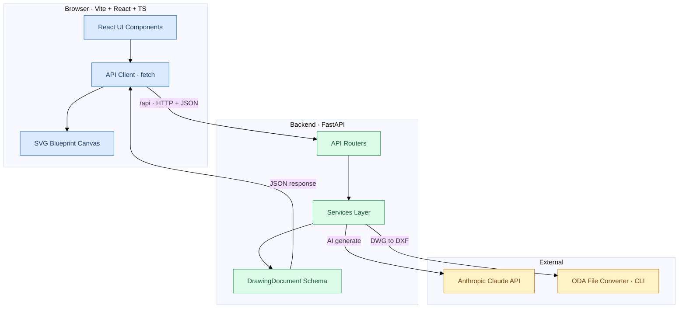
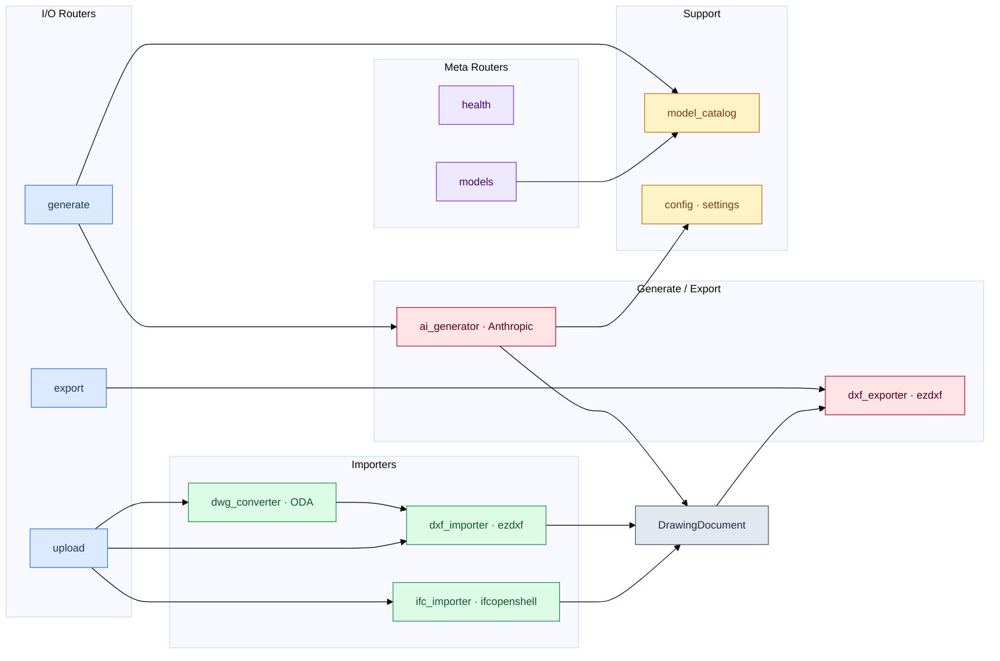
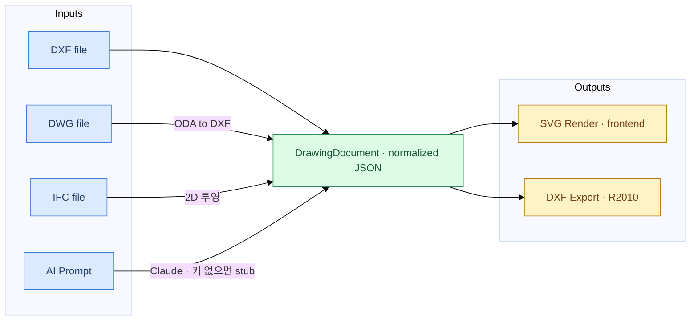
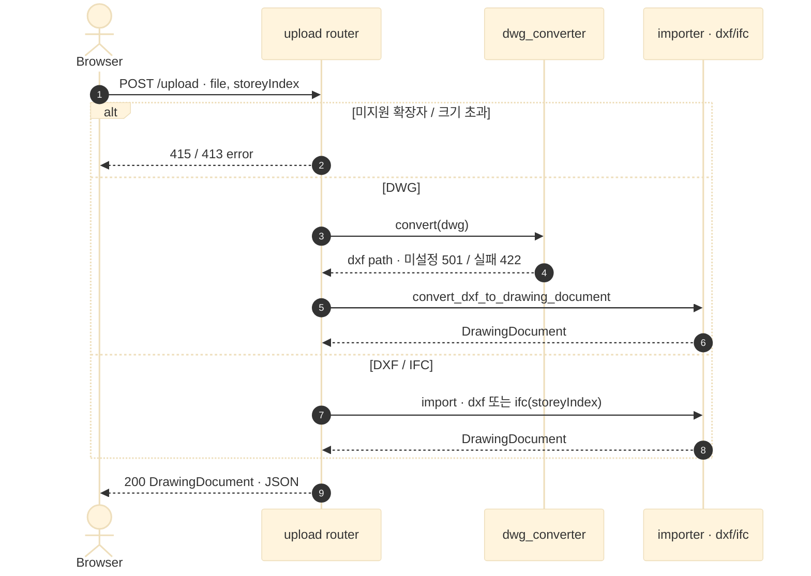
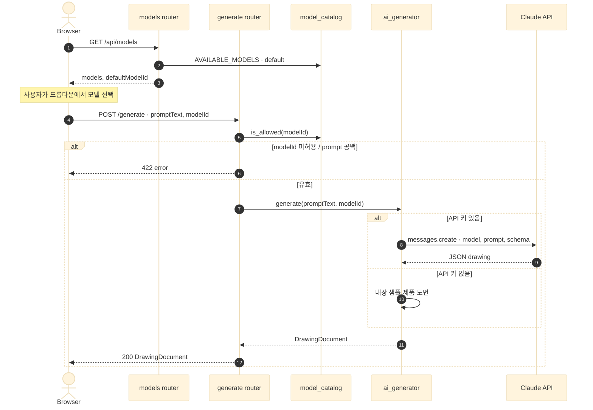
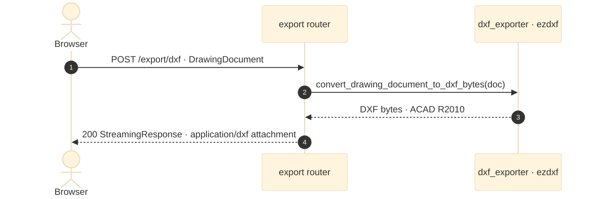
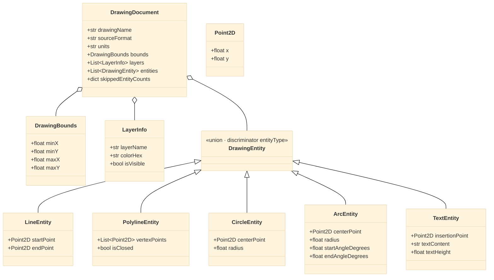

# edim-ai-blueprint — 아키텍처

AI 기반 2D 도면(블루프린트) 생성 시스템의 구조 문서. 모든 다이어그램은 Mermaid로 작성했다.

핵심 설계 원칙: **모든 입력(DXF · DWG · IFC · AI 프롬프트)은 하나의 정규화된 `DrawingDocument` JSON으로 수렴**하고, 프론트엔드는 이 형식만 SVG로 렌더링하며, DXF 익스포터는 이 형식만 소비한다.

---

## 1. 시스템 구성 (High-Level)

---

## 2. 백엔드 모듈 구조 (Routers → Services → Schema)

---

## 3. 정규화 데이터 흐름 (모든 입력 → DrawingDocument)

---

## 4. 흐름: 파일 업로드 (`POST /api/drawings/upload`)

---

## 5. 흐름: AI 도면 생성 + 모델 선택

---

## 6. 흐름: DXF 내보내기 (`POST /api/drawings/export/dxf`)

---

## 7. 데이터 모델: DrawingDocument

---

## 모듈 책임 요약

| 계층 | 모듈 | 책임 |
|------|------|------|
| Router | `health` | 상태 확인 |
| Router | `models` | 선택 가능한 모델 목록 + 기본 모델 ID 반환 |
| Router | `upload` | 확장자별 임포터 디스패치 (DXF/DWG/IFC), 크기·형식 검증 |
| Router | `generate` | 프롬프트·모델 검증 후 AI 생성 위임 |
| Router | `export` | DrawingDocument → DXF 스트리밍 응답 |
| Service | `dxf_importer` | ezdxf로 DXF → DrawingDocument |
| Service | `dwg_converter` | ODA CLI로 DWG → DXF (플러그블 `Protocol`) |
| Service | `ifc_importer` | ifcopenshell로 IFC 2D 투영 → DrawingDocument |
| Service | `ai_generator` | Claude로 프롬프트 → DrawingDocument (키 없으면 stub) |
| Service | `dxf_exporter` | DrawingDocument → DXF(R2010) bytes |
| Support | `model_catalog` | 선택 가능 모델 정의 + allow-list 검증 |
| Support | `config` | 환경변수 설정 (API 키·모델·ODA 경로·업로드 한도) |
| Schema | `DrawingDocument` | 전 계층 공용 정규화 도면 형식 |
