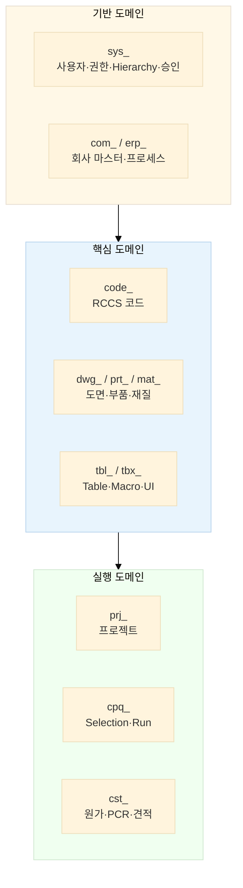
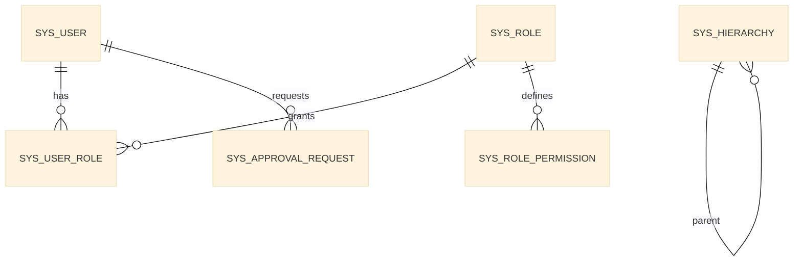
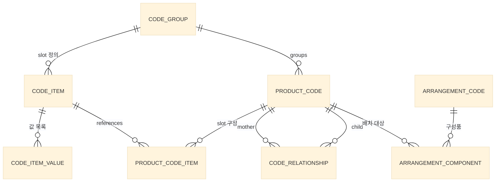
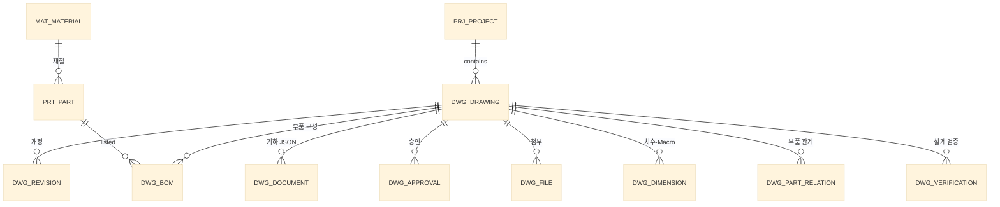

# EDIM DB 정의서

> **기준 문서**: [`EDIM_개요.md`](EDIM_개요.md) §10 도면 DB 모델, §11 ERP 프로세스 코드, §5 RCCS 코드 체계
> **원천 자료**: EDIM Tool System EP2 — 슬라이드 26 (도면 DB), 72 (D-1 DB Structure), 33~38 (Code 등록), 74~75 (D-3/D-4 원가)

| 항목 | 내용 |
|---|---|
| 문서 버전 | v0.1 (초안) |
| 작성일 | 2026-07-07 |
| 대상 DBMS | PostgreSQL 16 (가정 — 미확정, §12 참조) |
| 문자 인코딩 | UTF-8 |
| 시간대 | Asia/Seoul, 저장은 `timestamptz` UTC |

---

## 1. 설계 원칙

### 1.1 명명 규칙

| 대상 | 규칙 | 예시 |
|---|---|---|
| 테이블 | `snake_case`, 도메인 접두어 | `code_group`, `dwg_drawing` |
| 컬럼 | `snake_case` | `product_code_id` |
| PK | `<엔티티>_id`, `BIGINT GENERATED ALWAYS AS IDENTITY` | `drawing_id` |
| FK 제약 | `fk_<테이블>_<참조테이블>` | `fk_dwg_bom_prt_part` |
| 유니크 제약 | `uq_<테이블>_<컬럼>` | `uq_dwg_drawing_no` |
| 인덱스 | `ix_<테이블>_<컬럼>` | `ix_dwg_drawing_project` |
| Enum 값 | 대문자 SNAKE | `PENDING`, `APPROVED` |

### 1.2 도메인 접두어

| 접두어 | 도메인 | 근거 (개요서/슬라이드) |
|---|---|---|
| `sys_` | 시스템 공통 — 사용자·권한·Hierarchy·승인·이력 | §2, §4 (E-3, H-1) |
| `code_` | RCCS 코드 — Sub/Product/Relationship/Arrangement | §5 (S-1-1~S-1-6) |
| `prj_` | 프로젝트 | 슬라이드 26-1 |
| `dwg_` | 도면/PLM — 도면·개정·치수·부품관계·검증 | §10 (S-4-1-1) |
| `prt_` / `mat_` | 부품 / 재질 | 슬라이드 26-4/26-6 |
| `cpq_` | CPQ — Selection·Run·산출물 | §6, §7.2 (C-1~C-3) |
| `tbl_` | 데이터 Table — Variant/Tech/Material Table | §7.1, 슬라이드 66 (E-4) |
| `tbx_` | Toolbox — UI Form·Macro·Templet·Print Form | §8 (S-2-1, S-2-2) |
| `cst_` | 원가/견적 — 단가·원가계산·PCR·견적 | §6 (D-3, D-4) |
| `erp_` / `com_` | ERP 프로세스 / 회사 마스터 | §11 (S-3-5) |

### 1.3 공통 컬럼

모든 업무 테이블은 아래 감사(Audit) 컬럼을 포함한다 (이하 표에서는 `[공통]`으로 생략 표기).

| 컬럼 | 타입 | Null | 설명 |
|---|---|---|---|
| `tenant_id` | BIGINT | N | 멀티테넌시 식별자 — `sys_tenant` 논리 FK (§12 미결정: 스키마 분리 대안) |
| `created_by` | VARCHAR(50) | N | 생성자 (login_id) |
| `created_at` | TIMESTAMPTZ | N | 생성 일시, DEFAULT now() |
| `updated_by` | VARCHAR(50) | Y | 수정자 |
| `updated_at` | TIMESTAMPTZ | Y | 수정 일시 |

> **자식 테이블 tenant_id 정책 (v0.4)**: 부모 FK가 필수(N)인 순수 자식 테이블(dwg_revision·dwg_bom·dwg_approval·product_code_item·code_relationship_slot_map·tbl_data_row·cpq_selection_item·tbx_macro_ref 등)은 tenant_id를 생략하고 부모 경유로 격리한다. 단 **RLS를 직접 거는 테이블은 포함** — 구현 시 RLS 적용 목록과 함께 확정.

### 1.4 승인 패턴

EDIM의 모든 Set-up 자산(코드·도면·Macro·UI Form·Table)은 **승인 후 사용** 원칙을 따른다 (개요서 §5, §7).

- 승인 대상 테이블은 `approval_status` 컬럼을 가진다: `DRAFT → PENDING → APPROVED / REJECTED`
- 승인 절차 이력은 공통 테이블 `sys_approval_request`에 기록한다
- 도면 승인만은 원천 스키마(슬라이드 26-7) 충실도를 위해 전용 테이블 `dwg_approval`을 별도 유지한다

### 1.5 Hierarchy = DB Address 패턴

개요서 §4: Hierarchy Tree는 모든 데이터의 **주소 체계**다.
자산 테이블은 `hierarchy_address`(Materialized Path, 예: `/CODE/SUB/SPEC/FAN/CENTRIFUGAL/CASING/DOUBLE`)를 보유하며,
Tree 노드가 이동·개명되어도 `sys_hierarchy.address`의 이력으로 추적 연결된다.

### 1.6 JSON 사용 기준

구조가 사용자 정의로 가변인 것만 `JSONB`를 쓴다: 도면 기하(DrawingDocument), UI Layout,
Flowchart, Table 행 값, PCR 항목. **조회·조인 대상 속성은 반드시 정규 컬럼으로 승격**한다.

---

## 2. 도메인 구성

**테이블 총괄**: 기반 9 + 코드 9 + 도면 14 + Table/Toolbox 6 + CPQ 4 + 원가 4 + ERP 7 = **53 테이블** (v0.4 — 테이블 수 불변, 컬럼·제약·인덱스 보강)

---

## 3. 시스템 공통 도메인 — sys_

### 3.1 `sys_user` — 사용자

| 컬럼 | 타입 | Null | 키/제약 | 설명 |
|---|---|---|---|---|
| `user_id` | BIGINT | N | PK | |
| `login_id` | VARCHAR(50) | N | UQ(tenant_id, login_id) | 로그인 ID (v0.3: 테넌트 범위 유일 — SaaS) |
| `user_name` | VARCHAR(100) | N | | 성명 |
| `email` | VARCHAR(200) | Y | | |
| `password_hash` | VARCHAR(200) | N | | bcrypt/argon2 |
| `department` | VARCHAR(50) | Y | | 소속 부서 (Sales/Tech/…) |
| `user_level` | VARCHAR(20) | N | CHECK | `PLATFORM` / `ADMIN` / `SETUP` / `GENERAL` — 개요서 §2 3단계+플랫폼 |
| `status` | VARCHAR(20) | N | | `ACTIVE` / `LOCKED` / `RETIRED` |
| [공통] | | | | |

### 3.2 `sys_role` — 역할

| 컬럼 | 타입 | Null | 키/제약 | 설명 |
|---|---|---|---|---|
| `role_id` | BIGINT | N | PK | |
| `role_name` | VARCHAR(100) | N | UQ(tenant_id, role_name) | |
| `description` | VARCHAR(500) | Y | | |
| [공통] | | | | |

### 3.3 `sys_user_role` — 사용자-역할 매핑

| 컬럼 | 타입 | Null | 키/제약 | 설명 |
|---|---|---|---|---|
| `user_role_id` | BIGINT | N | PK | |
| `user_id` | BIGINT | N | FK→sys_user, UQ(user_id, role_id) | |
| `role_id` | BIGINT | N | FK→sys_role | |

### 3.4 `sys_role_permission` — 권한

Head Tab·Hierarchy 노드·기능(컴포넌트 코드) 단위 권한. "각 사용자의 권한을 받은 항목만 표시" (개요서 §4).

| 컬럼 | 타입 | Null | 키/제약 | 설명 |
|---|---|---|---|---|
| `permission_id` | BIGINT | N | PK | |
| `role_id` | BIGINT | N | FK→sys_role | |
| `resource_type` | VARCHAR(30) | N | | `HEAD_TAB` / `HIERARCHY` / `FEATURE` / `TABLE` |
| `resource_key` | VARCHAR(200) | N | | 예: `S-1-3`, `/CODE/SUB/SPEC`, `CPQ` |
| `action` | VARCHAR(20) | N | | `VIEW` / `EDIT` / `APPROVE` / `SETUP` |

### 3.5 `sys_hierarchy` — Hierarchy Tree (DB Address)

| 컬럼 | 타입 | Null | 키/제약 | 설명 |
|---|---|---|---|---|
| `hierarchy_id` | BIGINT | N | PK | |
| `parent_id` | BIGINT | Y | FK→sys_hierarchy | NULL = 루트 |
| `tree_type` | VARCHAR(20) | N | CHECK | `PRODUCT` / `GENERAL_DB` / `CONFIG` — 개요서 §4 |
| `node_name` | VARCHAR(100) | N | | |
| `symbol` | VARCHAR(50) | Y | | 노드 심볼 (BOM/DWG/Document Box 등, 슬라이드 64) |
| `address` | VARCHAR(500) | N | UQ(tenant_id, address) | Materialized Path — 데이터 연결 주소 |
| | | | UQ(parent_id, node_name) | 형제 노드 이름 중복 방지 (v0.4) |
| `sort_order` | INT | N | | |
| `is_system` | BOOLEAN | N | DEFAULT false | true = EDIM 제공 Tree (편집 불가) |
| `remarks` | VARCHAR(500) | Y | | |
| `approval_status` | VARCHAR(20) | N | | §1.4 |
| [공통] | | | | |

> 이동/개명 시 이전 `address`는 `sys_history`에 남겨 추적한다 ("Tree 편집에도 Data는 저장된 Address 추적 연결").

### 3.6 `sys_approval_request` — 공통 승인 요청

| 컬럼 | 타입 | Null | 키/제약 | 설명 |
|---|---|---|---|---|
| `approval_id` | BIGINT | N | PK | |
| `target_table` | VARCHAR(60) | N | | 대상 테이블명 |
| `target_id` | BIGINT | N | | 대상 PK |
| `request_type` | VARCHAR(20) | N | | `CREATE` / `UPDATE` / `DELETE` |
| `step` | VARCHAR(20) | N | | `WRITE`(작성) / `REVIEW`(검토) / `APPROVE`(승인) — 슬라이드 26-7 준용 |
| `requester_id` | BIGINT | N | FK→sys_user | |
| `approver_id` | BIGINT | Y | FK→sys_user | |
| `requested_at` | TIMESTAMPTZ | N | | |
| `decided_at` | TIMESTAMPTZ | Y | | |
| `result` | VARCHAR(20) | Y | | `APPROVED` / `REJECTED` |
| `comment` | VARCHAR(1000) | Y | | |
| [공통] | | | | |

인덱스: `ix_sys_approval_target (target_table, target_id)`, `ix_sys_approval_approver (approver_id, result)`
제약(v0.4): `uq_approval_pending` — 부분 유니크 (target_table, target_id) WHERE result IS NULL — **동일 대상 중복 PENDING 요청 방지** (동시성)

### 3.7 `sys_history` — 변경 이력 (Audit Log)

| 컬럼 | 타입 | Null | 키/제약 | 설명 |
|---|---|---|---|---|
| `history_id` | BIGINT | N | PK | |
| `target_table` | VARCHAR(60) | N | | |
| `target_id` | BIGINT | N | | |
| `action` | VARCHAR(20) | N | | `INSERT` / `UPDATE` / `DELETE` / `MOVE` / `APPROVE` |
| `actor_id` | BIGINT | N | FK→sys_user | |
| `acted_at` | TIMESTAMPTZ | N | DEFAULT now() | |
| `before_data` | JSONB | Y | | 변경 전 |
| `after_data` | JSONB | Y | | 변경 후 |

인덱스(v0.4): `ix_sys_history_target (target_table, target_id, acted_at)` — 이력 조회(M-15-9) 풀스캔 방지

### 3.8 `sys_notification` — 알림

| 컬럼 | 타입 | Null | 키/제약 | 설명 |
|---|---|---|---|---|
| `notification_id` | BIGINT | N | PK | |
| `user_id` | BIGINT | N | FK→sys_user | 수신자 |
| `notify_type` | VARCHAR(30) | N | | `APPROVAL` / `TODO` / `SCHEDULE` / `ALERT` |
| `title` | VARCHAR(200) | N | | |
| `link_url` | VARCHAR(500) | Y | | |
| `is_read` | BOOLEAN | N | DEFAULT false | |
| `created_at` | TIMESTAMPTZ | N | | |

### 3.9 `sys_tenant` — 테넌트 마스터 (v0.3 추가)

공통 컬럼 `tenant_id`의 참조 대상 (설계 결함 수정 — 마스터 부재였음). Platform 전용 관리 (ADM-001).

| 컬럼 | 타입 | Null | 키/제약 | 설명 |
|---|---|---|---|---|
| `tenant_id` | BIGINT | N | PK | |
| `tenant_code` | VARCHAR(30) | N | UQ | |
| `tenant_name` | VARCHAR(200) | N | | 고객사명 |
| `plan` | VARCHAR(20) | N | | `SAAS` / `SELF_MANAGED` |
| `status` | VARCHAR(20) | N | | `ACTIVE` / `SUSPENDED` / `CLOSED` |
| `settings` | JSONB | Y | | 테넌트 설정 (로고·언어 기본값 등) |
| `created_by`·`created_at`… | | | | 감사 컬럼 (tenant_id 제외) |

> 업무 테이블의 `tenant_id`는 본 테이블 논리 FK — RLS 정책 키.

---

## 4. RCCS 코드 도메인 — code_

개요서 §5. 코드 자릿수(Item Slot) 정의 → 값 목록 → Product Code 조립 → Mother-Child 관계.

### 4.1 `code_group` — 코드 그룹

Sub Code Registration 화면(S-1-1/S-1-2)의 Group (예: `KOF` Fan Centrifugal, `FDV` Raw Material).

| 컬럼 | 타입 | Null | 키/제약 | 설명 |
|---|---|---|---|---|
| `group_id` | BIGINT | N | PK | |
| `group_code` | VARCHAR(20) | N | UQ(tenant_id, group_code) | `KOF`, `FDV`, `COP` |
| `group_name` | VARCHAR(100) | N | | |
| `group_type` | VARCHAR(20) | N | CHECK | `SPECIFICATION` / `RAW_MATERIAL` / `GPI`(일반구매품) / `PRODUCT` |
| `hierarchy_address` | VARCHAR(500) | N | | §1.5 (예: Fan>Centrifugal>Casing>Double) |
| `description` | VARCHAR(500) | Y | | |
| `approval_status` | VARCHAR(20) | N | | |
| [공통] | | | | |

### 4.2 `code_item` — 코드 자릿수 항목

Group 내 속성 Slot (A: Fan Model, B: Fan Size, C: Material …).

| 컬럼 | 타입 | Null | 키/제약 | 설명 |
|---|---|---|---|---|
| `item_id` | BIGINT | N | PK | |
| `group_id` | BIGINT | N | FK→code_group | |
| `item_slot` | VARCHAR(5) | N | UQ(group_id, item_slot) | `A` ~ `N` |
| `item_name` | VARCHAR(100) | N | | 예: Fan Model, Bearing Type |
| `description` | VARCHAR(500) | Y | | |
| `sort_order` | INT | N | | |
| [공통] | | | | |

### 4.3 `code_item_value` — 자릿수 값 목록

Sub Item List (350/400/450…, Gal./CU/AL…). 중복검토 후 승인.

| 컬럼 | 타입 | Null | 키/제약 | 설명 |
|---|---|---|---|---|
| `value_id` | BIGINT | N | PK | |
| `item_id` | BIGINT | N | FK→code_item | |
| `value_code` | VARCHAR(30) | N | UQ(item_id, value_code) | `350`, `Gal.`, `SR` |
| `value_name` | VARCHAR(100) | Y | | 표시명 |
| `ref_table_id` | BIGINT | Y | FK→tbl_data_table | "Table 참조" 값일 때 (S-1-2) |
| `description` | VARCHAR(500) | Y | | |
| `sort_order` | INT | N | | |
| `approval_status` | VARCHAR(20) | N | | |
| [공통] | | | | |

### 4.4 `product_code` — 제품 코드 (Main Code)

S-1-3. 예: `KDCR 3-13` (Double Suction casing with reinforced frame).

| 컬럼 | 타입 | Null | 키/제약 | 설명 |
|---|---|---|---|---|
| `product_code_id` | BIGINT | N | PK | |
| `main_code` | VARCHAR(50) | N | UQ(tenant_id, main_code) | 중복검토 대상 |
| `group_id` | BIGINT | N | FK→code_group | |
| `code_name` | VARCHAR(200) | N | | |
| `hierarchy_address` | VARCHAR(500) | N | | 제품 Tree 위치 |
| `base_drawing_id` | BIGINT | Y | FK→dwg_drawing | 대표 도면 (2D/3D) |
| `description` | VARCHAR(500) | Y | | |
| `approval_status` | VARCHAR(20) | N | | |
| [공통] | | | | |

### 4.5 `product_code_item` — 제품 코드 자릿수 구성

Product Code가 사용하는 Slot과 그 값의 출처 정의 (S-1-3 "Sub Code 항목 추가 → Code Item List 찾기 → 설정").

| 컬럼 | 타입 | Null | 키/제약 | 설명 |
|---|---|---|---|---|
| `pc_item_id` | BIGINT | N | PK | |
| `product_code_id` | BIGINT | N | FK→product_code | |
| `item_slot` | VARCHAR(5) | N | UQ(product_code_id, item_slot) | 이 제품 코드의 자릿수 |
| `source_item_id` | BIGINT | N | FK→code_item | 값 목록의 출처 Slot |
| `is_required` | BOOLEAN | N | DEFAULT true | |
| `sort_order` | INT | N | | |

### 4.6 `code_relationship` — Mother-Child 관계 (관계형 BOM)

S-1-4. Mother의 Sub Code 조합 조건에 일치하는 Child를 수량과 함께 연결.

| 컬럼 | 타입 | Null | 키/제약 | 설명 |
|---|---|---|---|---|
| `rel_id` | BIGINT | N | PK | |
| `mother_code_id` | BIGINT | N | FK→product_code | |
| `child_code_id` | BIGINT | N | FK→product_code | |
| `quantity` | NUMERIC(12,3) | N | | 예: Inlet-Cone 2 |
| `remarks` | VARCHAR(300) | Y | | 예: `Reverse Bending R`, `With FF` |
| `sort_order` | INT | N | | Part List 출력 순서 |
| `approval_status` | VARCHAR(20) | N | | Running Test 검증 후 승인 (§5 개요서) |
| [공통] | | | | |

인덱스: `ix_code_rel_mother (mother_code_id)`, `ix_code_rel_child (child_code_id)`

### 4.6.1 `code_relationship_slot_map` — 관계 Slot 매핑 (v0.3 추가)

> v0.2까지 `match_condition JSONB`였음 — BOM 전개 조인·검증·인덱스가 불가하여 **정규 테이블로 변경** (설계 결함 수정).
> 행 의미: Child의 `child_slot` 값은 Mother의 `mother_slot` 값을 상속하거나 `fixed_value`로 고정.

| 컬럼 | 타입 | Null | 키/제약 | 설명 |
|---|---|---|---|---|
| `slot_map_id` | BIGINT | N | PK | |
| `rel_id` | BIGINT | N | FK→code_relationship, UQ(rel_id, child_slot) | |
| `child_slot` | VARCHAR(5) | N | | Child 자릿수 |
| `mother_slot` | VARCHAR(5) | Y | | 상속할 Mother 자릿수 |
| `fixed_value` | VARCHAR(30) | Y | | 고정값 |

제약: `ck_slot_source` — mother_slot XOR fixed_value (정확히 하나)

### 4.7 `arrangement_code` — Arrangement 코드

S-1-5. 표준 구성 조합 (Double Deck 2, Double Suction / Fan Direction L0~R270, Direct Driven 등).

| 컬럼 | 타입 | Null | 키/제약 | 설명 |
|---|---|---|---|---|
| `arrangement_id` | BIGINT | N | PK | |
| `arrangement_code` | VARCHAR(50) | N | UQ(tenant_id, arrangement_code) | |
| `arrangement_name` | VARCHAR(200) | N | | |
| `product_family` | VARCHAR(50) | N | | `AHU` / `FAN` … |
| `direction_option` | VARCHAR(200) | Y | | 지원 방향 목록 (L0,L90,…,R270) |
| `install_option` | VARCHAR(200) | Y | | Direct Driven / Belt In-Line / Belt Along |
| `base_drawing_id` | BIGINT | Y | FK→dwg_drawing | Arrangement 도면 |
| `approval_status` | VARCHAR(20) | N | | |
| [공통] | | | | |

### 4.8 `arrangement_component` — Arrangement 구성품

S-1-6. Arrangement에 포함되는 Module과 결합 조건.

| 컬럼 | 타입 | Null | 키/제약 | 설명 |
|---|---|---|---|---|
| `component_id` | BIGINT | N | PK | |
| `arrangement_id` | BIGINT | N | FK→arrangement_code | |
| `product_code_id` | BIGINT | N | FK→product_code | 구성 Module |
| `position_key` | VARCHAR(30) | Y | | 배치 좌표/방향 키 |
| `join_macro_id` | BIGINT | Y | FK→tbx_macro | 결합 조건 계산식 (Arrangement relationship Templet) |
| `quantity` | NUMERIC(12,3) | N | DEFAULT 1 | |
| `sort_order` | INT | N | | |

---

## 5. 도면/PLM 도메인 — prj_ / dwg_ / prt_ / mat_

슬라이드 26의 9테이블을 근간으로, E-4 설계 기능(부품 관계·설계 검증·조립 순서)을 확장.

### 5.1 `prj_project` — 프로젝트 (슬라이드 26-1 확장)

| 컬럼 | 타입 | Null | 키/제약 | 설명 |
|---|---|---|---|---|
| `project_id` | BIGINT | N | PK | |
| `project_no` | VARCHAR(30) | N | UQ(tenant_id, project_no) | `PS-61313-5` |
| `project_name` | VARCHAR(200) | N | | |
| `customer_id` | BIGINT | Y | FK→com_company | 고객사 |
| `project_type` | VARCHAR(50) | Y | | `AHU` / `FAN` … |
| `sales_stage` | VARCHAR(30) | N | CHECK | `TECH_PROPOSAL`/`QUOTE`/`NEGOTIATION`/`CONTRACT`/`CONTRACT_CHANGE`/`CLOSED` (라벨: 기술제안~종료, S-3-5) |
| `start_date` | DATE | Y | | |
| `due_date` | DATE | Y | | 납기일 |
| `status` | VARCHAR(20) | N | | `IN_PROGRESS`(진행) / `DONE`(완료) / `HOLD`(보류) |
| `manager_id` | BIGINT | Y | FK→sys_user | 담당자 |
| `client_contact` | VARCHAR(200) | Y | | Client 담당자 정보 |
| `pain_point` | TEXT | Y | | 주요 요구사항 및 Pain Point |
| `note` | VARCHAR(1000) | Y | | |
| [공통] | | | | |

### 5.2 `dwg_drawing` — 도면 (슬라이드 26-2)

| 컬럼 | 타입 | Null | 키/제약 | 설명 |
|---|---|---|---|---|
| `drawing_id` | BIGINT | N | PK | |
| `project_id` | BIGINT | Y | FK→prj_project | NULL = 표준(Set-up) 도면 |
| `drawing_no` | VARCHAR(50) | N | UQ(tenant_id, drawing_no) | 도면 번호 |
| `drawing_name` | VARCHAR(200) | N | | |
| `drawing_type` | VARCHAR(20) | N | CHECK | `ASSEMBLY`(조립도) / `PART`(부품도) / `LAYOUT`(배치도) |
| `dwg_kind` | VARCHAR(20) | N | CHECK | `APPROVAL`(승인도) / `MANUFACTURING`(제작도) / `STANDARD`(표준도) — EDIM Run 산출 구분 |
| `scale` | VARCHAR(10) | Y | | `1:1`, `1:2` |
| `size` | VARCHAR(5) | Y | | `A0`~`A4` |
| `current_rev` | VARCHAR(5) | N | DEFAULT 'A' | |
| `status` | VARCHAR(20) | N | CHECK | `DRAFT`(작성중) / `REVIEW`(검토) / `APPROVED`(승인) / `RELEASED`(발행) |
| `source` | VARCHAR(20) | N | | `EDIM`(Macro 생성) / `IMPORT`(DXF/DWG/PDF) / `AI` |
| [공통] | | | | |

인덱스: `ix_dwg_drawing_project (project_id)`, `ix_dwg_drawing_status (status)`

### 5.3 `dwg_revision` — 개정 이력 (슬라이드 26-3)

| 컬럼 | 타입 | Null | 키/제약 | 설명 |
|---|---|---|---|---|
| `revision_id` | BIGINT | N | PK | |
| `drawing_id` | BIGINT | N | FK→dwg_drawing | |
| `rev_no` | VARCHAR(5) | N | UQ(drawing_id, rev_no) | `A`, `B`, `C`… |
| `rev_date` | DATE | N | | |
| `rev_reason` | VARCHAR(500) | Y | | |
| `rev_content` | TEXT | Y | | |
| `revised_by` | VARCHAR(50) | N | | |

### 5.4 `dwg_document` — 도면 기하 데이터

Block 단위 저장 원칙(개요서 §7.1 "Block 단위로 저장, 상위 호출 시 Block 상태").
`edim-ai-blueprint` 프로토타입의 `DrawingDocument` JSON 스키마와 호환.

| 컬럼 | 타입 | Null | 키/제약 | 설명 |
|---|---|---|---|---|
| `document_id` | BIGINT | N | PK | |
| `drawing_id` | BIGINT | N | FK→dwg_drawing | |
| `revision_id` | BIGINT | Y | FK→dwg_revision | |
| `block_name` | VARCHAR(100) | Y | | Block 식별자 (NULL = 전체 도면) |
| `content` | JSONB | N | | line/polyline/circle/arc/text + layers (DrawingDocument) |
| `origin_x` / `origin_y` | NUMERIC(14,4) | Y | | Block 원점 좌표 |
| [공통] | | | | |

### 5.5 `prt_part` — 부품 (슬라이드 26-4)

| 컬럼 | 타입 | Null | 키/제약 | 설명 |
|---|---|---|---|---|
| `part_id` | BIGINT | N | PK | |
| `part_no` | VARCHAR(50) | N | UQ(tenant_id, part_no) | `JD2345`, `DF12` |
| `part_name` | VARCHAR(200) | N | | Bearing, Shaft, Inlet-Cone |
| `specification` | VARCHAR(300) | Y | | 규격 |
| `material_id` | BIGINT | Y | FK→mat_material | |
| `product_code_id` | BIGINT | Y | FK→product_code | RCCS 코드 연결 (표준품인 경우) |
| `unit` | VARCHAR(10) | N | DEFAULT 'EA' | `EA` / `SET` / `M` … |
| `weight` | NUMERIC(12,3) | Y | | 단중 (kg) |
| `supplier_id` | BIGINT | Y | FK→com_company | 공급처 |
| `is_standard` | BOOLEAN | N | DEFAULT false | 표준품 여부 |
| [공통] | | | | |

### 5.6 `mat_material` — 재질 (슬라이드 26-6)

| 컬럼 | 타입 | Null | 키/제약 | 설명 |
|---|---|---|---|---|
| `material_id` | BIGINT | N | PK | |
| `material_code` | VARCHAR(30) | N | UQ(tenant_id, material_code) | |
| `material_name` | VARCHAR(100) | N | | `SS400`, `SUS304` |
| `material_type` | VARCHAR(20) | N | | `철강` / `비철` / `플라스틱` |
| `density` | NUMERIC(10,3) | Y | | kg/m³ — 원가 무게 계산 입력 |
| `standard` | VARCHAR(30) | Y | | `KS` / `ASTM` … |
| `hazard_class` | VARCHAR(30) | Y | | 위험 물성 등급 — 액체(독극물)/가스(폭발성)/고체 (v0.2, ERP-020) |
| [공통] | | | | |

### 5.7 `dwg_bom` — 도면 부품 구성표 (슬라이드 26-5 확장)

조립 순서(◆ Assembling Sequence, 개요서 §7.1)를 컬럼으로 흡수.

| 컬럼 | 타입 | Null | 키/제약 | 설명 |
|---|---|---|---|---|
| `bom_id` | BIGINT | N | PK | |
| `drawing_id` | BIGINT | N | FK→dwg_drawing | |
| `part_id` | BIGINT | N | FK→prt_part | |
| `item_no` | INT | N | UQ(drawing_id, item_no) | 품번 ①②③ |
| `quantity` | NUMERIC(12,3) | N | | |
| `assembly_seq` | INT | Y | | 조립 순서 |
| `assembly_note` | VARCHAR(500) | Y | | 조립 주의사항 |
| `note` | VARCHAR(300) | Y | | 예: `KAD 1120 2 R / With FF` |

### 5.8 `dwg_approval` — 도면 승인 이력 (슬라이드 26-7)

| 컬럼 | 타입 | Null | 키/제약 | 설명 |
|---|---|---|---|---|
| `approval_id` | BIGINT | N | PK | |
| `drawing_id` | BIGINT | N | FK→dwg_drawing | |
| `revision_id` | BIGINT | Y | FK→dwg_revision | |
| `step` | VARCHAR(20) | N | CHECK | `WRITE` / `REVIEW` / `APPROVE` |
| `approver_id` | BIGINT | N | FK→sys_user | |
| `approval_date` | DATE | Y | | |
| `result` | VARCHAR(20) | Y | | `APPROVED` / `REJECTED` |
| `comment` | VARCHAR(1000) | Y | | |

### 5.9 `dwg_file` — 첨부 파일 (슬라이드 26-8)

| 컬럼 | 타입 | Null | 키/제약 | 설명 |
|---|---|---|---|---|
| `file_id` | BIGINT | N | PK | |
| `project_id` | BIGINT | Y | FK→prj_project | Project Folder 소속 (v0.4 — GET /files?projectId 지원) |
| `folder` | VARCHAR(20) | Y | CHECK | `DWG` / `PRICE` / `DATA` / `BOM` / `RECEIVED`(접수자료) — 개요 §6 폴더 규약 (v0.4) |
| `drawing_id` | BIGINT | Y | FK→dwg_drawing | |
| `revision_id` | BIGINT | Y | FK→dwg_revision | |
| `file_name` | VARCHAR(300) | N | | |
| `file_type` | VARCHAR(10) | N | | `DWG`/`DXF`/`PDF`/`STEP`/`PNG`/`XLSX` |
| `file_path` | VARCHAR(500) | N | | 저장 경로 (스토리지 전략 §12) |
| `file_size` | BIGINT | Y | | bytes |
| `uploaded_date` | TIMESTAMPTZ | N | | |
| [공통] | | | | |

인덱스(v0.4): `ix_dwg_file_project (project_id, folder)` — Project Folder 목록 조회

### 5.10 `dwg_dimension` — 치수·Macro (슬라이드 26-9)

파라메트릭 설계의 핵심: 치수마다 Macro가 연결되고, EDIM Run이 Sub Code 조건으로 실행하여 값을 채운다.

| 컬럼 | 타입 | Null | 키/제약 | 설명 |
|---|---|---|---|---|
| `dimension_id` | BIGINT | N | PK | 원 스키마 `Model_id` |
| `drawing_id` | BIGINT | N | FK→dwg_drawing | |
| `product_code_id` | BIGINT | Y | FK→product_code | 원 스키마 `Code_id` |
| `dim_label` | VARCHAR(10) | N | UQ(drawing_id, dim_label) | 지시선 자동 번호 `A`~`N` (중복 검사) |
| `dim_type` | VARCHAR(20) | N | CHECK | `KEY`(주요 치수) / `DETAIL`(세부 치수) — 승인도면 구분 |
| `macro_id` | BIGINT | Y | FK→tbx_macro | 치수 계산식 (원 스키마 `Macro`) |
| `variant_value` | NUMERIC(14,4) | Y | | 직접 입력값 (Macro 미사용 시, 원 스키마 `Variant`) |
| `design_priority` | INT | Y | | 설계 우선순위 — 순환 참조 점검 대상 |
| `data_priority` | INT | Y | | 자료 참조 우선순위 |
| `base_point` | VARCHAR(100) | Y | | 설계 기준점 |
| `remarks` | VARCHAR(300) | Y | | |
| [공통] | | | | |

제약: `ck_dim_binding` — `macro_id` XOR `variant_value` (정확히 하나, v0.3)

### 5.11 `dwg_part_relation` — 부품 상호 관계 (E-4 Part relationship set-up)

| 컬럼 | 타입 | Null | 키/제약 | 설명 |
|---|---|---|---|---|
| `relation_id` | BIGINT | N | PK | |
| `drawing_id` | BIGINT | N | FK→dwg_drawing | |
| `block_a` | VARCHAR(100) | N | | 부품 A (Block명) |
| `block_b` | VARCHAR(100) | N | | 부품 B |
| `condition_align` | VARCHAR(30) | Y | | 조건1: `수직`/`수평`/`중심`/`중앙` |
| `condition_contact` | VARCHAR(50) | Y | | 조건2: 접촉(면·선·점·꼭지점)/좌표/각도 |
| `value_macro_id` | BIGINT | Y | FK→tbx_macro | 관계 값 계산식 (예: `=A2.Table23_3*Var32_2`) |
| `priority` | INT | N | | 관계 진행 우선순위 — 순환 참조 자동 점검 |
| `approval_status` | VARCHAR(20) | N | | |
| [공통] | | | | |

### 5.12 `dwg_verification` — 설계 검증 규칙 (■ Design Verification)

| 컬럼 | 타입 | Null | 키/제약 | 설명 |
|---|---|---|---|---|
| `verification_id` | BIGINT | N | PK | |
| `drawing_id` | BIGINT | N | FK→dwg_drawing | |
| `rule_name` | VARCHAR(100) | N | | |
| `macro_id` | BIGINT | N | FK→tbx_macro | 검증 조건식 (공학식·Table 활용) |
| `warning_message` | VARCHAR(500) | N | | 불일치 시 경고 문구 |
| `is_active` | BOOLEAN | N | DEFAULT true | |
| [공통] | | | | |

### 5.13 `dwg_supersedure` — 도면 대체 관계 (v0.2 추가)

Viewer 탭의 Supersedure — 신 도면이 구 도면을 대체 (DWG-027, 슬라이드 5/60).

| 컬럼 | 타입 | Null | 키/제약 | 설명 |
|---|---|---|---|---|
| `supersedure_id` | BIGINT | N | PK | |
| `old_drawing_id` | BIGINT | N | FK→dwg_drawing, UQ(old_drawing_id) | 대체되는 도면 |
| `new_drawing_id` | BIGINT | N | FK→dwg_drawing | 대체하는 도면 |
| `reason` | VARCHAR(500) | Y | | 대체 사유 |
| `superseded_date` | DATE | N | | |
| [공통] | | | | |

제약(v0.4): CHECK old_drawing_id <> new_drawing_id

> 대체된 도면 사용 시 경고 표시. 체인 조회는 재귀 (old→new→...최신).

### 5.14 `doc_control` — 문서 통제 (v0.2 추가)

Released Status·Version·DOC No.·Management Grade (DOC-001/002, 슬라이드 58, W-11).

| 컬럼 | 타입 | Null | 키/제약 | 설명 |
|---|---|---|---|---|
| `doc_control_id` | BIGINT | N | PK | |
| `doc_no` | VARCHAR(50) | N | UQ(tenant_id, doc_no, version) | Document Code 채번 (DOC-003) — **버전별 행 보존** (v0.4: doc_no 단독 UQ는 이력 불가 결함) |
| `title` | VARCHAR(200) | N | | |
| `doc_type` | VARCHAR(30) | N | | `TECH_REPORT` / `QUOTATION` / `DRAWING_DOC` / `GENERAL` |
| `ref_type` / `ref_id` | VARCHAR(30) / BIGINT | Y | | 원본 엔티티 (dwg_file, cst_quotation 등) |
| `released_status` | VARCHAR(20) | N | CHECK | `SET_UP` / `CHECK` / `APPROVE` / `ACCEPTED` |
| `version` | VARCHAR(20) | N | | 예: KD-0.2 |
| `person` | VARCHAR(50) | N | | 작성자 |
| `approver_id` | BIGINT | Y | FK→sys_user | |
| `approval_date` | DATE | Y | | |
| `management_grade` | VARCHAR(10) | N | DEFAULT 'S-3' | 보안 등급 — 권한승인정의서 '문서보안등급' |
| `remarks` | VARCHAR(500) | Y | | |
| [공통] | | | | |

인덱스: `ix_doc_control_status (tenant_id, released_status)`, `ix_doc_control_grade (management_grade)`

---

## 6. Table·Toolbox 도메인 — tbl_ / tbx_

### 6.1 `tbl_data_table` — 데이터 Table 마스터

Macro가 참조하는 `Table12` 등의 실체. Variant/Tech/Material Table (E-4 Table management).

| 컬럼 | 타입 | Null | 키/제약 | 설명 |
|---|---|---|---|---|
| `table_id` | BIGINT | N | PK | |
| `table_name` | VARCHAR(100) | N | UQ(tenant_id, table_name) | Macro 참조명 |
| `table_type` | VARCHAR(20) | N | CHECK | `VARIANT` / `TECH` / `MATERIAL` / `STD` / `GENERATED` |
| `department` | VARCHAR(50) | Y | | 관리 부서 (Engineering 등) |
| `hierarchy_address` | VARCHAR(500) | N | | Table Address (Hierarchy 주소) |
| `column_def` | JSONB | N | | 열 정의: Key No, `A`~`N`, 타입, 단위 |
| `description` | VARCHAR(500) | Y | | |
| `approval_status` | VARCHAR(20) | N | | DB로서의 명확한 구성 요구 (E-4) |
| [공통] | | | | |

### 6.2 `tbl_data_row` — 데이터 Table 행

| 컬럼 | 타입 | Null | 키/제약 | 설명 |
|---|---|---|---|---|
| `row_id` | BIGINT | N | PK | |
| `table_id` | BIGINT | N | FK→tbl_data_table | |
| `row_key` | VARCHAR(50) | N | UQ(table_id, row_key) | Key 열 값 (Size: `560`, `630`…) |
| `row_key_num` | NUMERIC(18,4) | Y | | row_key 숫자 해석값 — **Macro 범위 조회(`10:25`) 정렬용**, 저장 시 파싱 (v0.3 결함 수정: VARCHAR 사전순은 "1000" < "560") |
| `row_values` | JSONB | N | | `{"A":55,"B":45,...,"Remarks":"656"}` |
| `sort_order` | INT | N | | |

인덱스: `ix_tbl_row_table (table_id)` · `ix_tbl_row_num (table_id, row_key_num)` — 범위 조회용 · `row_values` GIN (조건 검색용)

### 6.3 `tbx_macro` — Macro (4-Way Sync 자산)

개요서 §8.2. Prompt·Macro·Flowchart·Description·Coding 5개 표현을 하나의 자산으로 버전 관리.

| 컬럼 | 타입 | Null | 키/제약 | 설명 |
|---|---|---|---|---|
| `macro_id` | BIGINT | N | PK | |
| `macro_name` | VARCHAR(100) | N | | |
| `version` | INT | N | DEFAULT 1 | UQ(tenant_id, macro_name, version) |
| `prompt_text` | TEXT | Y | | 자연어 요구 (예: "SS Fan 샤프트의 길이 계산…") |
| `macro_expr` | TEXT | Y | | Excel 문법 계산식 |
| `flowchart_def` | JSONB | Y | | Flowchart 그래프 |
| `description_text` | TEXT | Y | | 상세 설명 |
| `code_text` | TEXT | Y | | AI 생성 Coding |
| `apply_type` | VARCHAR(10) | N | CHECK | `MACRO`(간단) / `CODING`(복잡) |
| `test_input` | JSONB | Y | | 검증용 조건값 |
| `test_result` | JSONB | Y | | Run 결과 (예: `786`) |
| `status` | VARCHAR(20) | N | CHECK | `DRAFT` / `TESTED` / `PENDING` / `APPROVED` |
| `hierarchy_address` | VARCHAR(500) | Y | | 자산 저장 위치 |
| [공통] | | | | |

> Macro 참조 함수: `TableN(col, range, fn)` → `tbl_data_table`, `Var(...)` → Variant, `PreC(n)` → 선행 계산값.
> 참조 무결성은 파서가 저장 시 `tbx_macro_ref`(§6.4)로 추출·검증한다.

### 6.4 `tbx_macro_ref` — Macro 참조 목록

순환 참조 점검(설계 자료 순환 우선순위)과 영향도 분석용.

| 컬럼 | 타입 | Null | 키/제약 | 설명 |
|---|---|---|---|---|
| `ref_id` | BIGINT | N | PK | |
| `macro_id` | BIGINT | N | FK→tbx_macro | |
| `ref_type` | VARCHAR(20) | N | | `TABLE` / `VARIANT` / `MACRO` / `DIMENSION` |
| `ref_target_id` | BIGINT | N | | 참조 대상 PK |

### 6.5 `tbx_ui_form` — 사용자 UI Form (S-2-1)

| 컬럼 | 타입 | Null | 키/제약 | 설명 |
|---|---|---|---|---|
| `form_id` | BIGINT | N | PK | |
| `form_name` | VARCHAR(100) | N | | |
| `form_type` | VARCHAR(30) | N | | `CPQ_SELECTION` / `TECHNICAL` / `DOCUMENT` / `ERP` / `PRINT` |
| `version` | INT | N | DEFAULT 1 | |
| `layout_def` | JSONB | N | | Widget 트리 (Button/Label/Entry/Canvas/Combo…) + 동작 바인딩 |
| `hierarchy_address` | VARCHAR(500) | Y | | Head/Work Place 연결 위치 |
| `head_key` | VARCHAR(50) | Y | | Head-Templet 연결 (v0.2, SYS-020) |
| `is_system` | BOOLEAN | N | DEFAULT false | EDIM 제공 Form 여부 |
| `approval_status` | VARCHAR(20) | N | | |
| [공통] | | | | |

> Widget 개별 테이블은 두지 않는다 — 화면 배치는 통째 교체되는 문서 성격이므로 `layout_def` JSONB로 관리 (설계 결정).

### 6.6 `tbx_templet` — Templet

Command button set-up / Combo box set-up / Print Form / Graph 등 재사용 동작 정의.

| 컬럼 | 타입 | Null | 키/제약 | 설명 |
|---|---|---|---|---|
| `templet_id` | BIGINT | N | PK | |
| `templet_name` | VARCHAR(100) | N | | |
| `templet_type` | VARCHAR(30) | N | | `COMMAND_BUTTON` / `COMBO_BOX` / `DATA_TABLE` / `PRINT_FORM` / `GRAPH` / `SCREEN` |
| `definition` | JSONB | N | | 동작(저장/삭제/복사/등록/찾기)·대상·Data 바인딩 |
| `is_system` | BOOLEAN | N | DEFAULT false | |
| `approval_status` | VARCHAR(20) | N | | |
| [공통] | | | | |

---

## 7. CPQ 도메인 — cpq_

### 7.1 `cpq_selection` — 제품 선정 결과

| 컬럼 | 타입 | Null | 키/제약 | 설명 |
|---|---|---|---|---|
| `selection_id` | BIGINT | N | PK | |
| `project_id` | BIGINT | N | FK→prj_project | |
| `arrangement_id` | BIGINT | Y | FK→arrangement_code | |
| `finished_goods_code` | VARCHAR(100) | N | | 완성품 Code (예: `EU-55-2123-3000-…-7653`) |
| `product_code_id` | BIGINT | N | FK→product_code | Main Code |
| `slot_values` | JSONB | N | | 선택된 자릿수 값 (조회·검증은 앱 계층 — 확정 후 불변이므로 JSONB 유지, v0.3 검토 결과) |
| `spec_input` | JSONB | Y | | 사양 입력 (풍량·정압·온도… / Excel Import 포함) |
| `is_standard` | BOOLEAN | N | DEFAULT true | false = 비규격 (X-Code) |
| `x_code_status` | VARCHAR(20) | Y | | `REVIEW_REQUESTED` / `RND_DESIGN` / `NEW_CODE_REGISTERED` (§6 개요서 NSO 흐름) |
| `status` | VARCHAR(20) | N | | `DRAFT` / `CONFIRMED` |
| [공통] | | | | |

### 7.2 `cpq_selection_item` — 선정 하위 품목 (Sub Item List)

| 컬럼 | 타입 | Null | 키/제약 | 설명 |
|---|---|---|---|---|
| `sel_item_id` | BIGINT | N | PK | |
| `selection_id` | BIGINT | N | FK→cpq_selection | |
| `resolved_code` | VARCHAR(100) | N | | 전개된 하위 Code (`KDP 1-21-13-15`) |
| `resolved_slots` | JSONB | Y | | 전개 확정 Slot 값 — **가격·Macro 평가가 문자열 파싱 없이 사용** (v0.4). 전개 후 불변이므로 JSONB 허용 (§11-9 경계 원칙 부합) |
| `child_code_id` | BIGINT | Y | FK→product_code | |
| `item_name` | VARCHAR(200) | N | | Fan bearing Frame … |
| `quantity` | NUMERIC(12,3) | N | | |
| `bom_level` | INT | N | DEFAULT 1 | BOM 트리 깊이 |
| `parent_item_id` | BIGINT | Y | FK→cpq_selection_item | BOM 트리 구성 |
| `remarks` | VARCHAR(300) | Y | | |

인덱스(v0.4): `ix_sel_item_selection (selection_id, bom_level)` · cpq_selection에 `ix_cpq_sel_project (project_id, status)`

### 7.3 `cpq_run` — EDIM Run 실행 이력

| 컬럼 | 타입 | Null | 키/제약 | 설명 |
|---|---|---|---|---|
| `run_id` | BIGINT | N | PK | |
| `selection_id` | BIGINT | N | FK→cpq_selection | |
| `run_type` | VARCHAR(20) | N | CHECK | `BOM` / `DWG` / `PRICING` / `TECH` / `ALL` |
| `status` | VARCHAR(20) | N | | `RUNNING` / `SUCCESS` / `FAILED` |
| `started_at` / `finished_at` | TIMESTAMPTZ | N/Y | | |
| `dimension_values` | JSONB | Y | | **계산값 Table** — Macro 실행 결과 치수표 (§7.1 개요서 Runtime) |
| `error_detail` | JSONB | Y | | Macro 실패·검증 경고 목록 |
| [공통] | | | | |

### 7.4 `cpq_output` — Run 산출물

| 컬럼 | 타입 | Null | 키/제약 | 설명 |
|---|---|---|---|---|
| `output_id` | BIGINT | N | PK | |
| `run_id` | BIGINT | N | FK→cpq_run | |
| `output_type` | VARCHAR(30) | N | CHECK | `BOM` / `APPROVAL_DWG` / `MFG_DWG` / `TECH_DATA` / `PCR` / `QUOTATION` / `GENERAL_DOC` |
| `file_id` | BIGINT | Y | FK→dwg_file | Project Folder 저장 파일 |
| `data` | JSONB | Y | | 구조화 산출 데이터 |
| `created_at` | TIMESTAMPTZ | N | | |

---

## 8. 원가/견적 도메인 — cst_

D-3/D-4: 4종 단가 Table → 자재비·제조비 → Direct Cost → PCR → Quotation.

### 8.1 `cst_price` — 단가

| 컬럼 | 타입 | Null | 키/제약 | 설명 |
|---|---|---|---|---|
| `price_id` | BIGINT | N | PK | |
| `product_code_id` | BIGINT | Y | FK→product_code | Code 기준 단가 |
| `part_id` | BIGINT | Y | FK→prt_part | 부품 기준 단가 (둘 중 하나 필수 — CHECK) |
| `price_source` | VARCHAR(20) | N | CHECK | `QUOTE`(견적) / `PURCHASE`(구매이력) / `STOCK`(재고단가) / `APPLIED`(견적적용) |
| `supplier_id` | BIGINT | Y | FK→com_company | |
| `price` | NUMERIC(18,2) | N | | |
| `currency` | VARCHAR(3) | N | DEFAULT 'KRW' | ISO 4217 |
| `valid_from` / `valid_to` | DATE | N/Y | | 적용 기간 |
| [공통] | | | | |

인덱스: `ix_cst_price_code (product_code_id, price_source, valid_from)`
제약(v0.3): `ck_price_target` — product_code_id XOR part_id · **적용기간 중복 방지** — EXCLUDE USING gist(대상, price_source, supplier_id, daterange(valid_from, valid_to)), btree_gist 확장

### 8.2 `cst_calc` — 원가 계산 결과

| 컬럼 | 타입 | Null | 키/제약 | 설명 |
|---|---|---|---|---|
| `calc_id` | BIGINT | N | PK | |
| `run_id` | BIGINT | N | FK→cpq_run | Pricing Run |
| `calc_type` | VARCHAR(20) | N | CHECK | `MATERIAL`(원자재 면적·무게·부피×단가) / `MANUFACTURING`(시간·임율·장비) / `DIRECT` |
| `detail` | JSONB | N | | 항목별 내역 |
| `total_amount` | NUMERIC(18,2) | N | | |
| [공통] | | | | |

### 8.3 `cst_pcr` — Pre-Calculation Report

| 컬럼 | 타입 | Null | 키/제약 | 설명 |
|---|---|---|---|---|
| `pcr_id` | BIGINT | N | PK | |
| `selection_id` | BIGINT | N | FK→cpq_selection | |
| `business_type` | VARCHAR(30) | N | UQ(selection_id, business_type) | `OWN` / `BIZ_TYPE1`… (D-3 열 구조, v0.4: Type별 1행) |
| `sections` | JSONB | N | | Sales price/Procurement/Sub-mfg/Other direct/S&A/Full costs 섹션별 항목 |
| `direct_cost_total` | NUMERIC(18,2) | N | | |
| `contribution_margin` | NUMERIC(18,2) | Y | | |
| `ebit` | NUMERIC(18,2) | Y | | |
| `status` | VARCHAR(20) | N | | `DRAFT` / `CONFIRMED` |
| [공통] | | | | |

### 8.4 `cst_quotation` — 견적서

| 컬럼 | 타입 | Null | 키/제약 | 설명 |
|---|---|---|---|---|
| `quotation_id` | BIGINT | N | PK | |
| `quotation_no` | VARCHAR(30) | N | UQ(tenant_id, quotation_no) | `QR-61216-01` |
| `pcr_id` | BIGINT | N | FK→cst_pcr | |
| `project_id` | BIGINT | N | FK→prj_project | |
| `customer_id` | BIGINT | N | FK→com_company | |
| `total_amount` | NUMERIC(18,2) | N | | |
| `currency` | VARCHAR(3) | N | | |
| `vat_mode` | VARCHAR(10) | Y | | 별도/포함 |
| `validity_period` | VARCHAR(50) | Y | | 유효기간 |
| `delivery_terms` | VARCHAR(200) | Y | | 납품 조건 (EXW/FOB/CIP…) |
| `payment_terms` | VARCHAR(200) | Y | | 지급 조건 |
| `line_items` | JSONB | N | | 장비별 수량·단가·합계 |
| `doc_file_id` | BIGINT | Y | FK→dwg_file | 출력 PDF |
| `status` | VARCHAR(20) | N | | `DRAFT` / `SENT` / `ORDERED` / `CLOSED` |
| [공통] | | | | |

---

## 9. ERP·마스터 도메인 — erp_ / com_

> v0.1 범위: 프로세스 골격 + 회사/인력 마스터 + Work Process(공정) 데이터.
> 부서별 상세 업무 테이블(자재 입출고·재고 수량·생산계획·품질 등)은 기능 정의서 확정 후 v0.4에서 확장한다.

### 9.1 `erp_process_def` — 프로세스 정의 (개요서 §11 코드)

| 컬럼 | 타입 | Null | 키/제약 | 설명 |
|---|---|---|---|---|
| `proc_def_id` | BIGINT | N | PK | (v0.3: 대리키로 표준화) |
| `proc_code` | VARCHAR(10) | N | UQ(tenant_id, proc_code) | `PS`, `PCR`, `QCR`, `OR`, `MR`… |
| `proc_name` | VARCHAR(100) | N | | 견적 검토, 수주 … |
| `department` | VARCHAR(50) | N | | 영업/기술/자재/생산/CS/QC/재무 |
| `form_id` | BIGINT | Y | FK→tbx_ui_form | 처리 화면 |
| `is_auto` | BOOLEAN | N | DEFAULT false | 자동 실행 여부 |
| [공통] | | | | |

### 9.1.1 `erp_process_edge` — 프로세스 선행/후행 관계 (v0.3 추가)

> v0.2까지 `prev_codes/next_codes` CSV 컬럼이었음 — **관계는 행으로** (조회·무결성·그래프 탐색 가능). 설계 결함 수정.

| 컬럼 | 타입 | Null | 키/제약 | 설명 |
|---|---|---|---|---|
| `edge_id` | BIGINT | N | PK | |
| `from_def_id` | BIGINT | N | FK→erp_process_def, UQ(from_def_id, to_def_id) | 선행 |
| `to_def_id` | BIGINT | N | FK→erp_process_def | 후행 |
| `transition_condition` | VARCHAR(200) | Y | | 전이 조건 (예: QCR = DONE) |
| [공통] | | | | |

### 9.2 `erp_process_event` — 프로세스 이벤트 (상태기계 인스턴스)

| 컬럼 | 타입 | Null | 키/제약 | 설명 |
|---|---|---|---|---|
| `event_id` | BIGINT | N | PK | |
| `proc_def_id` | BIGINT | N | FK→erp_process_def | (v0.3: FK 대상 대리키화) |
| `project_id` | BIGINT | N | FK→prj_project | |
| `ref_type` / `ref_id` | VARCHAR(30) / BIGINT | Y | | 연관 엔티티 (BOM, PO, 견적 등) |
| `status` | VARCHAR(20) | N | | `TODO` / `IN_PROGRESS` / `DONE` / `ALERT` |
| `assignee_id` | BIGINT | Y | FK→sys_user | |
| `due_date` | DATE | Y | | 이상 경고(시간) 기준 |
| `done_at` | TIMESTAMPTZ | Y | | |
| `data` | JSONB | Y | | 프로세스별 페이로드 |
| [공통] | | | | |

인덱스: `ix_erp_event_project (project_id, proc_def_id)`, `ix_erp_event_assignee (assignee_id, status)` — To-do List/Dashboard 조회

### 9.3 `com_company` — 회사 마스터

| 컬럼 | 타입 | Null | 키/제약 | 설명 |
|---|---|---|---|---|
| `company_id` | BIGINT | N | PK | |
| `company_type` | VARCHAR(20) | N | CHECK | `CUSTOMER` / `SUPPLIER` / `PARTNER` / `BANK` |
| `company_name` | VARCHAR(200) | N | | |
| `nation` | VARCHAR(50) | Y | | |
| `biz_reg_no` | VARCHAR(30) | Y | | 사업자번호 |
| `contacts` | JSONB | Y | | 담당자 목록 |
| `evaluation_grade` | VARCHAR(10) | Y | | 업체 평가(CE) 결과 |
| `payment_terms` | VARCHAR(200) | Y | | 지불조건 |
| `remarks` | VARCHAR(500) | Y | | |
| [공통] | | | | |

### 9.4 `erp_work_process` — 공정 데이터 (S-4-1-2 / 슬라이드 45)

Product Code별 제조·조립 공정 정보. Manufacturing Cost 계산의 입력.

| 컬럼 | 타입 | Null | 키/제약 | 설명 |
|---|---|---|---|---|
| `wp_id` | BIGINT | N | PK | |
| `product_code_id` | BIGINT | N | FK→product_code | |
| `process_type` | VARCHAR(20) | N | | `MATERIAL` / `PROCESS` / `ASSEMBLING` |
| `seq_no` | INT | N | | 전·후 공정 순서 |
| `workshop` | VARCHAR(50) | Y | | 작업장 (Work shop 3) |
| `warehouse` | VARCHAR(50) | Y | | 창고 (WS 1) |
| `min_stock` | NUMERIC(12,3) | Y | | 최소 재고 |
| `person_count` | INT | Y | | 작업 인원 |
| `skill_grade` | VARCHAR(20) | Y | | 필요 스킬 등급 |
| `work_time` | NUMERIC(10,3) | Y | | 작업 시간 (h) — 임율 × 시간 = 제조비 |
| `make_or_buy` | VARCHAR(10) | Y | | `MAKE`(제조) / `BUY`(구매) |
| `supplier_id` | BIGINT | Y | FK→com_company | |
| `remarks` | VARCHAR(300) | Y | | |
| [공통] | | | | |

### 9.5 `prt_supplier_code_map` — 사용자↔공급자 코드 매핑 (v0.2 추가)

발주 문서에 공급자 코드 표기 (ERP-018, 슬라이드 46 "제품코드: 사용자용–공급자용").

| 컬럼 | 타입 | Null | 키/제약 | 설명 |
|---|---|---|---|---|
| `map_id` | BIGINT | N | PK | |
| `part_id` | BIGINT | Y | FK→prt_part | 부품 기준 (둘 중 하나 필수 — CHECK) |
| `product_code_id` | BIGINT | Y | FK→product_code | 코드 기준 |
| `supplier_id` | BIGINT | N | FK→com_company | 공급처 |
| `supplier_code` | VARCHAR(50) | N | UQ(supplier_id, supplier_code) | 공급자측 코드 |
| `supplier_name` | VARCHAR(200) | Y | | 공급자측 품명 |
| [공통] | | | | |

제약: `ck_map_target` — part_id XOR product_code_id (v0.3)

### 9.6 `erp_warehouse` — 창고·저장위치 (v0.2 추가)

저장위치 계층: 지역/공장/창고/Storage/Sector (ERP-020, 슬라이드 46).

| 컬럼 | 타입 | Null | 키/제약 | 설명 |
|---|---|---|---|---|
| `warehouse_id` | BIGINT | N | PK | |
| `parent_id` | BIGINT | Y | FK→erp_warehouse | 위치 계층 (NULL = 지역) |
| `location_type` | VARCHAR(20) | N | CHECK | `REGION` / `PLANT` / `WAREHOUSE` / `STORAGE` / `SECTOR` |
| `location_code` | VARCHAR(30) | N | UQ(tenant_id, location_code) | 예: `WS 1` |
| `location_name` | VARCHAR(100) | N | | |
| `hazard_allowed` | VARCHAR(100) | Y | | 보관 가능 위험등급 (액체-독극물/가스-폭발성 등) |
| `inspection_cycle` | VARCHAR(30) | Y | | 정기 점검 주기 |
| `remarks` | VARCHAR(300) | Y | | |
| [공통] | | | | |

> `mat_material`에는 v0.2에서 `hazard_class VARCHAR(30)`(위험 물성 등급 — 액체/가스/고체 분류) 컬럼을 추가한다.
> `tbx_ui_form`에는 `head_key VARCHAR(50)`(Head-Templet 연결, SYS-020) 컬럼을 추가한다.
> 건축 설비(duct_*) 영역 테이블은 **E-4-2 사업 범위 확정 후** v0.3에서 정의한다 (보완노트 §3.1).

---

## 10. 공통 코드 정의

> **원칙 (v0.3)**: DB 코드 값은 영문 대문자 SNAKE — 한글 라벨은 UI 리소스(i18n)에서 매핑한다 (REQ-N-015, 개발표준 §2).

| 코드 그룹 | 값 | 사용 테이블 |
|---|---|---|
| `approval_status` | `DRAFT` `PENDING` `APPROVED` `REJECTED` | 모든 Set-up 자산 |
| `user_level` | `PLATFORM` `ADMIN` `SETUP` `GENERAL` | sys_user |
| `tree_type` | `PRODUCT` `GENERAL_DB` `CONFIG` | sys_hierarchy |
| `group_type` | `SPECIFICATION` `RAW_MATERIAL` `GPI` `PRODUCT` | code_group |
| `drawing.status` | `DRAFT` `REVIEW` `APPROVED` `RELEASED` | dwg_drawing |
| `drawing_type` | `ASSEMBLY` `PART` `LAYOUT` | dwg_drawing |
| `dwg_kind` | `APPROVAL` `MANUFACTURING` `STANDARD` | dwg_drawing |
| `dim_type` | `KEY` `DETAIL` | dwg_dimension |
| `sales_stage` | `TECH_PROPOSAL` `QUOTE` `NEGOTIATION` `CONTRACT` `CONTRACT_CHANGE` `CLOSED` | prj_project |
| `table_type` | `VARIANT` `TECH` `MATERIAL` `STD` `GENERATED` | tbl_data_table |
| `macro.status` | `DRAFT` `TESTED` `PENDING` `APPROVED` | tbx_macro |
| `apply_type` | `MACRO` `CODING` | tbx_macro |
| `run_type` | `BOM` `DWG` `PRICING` `TECH` `ALL` | cpq_run |
| `output_type` | `BOM` `APPROVAL_DWG` `MFG_DWG` `TECH_DATA` `PCR` `QUOTATION` `GENERAL_DOC` | cpq_output |
| `price_source` | `QUOTE` `PURCHASE` `STOCK` `APPLIED` | cst_price |
| `released_status` | `SET_UP` `CHECK` `APPROVE` `ACCEPTED` | doc_control (v0.2) |
| `location_type` | `REGION` `PLANT` `WAREHOUSE` `STORAGE` `SECTOR` | erp_warehouse (v0.2) |
| `proc_code` | 개요서 §11 표 전체 (PS~PE, 약 40종) | erp_process_def 초기 적재 데이터 |

---

## 11. 관계 무결성·성능 지침

1. **FK ON DELETE**: 기본 `RESTRICT`. 이력성 자식(revision, approval, history)은 `CASCADE` 금지 — 삭제 대신 상태 변경.
2. **순환 참조 점검**: `code_relationship`(mother→child)과 `tbx_macro_ref`는 저장 시 DAG 검증 (재귀 CTE) — "순환 참조 자동 점검" 요건.
3. **BOM 전개 쿼리**: `code_relationship` 재귀 CTE로 완성품 Code → 전체 Part List. 깊이 제한 파라미터 필수.
4. **JSONB 인덱스**: `tbl_data_row.row_values`, `cpq_selection.slot_values`에 GIN 인덱스.
5. **대용량 파일**: DB에는 경로만(`dwg_file.file_path`), 실체는 객체 스토리지 (§12).
6. **파티셔닝 후보**: `sys_history`, `erp_process_event` — 월 단위 Range 파티션 (v0.2 검토).
7. **테넌트 격리**: 모든 조회에 `tenant_id` 필수 조건 — Row-Level Security 정책 적용 검토.
8. **Hierarchy 이동(v0.3)**: `address` 변경은 하위 전체 일괄 UPDATE를 단일 트랜잭션 + 트리 잠금으로, 이전 address는 sys_history 보존.
9. **JSONB 경계(v0.3)**: 조인·검증·범위조회 대상은 정규 컬럼/테이블로 — match_condition·prev/next_codes 정규화의 근거. `dwg_document.content`는 5MB 초과 시 Object Storage 외부화 + 메타만 유지.

---

## 12. 미결정 사항

| # | 항목 | 내용 | 담당/기한 |
|---|---|---|---|
| 1 | DBMS 확정 | PostgreSQL 16 가정. 고객사 표준(Oracle/MSSQL) 확인 필요 | 착수 협의 |
| 2 | 멀티테넌시 전략 | `tenant_id` 컬럼 vs 스키마 분리 vs DB 분리 — SaaS 규모·보안 요건에 따라 | 설계 단계 |
| 3 | 파일 스토리지 | 객체 스토리지(S3 호환) vs NAS — 도면 CAD 파일 용량·백업 정책 | 설계 단계 |
| 4 | Macro 문법 범위 | Excel 문법 호환 수준 (특허 침해 확인 필요 — 슬라이드 27 노트) | 법무 검토 |
| 5 | ERP 상세 테이블 | 자재 입출고·생산계획·품질·재무 상세 — 기능 정의서 확정 후 v0.2 | 기능 정의 후 |
| 6 | 3D 데이터 | STEP/GLB 저장 방식, `dwg_document` 확장 여부 | PoC 결과 반영 |
| 7 | 다국어 | 코드명·항목명 i18n 컬럼 전략 (`_ko`/`_en` vs 번역 테이블) | 요구사항 확인 |
| 8 | 삭제 정책 | Soft Delete(`deleted_at`) 적용 범위 | 설계 단계 |

---

## 13. 변경 이력

| 버전 | 일자 | 내용 | 작성 |
|---|---|---|---|
| v0.1 | 2026-07-07 | 최초 작성 — 46 테이블, 슬라이드 26 원천 스키마 + D-1 구조 확장 | — |
| v0.2 | 2026-07-07 | 보완노트 §3.1 반영 — dwg_supersedure·doc_control·prt_supplier_code_map·erp_warehouse 추가(50 테이블), mat_material.hazard_class·tbx_ui_form.head_key 컬럼, duct_*는 범위 확정 후 v0.3 | — |
| v0.4 | 2026-07-07 | **런타임 경로 리뷰(3차)** — dwg_file.project_id/folder(Project Folder 규약), doc_control 버전별 UQ, 중복 PENDING 방지 부분 UQ, sys_history 인덱스, supersedure 자기참조 CHECK, cst_pcr UQ, hierarchy 형제 UQ, cpq_selection_item.resolved_slots, 자식 테이블 tenant_id 정책 | — |
| v0.3 | 2026-07-07 | **설계 품질 리뷰(6결함 수정)** — ①process CSV→edge 테이블 ②row_key_num(숫자 범위) ③한글 enum→영문 코드(i18n) ④sys_tenant 신설 ⑤match_condition→slot_map 정규화 ⑥login_id 테넌트 UQ + XOR·기간배타 제약, Hierarchy/JSONB 지침 — 53 테이블 | — |
