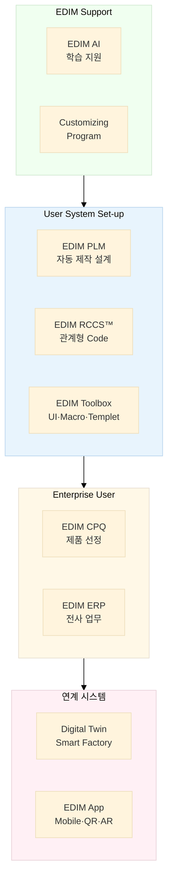
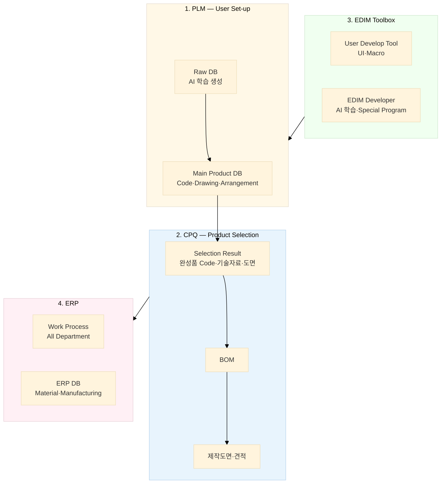
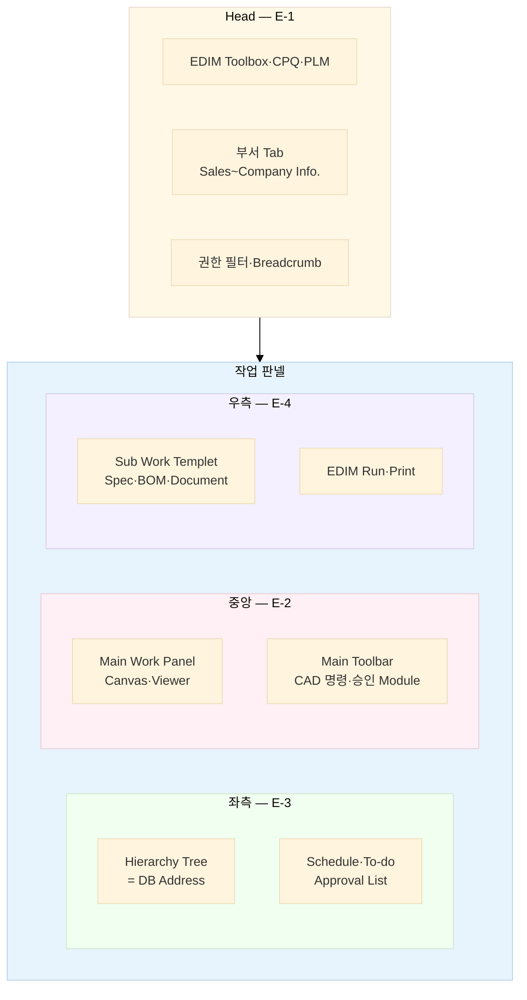
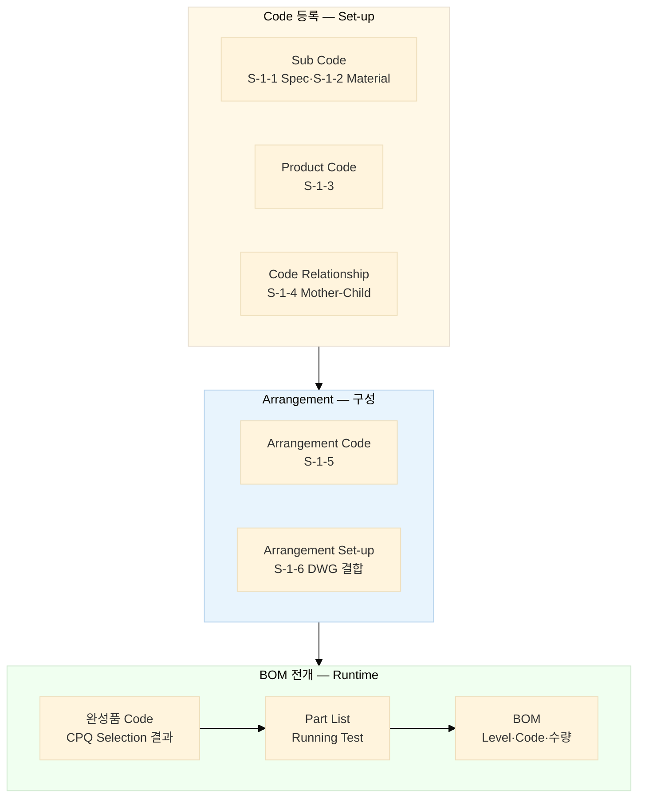
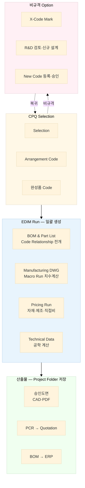
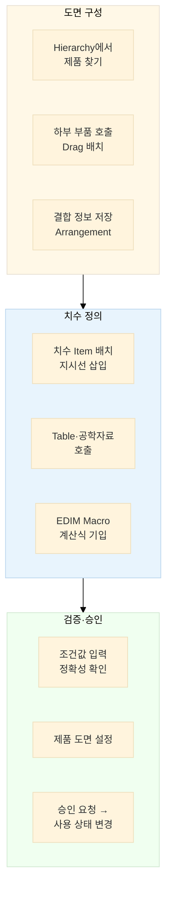
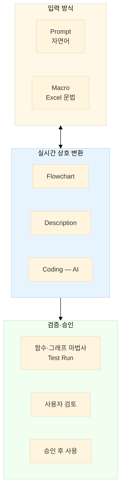
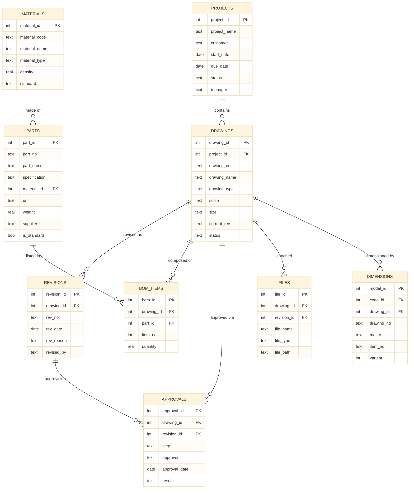

# EDIM 개요

> **EDIM (Enterprise Digital Integration Management)** — CTO/ETO 제조기업용 통합 비즈니스 플랫폼
>
> 본 문서는 `docs/reference/EDIM Tool System EP2.pptx` (NOVA Solution, 2026.03, 78 슬라이드)를 분석·정리한
> 시스템 개요서이며, 후속 정의 문서(클래스 정의서 · DB 정의서 · 기능 정의서)의 기준 문서로 사용한다.

---

## 1. EDIM이란

**EDIM**은 CTO(Configure-to-Order) · ETO(Engineer-to-Order) 방식 제조기업의
**CPQ + PLM + ERP + Digital Twin**을 하나로 통합하는 비즈니스 플랫폼이다.

핵심 가치는 단순하다: **제품 구성(Configuration)을 선택하면, 생산에 필요한 모든 자료가 자동 생성된다.**

| 자동 생성 산출물 | 설명 |
|---|---|
| BOM / Part List | 관계형 코드(RCCS)로 상위 코드에서 전체 하위 부품 전개 |
| 승인도면 / 제작도면 | Macro 기반 파라메트릭 설계로 치수 자동 계산 |
| 기술자료 (Technical Report) | 공학 계산식(Macro) 실행 결과 |
| 견적서 (Quotation) | 자재비 + 제조비 + 직접비 → PCR → 견적 |
| ERP 업무 데이터 | BOM 기반 전사 업무 프로세스 구동 |

- **Document 준비시간: 1시간 이내** (기존 수일 소요 업무)
- 프로젝트 진행 중 사양 변경에도 즉시 재생성으로 빠른 고객 대응
- 비규격 Module은 X-Code로 분기 → R&D 신규 코드 등록 → 표준 프로세스 복귀
- 대상 도메인 예시: 공조기(AHU) · 산업용 송풍기(Fan) 제조 (제품코드 `KAD-450-6-21-4-SR-7` 등)

### 사용자 여정

```
Project Registration ▶ Product Selection(CPQ) ▶ Document(BOM · DWG · Quotation · Tech.) ▷ ERP
```

---

## 2. 시스템 구성

EDIM은 6개 핵심 모듈로 구성되며, 사용자가 직접 시스템을 구축(Set-up)할 수 있는
Toolbox와 이를 지원하는 AI가 차별점이다.



### 모듈 정의

| 모듈 | 역할 | 핵심 산출물 |
|---|---|---|
| **EDIM CPQ** | Configuration 선택에 의한 제품 선정 | 완성품 Code, 승인도면, 기술자료, 견적 |
| **EDIM PLM** | 제작도면 자동 생성 (Macro 파라메트릭 설계) | 제작도면, 설계 검증 |
| **EDIM RCCS™** | 관계형 BOM Data 생성 (Relational Code Configuration System) | Sub/Product/Arrangement Code, BOM |
| **EDIM Toolbox** | 사용자 직접 UI 제작 + Programming (No-Code) | 사용자 UI Form, Macro |
| **EDIM ERP** | BOM 정보 기반 전사 업무 진행 | 부서별 업무 프로세스, Dashboard |
| **EDIM AI** | 사내 자료(도면·서류) 학습 DB 구축, Macro/UI 자동 생성 | AI 학습 DB, 생성형 프로그래밍 |

### 운영 형태

- **SaaS / Web-based Application** + Cloud-based Data Management (Self-managed Server 옵션)
- 3단계 사용자 권한: 개발자(Platform) / 기업 관리자 / 일반 사용자(Data Set-up · 일반)
- System DB에 영향을 주는 작업은 Platform 승인 필수, AI 학습은 Platform 제공자만 수행

---

## 3. 데이터 흐름

PLM에서 구축한 제품 DB를 CPQ가 소비하고, 그 결과가 ERP 전 부서로 흐른다.
Toolbox는 이 전 과정의 UI와 계산 로직을 만든다.



**Data 참조 규칙** (슬라이드 14):

| 데이터 | 생성/참조 방법 |
|---|---|
| Main Product DB (1-1) | 일반 DB(1-2) 자료를 참조하여 사용자 설정 |
| Raw DB (1-3) | EDIM Developer(3-2)의 AI 학습으로 생성 (비용 발생) |
| Selection Result (2-1) | Main Product DB에서 자료 추출 |
| BOM (2-2) | 완성품 Code 기반으로 Main Product DB에서 추출 |
| 제작도면·견적 (2-3) | Part Code 기반으로 ERP Data 또는 Main Product DB에서 추출 |

---

## 4. Main Work Frame — 화면 구조

모든 화면은 하나의 공통 프레임을 따른다. Hierarchy Tree가 **DB 주소 체계** 역할을 겸하는 것이
구조적 특징이다 (Tree를 편집해도 Data는 저장된 Address로 추적 연결).



### Hierarchy Tree 관리 원칙

- Tree 종류: 제품 / 일반 DB / 설정 DB — 모든 DB Address로 활용
- 색인: 각 Tree는 "이름 · 비고 · 심볼"로 관리, 검색 지원
- History 관리: 생성·편집·삭제의 작업자/일자/승인 기록
- 편집 시 DB 상호관계 이상 유무 점검 후 저장, 관리자 승인 후 사용
- EDIM 제공 Tree(편집 불가)와 사용자 제작 Tree 구분

---

## 5. RCCS™ — 관계형 코드 체계

EDIM의 심장. 제품의 속성을 자릿수별 Sub Code로 정의하고, Mother–Child 관계를 설정하면
완성품 Code 하나로 전체 BOM이 자동 전개된다.



### 코드 구조 예시

```
KAD - 450 - 6 - 21 - 4 - SR - 7
 A     B    C    D    E   F    G
 │     │    │    │    │   │    └─ Impeller Type
 │     │    │    │    │   └─ Sensor(FF)
 │     │    │    │    └─ Bearing Type
 │     │    │    └─ Material
 │     │    └─ (속성 항목별 Sub Code)
 │     └─ Fan Size
 └─ Fan Model
```

### 등록 워크플로우

1. **Code Hierarchy 생성** — Specification/Material/Market Product 등 그룹 정의
2. **Code Item List 등록** — 제품·원자재의 특징/속성을 Item으로 등록 → 승인
3. **Product Code 생성** — Main Code 중복 검토 → Sub Code 항목 연결 → 승인
4. **Mother–Child 관계 설정** — 관련 Sub Code 항목 매칭 + 수량 지정 (예: Casing 1, Inlet-Cone 2)
5. **Part List Running Test** — Mother Sub Code 조합 선택 → 조건 일치 Child 전량 추출 검증
6. **승인** — 관리자 승인 후 사용 (모든 단계 공통)

---

## 6. EDIM RUN — 자동 생성 파이프라인

CPQ 선택 결과에서 모든 생산 자료를 일괄 생성하는 실행 엔진.



### 원가 → 견적 흐름

| 단계 | 입력 | 산출 |
|---|---|---|
| Material Cost | 원자재 정보(면적·무게·부피) × 단가 Table(견적/구매이력/재고단가/견적적용) | 자재비 |
| Manufacturing Cost | Work Process의 제조 정보(시간·임율·장비) | 제조비 |
| Direct Cost | 자재비 + 제조비 + 기타 직접비 | 직접비 합계 |
| PCR (Pre-Calculation Report) | 직접비 + 판관비 Table + Business Type | EBIT까지 전개 |
| Quotation | PCR + Customer/Project Information | 견적서 출력 |

---

## 7. 핵심 워크플로우

발표자 노트에서 추출한 3대 표준 업무 흐름. 모든 화면 기능 정의의 기준이 된다.

### 7.1 제품 설계 — 파라메트릭 도면 Set-up



**Runtime 동작**: CPQ 제품 Code 생성 → 연결된 Sub-code 생성 → 조건별 Macro 계산 실행 →
**계산값 Table 생성·저장** → 도면 출력 시 각 치수 공간에 값 기입 → 출력

**후속 공정**: 설계 치수 Table을 API로 2D/3D 도면 생성, Digital Twin용 자료로 활용
→ **도면은 기하가 아니라 데이터가 원본** (Data-first Drawing)

### 7.2 제품 선정 — CPQ

1. Project 검색 → 장비 일람표 확인 → 기본 Arrangement Code 작성
2. 이미지 표에서 모듈을 Drag하여 제품 구성 조합 (이동·삭제·분할·통합)
3. 조합된 도면 치수를 DB에서 표시, 기준 치수 입력 시 하부 자료 자동 반영
4. 3각법 View 선택(6면·전체), 모듈 더블클릭 → 속성(기술·물성·세부치수) 편집 UI
5. 최종 사양으로 도면·부품표·기술자료 출력 (File/Print)
6. 고객 사양 Excel Import → Selection 입력 항 자동 적용도 지원

### 7.3 서류 등록·계산 — Document

1. Hierarchy로 서류 위치 찾기 → 필요 서류 등록
2. 계산용 UI 호출 → 서류의 입력 위치/대상 Item 지정
3. Table·공학자료 호출 → EDIM Macro로 계산식 입력 → 결과값 확인
4. 저장 → 승인 요청 → 승인 후 사용
5. Print Set-up: 양식 배치, Data 위치, 워터마크, Font, 용지, 머리글/바닥글, PDF/Office 내보내기

---

## 8. EDIM Toolbox

사용자가 코딩 없이 UI와 프로그램을 직접 만드는 도구. Qt Designer 방식의 Form Builder +
Excel 문법의 Macro 엔진.

### 8.1 UI Tool

- Widget: Button · Label · Entry · Text · Canvas · Frame · Menu · Scrollbar · Combo box · Table
- 동작 정의: Set-up 전용 창(Templet)에서 위젯별 동작(저장/삭제/복사/등록/찾기)과 대상 Data 연결
- **UI 개발 AI**: 개발하려는 Application 설명 입력 → 용도/항목/필요 DB Table 정리된 UI 자동 제안
- 기타: 인터넷 검색 Tool, AI 질의응답(사내 자료 검색) 내장 예정

### 8.2 Macro 엔진 — 4-Way Sync



**Macro 문법 예시** (Excel 호환 + Table/Variant 참조 확장):

```
=IF(MC,CC>500, Table12(E,10:25,Cos2)+Var(FES,15,F3), Table12(E,10:25,Cos2)+Var(FES,15,F3))*PreC(1)
```

**Technical Highlights** (슬라이드 29):

| 항목 | 기술적 명칭 | 상세 |
|---|---|---|
| 접근성 | No-Code Macro Engine | 코딩 없이 매크로만으로 복잡한 로직 제작 |
| 편의성 | Generative AI Integration | AI가 사용자 의도를 파악하여 코드/매크로 자동 생성 |
| 가시성 | 4-Way Sync View | Flowchart ↔ Macro ↔ Code ↔ Text 실시간 상호 변환 |
| 유연성 | Multi-Modal Input | 텍스트·그림·자연어 등 다양한 방식으로 개발 시작 |
| 지속성 | Asset Management | 개발된 로직의 저장·버전 관리·재사용 |

**프로그램 적용 기준**: 간단한 계산식 = Macro / 복잡한 계산식 = Coding(AI)

---

## 9. EDIM AI

사내 보유 자료(도면·기술자료·일반 서류)를 학습하여 EDIM format DB로 구축한다.

### CAD 도면 학습 전략

CAD 원본이 아니라 **CAD에서 추출한 표현**(텍스트·속성·형상특징·이미지)을 학습 대상으로 한다.

| 난이도 | 방식 | 내용 |
|---|---|---|
| 하 | 메타데이터/속성/텍스트 추출 | 타이틀블록(도번·Rev·작성자·재질·축척), 레이어명, 블록 속성, BOM 규칙 분류 → LLM이 테이블 정리 |
| 중 | 2D 도면 객체 이해 | DWG/DXF 엔티티(라인·폴리라인·치수·해치·블록) 파싱, 치수/공차/기호 텍스트 추출, 스캔 도면은 OCR+도면인식 |
| 상 | 3D 형상 학습 | STEP/IGES 등에서 홀·포켓·필렛 Feature 인식, 형상 유사도 검색 — 전용 데이터셋/라벨링/3D 전처리 필요 |

### 파이프라인

1. CAD를 DXF/STEP 등으로 변환
2. CAD API로 텍스트/속성/구조 추출
3. 결과(구조화 데이터·렌더 이미지·요약 텍스트)로 분류/추출/검색(RAG)/모델학습

### 활용

- **도면**: 기준 제품 도면 학습 → EDIM format DB 구축 (승인 모듈 도면 > Arrangement, 2D > 3D, PDF > DXF)
- **기술자료**: 자동 설계 및 기술자료 생성 기반
- **일반 서류**: ERP 연동 생성 기반 (챗봇)

---

## 10. 도면 DB 모델

슬라이드 26의 도면 관리 스키마. **DB 정의서의 출발점**이 되는 9개 테이블.



> **주목**: `DIMENSIONS.macro` — 치수마다 Macro(계산식)가 저장되어, EDIM Run 시
> Sub Code 조건으로 실행되어 값이 채워진다. 이것이 파라메트릭 설계의 데이터 구조다.
>
> 이 외에 전체 시스템 DB(D-1)에는 TLM Code 관리(Sub Code/Product Code Hierarchy · Code Relationship ·
> Arrangement), CPQ(Selection·Document Form), ERP Set-up(Company DB·부서별 Variant),
> Pre-calculation, Engineering Information, EDIM Tool(UI·Macro·Templet) 영역이 존재한다.

---

## 11. ERP 업무 프로세스 코드

ERP는 부서 간 업무를 프로세스 코드 상태기계로 연결한다 (슬라이드 10 Dashboard).

| 영역 | 프로세스 코드 |
|---|---|
| 영업 | PS(Project 등록) → PCR(견적 검토) → QCR(견적) → OR(수주) → AP(승인 도서) → APP(고객 승인) |
| 기술 | MR(제작의뢰) → MRR(제작 점검) → PL(Part List) → BOM → PSU(제품 Set-up) → PLM(자동 제작 설계) |
| 자재 | PR(자재발주요청) → PO(발주) → MI(자재 입고) → MO(자재 출고) → RM(자재 수령) → ER(자재 품질 검사) |
| 생산 | MP(생산계획) → WR(작업 지시) → SFI(반·완성품 입고) → EF(반·완성품 검사) → FF(완성) → NCF(부적합) → SPP(Stock 생산) |
| 납품/CS | FDR(출고요청) → SFO(고객 출고) → DF(납품) → IR(기성청구) → CR(시운전 요청) → CF(시운전) |
| 재무 | II(세금계산매입) → PA(매입 출금) → IO(세금계산매출) → PI(매출 입금) → RR(정산) → RA(정산승인) → FM(재무관리) |
| 평가 | CE(업체 평가) → PE(Project 평가) / CC(원가 산출) |

**Dashboard**: 전후 공정 관리 · Project 일정 · Event 상황 · 이상 경고(시간·자금) · 프로젝트별 손익 · 자금 흐름 추적

---

## 12. EDIM App — 모바일

사무실 외 지역 업무를 QR Code로 접근 (컴퓨터 접근이 안 되는 현장 대응).

- **주요 사용**: 업무 승인, 업무 소통(Project 중심 대화/History), 자재 입출고, 검수(자재·완성품·설치), 유지보수, 증강현실(AR), 공지
- **QR 정보**: 도면, 각종 서류, Project History, Project 정보, 처리할 업무
- **연계**: Partner(Supplier·Manufacturer·Distributor) 실시간 Code 연결, Smart Factory(Digital Twin, DTDesigner), AR/XR

---

## 13. 컴포넌트 코드 맵

발표자료 전반에 사용된 기능 식별 코드. **기능 정의서의 기능 ID 체계**로 승계한다.

| 코드 | 영역 | 기능 |
|---|---|---|
| **H-1** | Head | Main Work Frame / Head System Set-up |
| **E-1 ~ E-4** | Frame | Main / Main Work Place(Toolbar) / Key Work Place(Hierarchy) / Sub Work Place(Templet) |
| **S-1-1 ~ S-1-6** | TLM Code | Sub Code Spec / Sub Code Material / Product Code / Code Relationship / Arrangement Code / Arrangement Set-up |
| **S-2-1, S-2-2** | Toolbox | UI Design / Program Macro |
| **S-3-1 ~ S-3-5** | CPQ Set-up | Selection / Technical / Document / Print Set-up / User Customizing ERP |
| **S-4-1-1, S-4-1-2** | PLM | Design(DWG) / Work Process(All Department) |
| **C-1 ~ C-3** | CPQ 사용 | Selection / Technical / Document |
| **D-1 ~ D-4** | Data | DB Structure / EDIM RUN / Pre-Calculation & Quotation / Product Cost Management |
| **E-4-2** | 확장 | 건축 설비 Design (Duct 자동 배치·풍량 계산) |

---

## 14. 후속 정의 문서 계획

본 개요서를 기준으로 아래 정의서를 작성한다.

| # | 문서 | 내용 | 기준 절 | 상태 |
|---|---|---|---|---|
| 1 | **DB 정의서** | 46테이블 상세 (컬럼·타입·제약·인덱스) — [`EDIM_DB_정의서.md`](EDIM_DB_정의서.md) / [`EDIM_DB정의서.xlsx`](EDIM_DB정의서.xlsx) | §10, §11 | ✅ v0.1 |
| 2 | **컴포넌트 정의서** | FE/GW/SVC/ENG/AI/INT/INF 39컴포넌트 + API — [`EDIM_컴포넌트_정의서.md`](EDIM_컴포넌트_정의서.md) / [`EDIM_컴포넌트정의서.xlsx`](EDIM_컴포넌트정의서.xlsx) | §2, §6, §13 | ✅ v0.1 |
| 3 | **기능 정의서** | 14모듈 178기능 (기능코드·컴포넌트·DB·Phase 추적) — [`EDIM_기능정의서.xlsx`](EDIM_기능정의서.xlsx) · 보완 근거: [`EDIM_요구사항_보완노트.md`](EDIM_요구사항_보완노트.md) | §7, §13 | ✅ v0.2 |
| 4 | **메뉴 정의서** | Head Tab 기준 97메뉴 (PPT 3차 대조 v0.3) (화면 ID·기능 ID·권한·Phase 매핑) — [`EDIM_메뉴정의서.xlsx`](EDIM_메뉴정의서.xlsx) | §4, §13 | ✅ v0.1 |
| 5 | **화면설계서** | 주요 화면 16종 와이어프레임 W-01~W-16 (설계 노트·기능 ID 연계) — [`EDIM_화면설계서.html`](EDIM_화면설계서.html) · 열람: https://edim.seekerslab.com/design/ | §4, §7 | ✅ v0.1 |
| 6 | **요구사항정의서** | 기능 50·비기능 22·인터페이스 8 (REQ↔기능 추적) — [`02_요구사항/EDIM_요구사항정의서.xlsx`](02_요구사항/EDIM_요구사항정의서.xlsx) | 전체 | ✅ v0.2 |
| 7 | **요구사항추적표 (RTM)** | REQ→기능→메뉴→화면→컴포넌트→DB 자동 조인, 커버리지 178/178 — [`EDIM_요구사항추적표.xlsx`](EDIM_요구사항추적표.xlsx) | 전체 | ✅ 자동 생성 |
| 8 | **산출물목록** | SI 표준 산출물 34종 현황·계획 (문서 레지스터) — [`EDIM_산출물목록.xlsx`](EDIM_산출물목록.xlsx) | - | ✅ v0.1 |
| 9 | **클래스 정의서** | DrawingDocument·Code·Macro·Hierarchy 등 도메인 모델 클래스 | §5, §8, §10 | 예정 |
| 10 | **인터페이스 정의서** | EDIM Run API 상세 스펙, ERP/Digital Twin 연계, Excel Import/Export | §6, §7.1 | 예정 |
| 11 | **권한·승인 정의서** | 역할 4종·매트릭스(97메뉴 자동 도출)·승인 상태기계 13종·Platform 범위·Grade — [`EDIM_권한승인정의서.xlsx`](EDIM_권한승인정의서.xlsx) | §2, §4 | ✅ v0.1 |

> Excel 산출물은 `docs/tools/make_*_xlsx.py`로 재생성 가능 (`py docs/tools/make_feature_xlsx.py` 등).
> DB정의서.xlsx는 `EDIM_DB_정의서.md`를 파싱하여 생성하므로 **MD를 먼저 수정 후 재생성**한다.
> RTM은 요구사항·기능·메뉴 xlsx를 조인하므로 **셋 중 하나라도 바뀌면 재생성**한다.
> 이후 신규 산출물의 필요·상태 관리는 **산출물목록**(§14-8)을 단일 기준으로 한다.

### 참고 자료

| 파일 | 내용 |
|---|---|
| `reference/EDIM Tool System EP2.pptx` | 원본 발표자료 (78 슬라이드) |
| `reference/EDIM Tool System EP2.pdf` | 렌더링본 (다이어그램·UI 목업 확인용) |
| `reference/EDIM_EP2_slide_text.txt` | 슬라이드 텍스트 전문 |
| `reference/EDIM_EP2_speaker_notes.txt` | 발표자 노트 전문 (표준 워크플로우 원문) |

---

*작성일: 2026-07-07 · 출처: NOVA Solution "EDIM Tool System EP2" (2026.03)*
