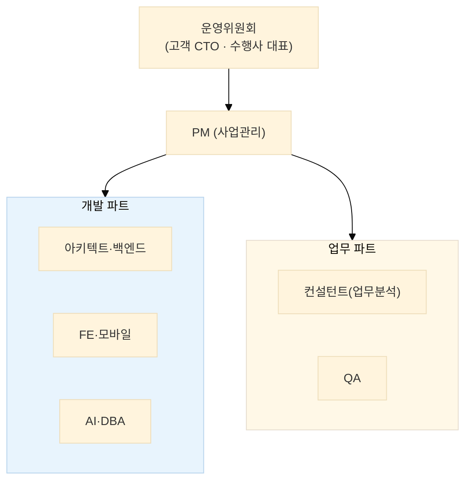

# EDIM 사업수행계획서

> EDIM Tool System 구축 사업의 **범위·조직·일정·관리 체계**를 정의하는 착수 문서.
> 계약 조건(시작일·투입 인력·범위 협의 4건)이 확정되면 v1.0으로 승격하며,
> 그 전까지는 WBS와 동일한 **가정 기반 초안**으로 운영한다.

| 항목 | 내용 |
|---|---|
| 문서 버전 | v0.1 (초안 — 계약 확정 전 가정 기반) |
| 작성일 | 2026-07-11 |
| 사업명 | EDIM Tool System 구축 (CTO/ETO 제조기업용 통합 비즈니스 플랫폼) |
| 관련 문서 | [개요](EDIM_개요.md) · [WBS](04_WBS/EDIM_WBS.xlsx) · [위험관리대장](EDIM_위험관리대장.xlsx) · [보안관리계획서](EDIM_보안관리계획서.md) · [산출물목록](EDIM_산출물목록.xlsx) |
| 일정 가정 | W1 = **2026-08-03(월)** 시작, 총 44주 — 계약 확정 시 WBS `START` 재산정 |

---

## 1. 사업 개요

### 1.1 목적

**EDIM**(Enterprise Digital Integration Management)은 CTO(Configure-to-Order)·ETO(Engineer-to-Order)
제조기업의 **CPQ + PLM + ERP + Digital Twin**을 하나로 통합하는 플랫폼이다.
핵심 가치: **제품 구성(Configuration)을 선택하면 생산에 필요한 모든 자료(BOM·도면·기술자료·견적·ERP 데이터)가 자동 생성**된다
— Document 준비시간 1시간 이내 (기존 수일 소요 업무).

### 1.2 추진 배경·근거

- 원천 요구: `reference/EDIM Tool System EP2.pptx` (NOVA Solution, 78슬라이드) — [개요](EDIM_개요.md)로 분석 완료
- 분석·설계 산출물 선행 완료: 요구사항 80건 → 기능 179건 → 메뉴 98 → 화면 24 → 컴포넌트 39 → DB 54테이블, RTM 커버리지 179/179
- **선행 검증(PoC) 완료**: 개발 서버(edim.seekerslab.com)에 24화면 전량 + 실 DB(PostgreSQL 16) 연동 +
  Macro 엔진·EDIM Run 실 파이프라인(BOM→치수→DXF→견적 PDF)·CAD(DXF)·i18n 런타임 구축 —
  본사업 착수 시 이 코드가 기준선(baseline)이 된다

### 1.3 수행 범위

| 구분 | 범위 |
|---|---|
| 기능 | 14모듈 179기능 ([기능정의서](EDIM_기능정의서.xlsx)) — CPQ·PLM·Code Set-up·ERP·Toolbox·공통·Mobile |
| 화면 | 98메뉴 · 24대표화면 + 상세 4종 — 전 화면 Dense(B안) 디자인 확정 |
| 데이터 | DB 54테이블 462컬럼, 데이터 이행 9대상 ([데이터이행계획서](EDIM_데이터이행계획서.md)) |
| AI | 도면·서류 학습(RAW DB→RAG)·Macro/UI 생성 보조 — Platform 전용 학습 관리 |
| 배포 | SaaS 멀티테넌트 + Self-managed Server 패키지 겸용 (REQ-N-018) |

**범위 협의(미확정) 항목** — M1(요구 확정) 전 결정 필수, [위험관리대장](EDIM_위험관리대장.xlsx) 연동:

1. DUCT 건축 설비 모듈 포함 여부 (별도 견적 사안)
2. ERP 자체 구현 vs 기존 ERP 연계(INT-01) 경계
3. 보안 솔루션(DRM 등) 연계 범위 (DOC-004)
4. CAD 명령표(슬라이드 61)의 사양/참고 여부 · ODA 라이선스 · Digital Twin 연계 스펙

## 2. 수행 조직·역할

### 2.1 투입 인력(안) — 계약 협의 대상

PM 1 · 아키텍트 1 · 백엔드 2~3 · FE 2 · 모바일 1 · AI 1 · DBA 1 · QA 1 · 컨설턴트 1 (WBS 문서정보와 동일)

### 2.2 역할·책임 (R&R)

| 역할 | 책임 | 주요 산출물 |
|---|---|---|
| PM | 일정·범위·위험·보고 총괄, 변경 통제 | 사업수행계획·주간보고·위험관리대장 |
| 아키텍트 | 기술 표준·구조 설계, 코드 리뷰 게이트 | 개발표준·클래스/컴포넌트 정의서 |
| 백엔드/FE/모바일 | 모듈 구현 + 단위테스트 (커버리지 80%) | P1~P5 모듈·테스트 결과 |
| AI | 학습 파이프라인·Macro/UI 생성 보조 | 학습 DB·품질 리포트 |
| DBA | 물리 설계·마이그레이션·이행 | DDL·이행 결과서 |
| QA | 통합·성능 시험, FVT 준비 | 테스트 결과·결함관리대장 |
| 컨설턴트 | AS-IS 조사·업무 검증·교육 | 현행분석서·교육 자료 |
| **고객사** | 원천 자료 제공·업무 검증·검수, 협의 4건 의사결정 | 요구 확정·FVT 승인 |

## 3. 일정 계획

구조는 **SI 8단계 × 개발 Phase(P1~P5, 중첩 진행)** — 상세는 [WBS](04_WBS/EDIM_WBS.xlsx) (38 Task·44주 간트).

| 단계 | 주차 | 핵심 내용 |
|---|---|---|
| 1 착수 | W1~2 | 킥오프·수행계획 확정, CI 파이프라인, 개발표준 v1.0 |
| 2 분석 | W3~6 | AS-IS 조사, 요구 확정(협의 4건), 이행 대상 조사 |
| 3 설계 | W7~12 | 화면·DB·인터페이스·클래스 v1.0 |
| 4 구현 | W9~36 | P1 RCCS 코어 → P2 설계·Run → P3 원가·문서 → P4 Toolbox·AI → P5 ERP·모바일 |
| 5 테스트 | W31~38 | 통합 E2E·성능(REQ-N-001~005)·결함 조치·FVT 준비 |
| 6 이행 | W35~40 | 데이터 이행·AI 학습·운영 환경 구축 |
| 7 안정화 | W39~42 | 파일럿 운영·교육·매뉴얼 |
| 8 종료 | W43~44 | FVT 검수·인수인계 |

**마일스톤**: M1 요구 확정(W6) · M2 설계 완료(W12) · M3 핵심 E2E 데모(W20 — 코드 등록→CPQ→Run→도면·견적 자동 생성) · M4 검수(W43)

## 4. 관리 체계

### 4.1 보고·회의

| 구분 | 주기 | 내용 |
|---|---|---|
| 주간 보고 | 매주 | 진척(WBS 대비)·이슈·차주 계획 |
| 단계 검토회 | M1~M4 | 산출물 승인 게이트 — 검토회의록 |
| 운영위원회 | 월 1회 | 범위·일정 변경, 위험 에스컬레이션 |
| 이슈 처리 | 수시 | 48시간 내 1차 응답, 지연 시 운영위 상정 |

### 4.2 산출물·형상 관리

- 단일 레지스터: [산출물목록](EDIM_산출물목록.xlsx) — 신규 문서는 레지스터 등록이 선행
- docs-as-code: MD/생성 스크립트가 원본, xlsx·PDF·포털은 재생성 ([docs/README](README.md) §4 절차 준수)
- 추적 체계: REQ → 기능 → 메뉴 → 화면 → 컴포넌트 → DB → FVT, RTM 자동 검증(미연결 0 유지)
- 버전 규칙: `v0.x` 초안 반복 → 고객 승인 시 `v1.0`. Git 단일 저장소, 커밋·리뷰 표준은 [개발표준](EDIM_개발표준정의서.md) §6

### 4.3 변경 관리

1. 변경요청(CR) 접수 — 요구·범위·일정 영향 기술
2. 영향 분석 — RTM으로 파급 범위(기능→화면→DB) 자동 식별
3. 운영위 승인 → WBS·산출물 개정 (개정 트리거는 [개발표준](EDIM_개발표준정의서.md) §12 연동)

### 4.4 위험·보안 관리

- 위험: [위험관리대장](EDIM_위험관리대장.xlsx) — 주간 보고 시 갱신, 등급 심각 항목은 운영위 상정
- 보안: [보안관리계획서](EDIM_보안관리계획서.md) — 개발·데이터·문서·인프라 보안 기준과 사고 대응 절차
- 품질: 단위테스트 커버리지 80%·통합 E2E·성능시험 합격 기준은 [개발표준](EDIM_개발표준정의서.md) §7 및 FVT 연동

## 5. 전제 조건·제약

- 시작일·투입 인력·범위 협의 4건은 계약 시 확정 — 확정 전 수치는 모두 가정
- Macro Excel 호환 문법은 특허 검토 결과에 따라 조정될 수 있음 (REQ-N-021)
- 고객사는 원천 자료(코드·도면·단가) 추출과 업무 검증 인력을 제공한다 ([데이터이행계획서](EDIM_데이터이행계획서.md) §6)

---

## 변경 이력

| 버전 | 일자 | 내용 |
|---|---|---|
| v0.1 | 2026-07-11 | 최초 작성 — WBS v0.1·산출물목록 v0.1 기준, 계약 확정 전 가정 기반 초안 |
