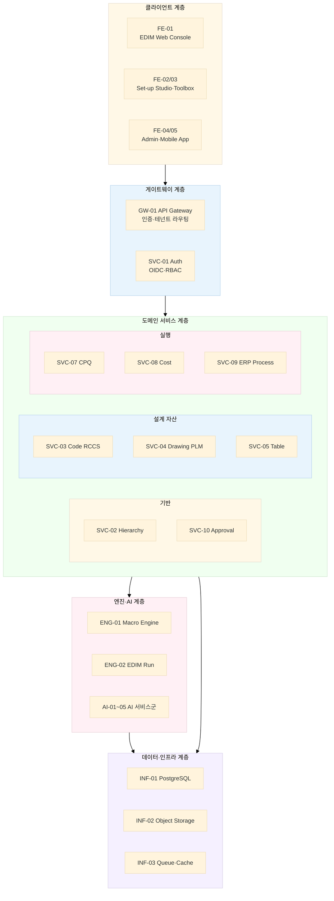
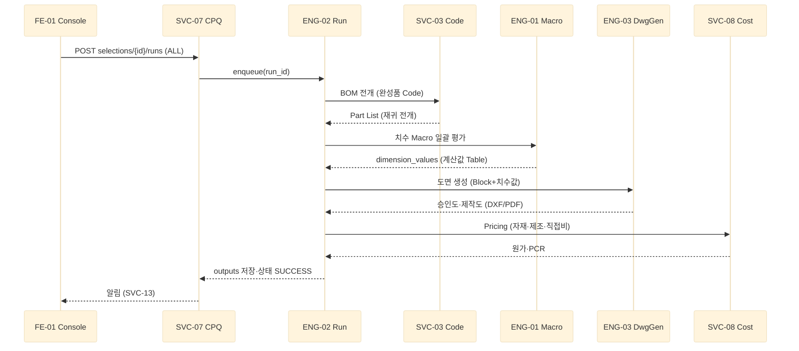
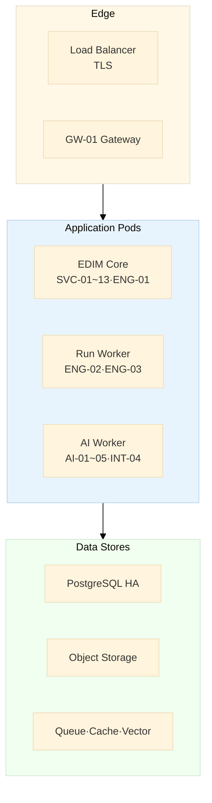

# EDIM 컴포넌트 정의서

> **기준 문서**: [`EDIM_개요.md`](EDIM_개요.md) (기능 코드 §13) · [`EDIM_DB_정의서.md`](EDIM_DB_정의서.md) (테이블 46종)
> **목적**: EDIM 개발에 필요한 컴포넌트(클라이언트·API·서비스·엔진·AI·연계·인프라)를 식별하고
> 책임·API·의존관계·개발 단계를 정의한다.

| 항목 | 내용 |
|---|---|
| 문서 버전 | v0.1 (초안) |
| 작성일 | 2026-07-07 |
| 아키텍처 방침 | **모듈러 모놀리스** 코어 + 분리형 워커(Run·AI·변환) — §1.2 |
| 컴포넌트 ID 체계 | `FE-`(클라이언트) `GW-`(게이트웨이) `SVC-`(도메인 서비스) `ENG-`(엔진) `AI-`(AI) `INT-`(연계) `INF-`(인프라) |

---

## 1. 아키텍처 총괄

### 1.1 컴포넌트 구성도

### 1.2 아키텍처 결정

| # | 결정 | 근거 |
|---|---|---|
| 1 | **모듈러 모놀리스 코어** — SVC-01~13을 단일 배포 단위 내 모듈로 시작, 도메인 경계는 패키지/스키마로 유지 | SI 초기 속도·운영 단순성. 모듈 경계를 지키면 추후 MSA 분리 가능 |
| 2 | **분리형 워커** — ENG-02(EDIM Run)·AI 파이프라인·CAD 변환(INT-04)은 처음부터 별도 프로세스 | 장시간 작업·CPU 부하·외부 바이너리(ODA) 격리, 큐 기반 비동기 |
| 3 | **API-First** — 모든 화면은 공개 API만 사용 (내부 전용 API 금지) | Toolbox 사용자 제작 UI가 동일 API를 호출해야 함 (§8 개요서) |
| 4 | **도면 = 데이터** — 기하는 `DrawingDocument` JSON 표준 (프로토타입 `edim-ai-blueprint` 스키마 승계) | 개요서 §7.1 Data-first Drawing |
| 5 | **승인 게이트 공통화** — 자산 변경은 SVC-10을 경유해야 `APPROVED` 전이 가능 | 개요서 §1.4 승인 패턴 |

---

## 2. 클라이언트 컴포넌트 — FE

### FE-01 EDIM Web Console

Enterprise User가 사용하는 메인 웹 애플리케이션. Main Work Frame(H-1/E-1~E-4) 구현체.

| 항목 | 내용 |
|---|---|
| 사용자 | 일반 사용자(GENERAL), Data Set-up 사용자 |
| 기능 코드 | E-1~E-4, C-1(Selection)·C-2(Technical)·C-3(Document), ERP 업무 화면 |
| 주요 화면 | Head Tab + Hierarchy Tree 패널, CPQ 제품 선정(Arrangement Canvas·DWG View), 기술자료·서류, Sub Work Place(Spec·BOM·Quotation·Drawing List), Schedule/To-do/승인함, Dashboard |
| 핵심 요소 | ① **Drawing Viewer** — DrawingDocument JSON→SVG 렌더(팬줌·레이어·치수 표시) ② **동적 Form 렌더러** — `tbx_ui_form.layout_def` 해석 실행 ③ 3각법 6면 View 전환 |
| 의존 | GW-01, SVC-02/03/04/05/07/08/09/10, ENG-02(Run 요청) |
| 기술 후보 | React + TypeScript + Vite, SVG 렌더(1만 엔티티 초과 시 Canvas/WebGL 전환) |

### FE-02 Set-up Studio

기업 관리자·Set-up 사용자의 시스템 구축 도구.

| 항목 | 내용 |
|---|---|
| 기능 코드 | S-1-1~S-1-6(Code 등록), S-4-1-1(Design DWG), S-4-1-2(Work Process), S-3-1~S-3-4(CPQ Set-up) |
| 주요 화면 | Sub/Product Code 등록(중복검토·승인요청), Code Relationship(Mother-Child·Running Test), Arrangement Set-up, **Drawing Editor**(CAD형 캔버스: 부품 Drag 배치·치수선·지시선·Block 저장·Part Relation·설계검증 설정), Work Process 데이터 입력, Selection/Document/Print Form 구성 |
| 핵심 요소 | Drawing Editor — CAD 명령(복사/이동/반전/연장/삭제/회전), 스냅(끝점·중앙·중심), 치수↔부품 동기화(Parametric), Undo/Redo |
| 의존 | SVC-02/03/04/05/06/10, ENG-01(Macro 바인딩·Test Run) |
| 기술 후보 | FE-01과 동일 스택, Canvas 기반 에디터 모듈 분리 |

### FE-03 Toolbox Designer

사용자 제작 UI·프로그램 도구 (S-2-1, S-2-2).

| 항목 | 내용 |
|---|---|
| 주요 화면 | ① **UI Designer** — Widget Palette(Button/Label/Entry/Text/Canvas/Frame/Menu/Combo/Table) Drag&Drop, 속성 편집기, 동작 Templet 바인딩, AI UI 제안 ② **Macro Studio** — Prompt/Macro/Flowchart/Description/Coding 4-Way Sync 편집기, 함수 마법사·그래프 마법사, Data Information Call(Table 탐색), Test Run, 승인 요청 |
| 의존 | SVC-05/06/10, ENG-01, AI-03(Macro 생성)/AI-04(UI 생성) |
| 산출물 | `tbx_ui_form.layout_def`, `tbx_macro` 레코드 |

### FE-04 Admin Console

플랫폼(NOVA)·테넌트 관리자용 운영 콘솔.

| 항목 | 내용 |
|---|---|
| 사용자 | PLATFORM, ADMIN |
| 주요 화면 | 테넌트 관리, 사용자·역할·권한(Head Tab/Hierarchy/기능 단위), 승인 관리(일괄 처리·위임), Hierarchy 마스터 관리(is_system Tree), **AI 학습 관리**(Platform 전용 — 학습 데이터 등록·파이프라인 실행·품질 확인), System DB 변경 승인, 사용량·감사 로그 조회 |
| 의존 | SVC-01/02/10, AI-02, INF-07(모니터링) |

### FE-05 EDIM App

모바일 앱 (개요서 §12).

| 항목 | 내용 |
|---|---|
| 주요 기능 | QR 스캔→도면/서류/Project 정보 열람, 업무 승인, Project 중심 대화(History), 자재 입출고 처리, 검수(자재·완성품·설치), 유지보수 접수, 공지, AR 뷰(3D 모델 오버레이) |
| 의존 | GW-01, SVC-04/09/10/13, INT-05(QR), INT-02(Digital Twin·AR 데이터) |
| 기술 후보 | React Native 또는 Flutter, 오프라인 캐시(현장 네트워크 불안정 대응) |

---

## 3. 게이트웨이·인증 — GW / SVC-01

### GW-01 API Gateway

| 항목 | 내용 |
|---|---|
| 책임 | 단일 진입점: TLS 종단, JWT 검증, **테넌트 해석**(토큰 claim→`tenant_id`), 라우팅, Rate Limit, 요청 로깅 |
| 기술 후보 | Kong / Traefik / Spring Cloud Gateway 중 택1 (§9 미결정) |

### SVC-01 Auth Service

| 항목 | 내용 |
|---|---|
| 책임 | 인증(OIDC·ID/PW), 토큰 발급/갱신, RBAC 평가(`sys_role_permission` — HEAD_TAB/HIERARCHY/FEATURE/TABLE × VIEW/EDIT/APPROVE/SETUP), 세션·비밀번호 정책 |
| 주요 API | `POST /auth/login` · `POST /auth/refresh` · `GET /auth/me` · `GET /auth/permissions?resource=` |
| DB | sys_user, sys_role, sys_user_role, sys_role_permission |

---

## 4. 도메인 서비스 — SVC-02 ~ SVC-13

> 공통 API 규약: `[/api/v1]` REST, 커서 페이지네이션, RFC 9457 오류 형식, 모든 요청 tenant 필수.
> 승인 대상 자산의 쓰기 API는 `approval_status=DRAFT`로만 저장되고, 승인 전이는 SVC-10 경유.

### SVC-02 Hierarchy Service

| 항목 | 내용 |
|---|---|
| 책임 | Hierarchy Tree CRUD·이동·병합, Address 발급·이력 추적, 심볼·검색, DB 상호관계 점검 후 저장 |
| 주요 API | `GET /hierarchy/trees?type=` · `GET /hierarchy/nodes/{id}/children` · `POST /hierarchy/nodes` · `PATCH /hierarchy/nodes/{id}/move` · `GET /hierarchy/resolve?address=` |
| DB | sys_hierarchy, sys_history |

### SVC-03 Code Service — RCCS

| 항목 | 내용 |
|---|---|
| 책임 | 코드 그룹/자릿수/값 등록(중복검토), Product Code 조립, Mother-Child 관계 관리, **BOM 전개**(재귀 CTE·깊이 제한), **Part List Running Test**, Arrangement 코드·구성 |
| 주요 API | `POST /codes/groups` · `POST /codes/products` · `GET /codes/products/{id}/check-duplicate` · `POST /codes/relationships` · `POST /codes/products/{id}/expand`(BOM 전개) · `POST /codes/relationships/running-test` · `POST /codes/arrangements` |
| DB | code_* 8테이블 |
| 핵심 로직 | `match_condition` slot 매핑 해석, DAG 순환 검증 |

### SVC-04 Drawing Service — PLM

| 항목 | 내용 |
|---|---|
| 책임 | 도면·개정·승인 관리, DrawingDocument(Block 단위) 저장/호출, 치수(dimension)·부품관계·설계검증 규칙 관리, Import(DXF/DWG/PDF/STEP→INT-04 위임)·Export(DXF/PDF) |
| 주요 API | `POST /drawings` · `GET /drawings/{id}/document?block=` · `PUT /drawings/{id}/document` · `POST /drawings/{id}/revisions` · `POST /drawings/{id}/dimensions` · `POST /drawings/{id}/relations` · `POST /drawings/import` · `POST /drawings/{id}/export?format=dxf` |
| DB | dwg_* 12테이블, prt_part, mat_material |

### SVC-05 Table Service

| 항목 | 내용 |
|---|---|
| 책임 | 데이터 Table 정의·행 관리, Excel Import(INT-03), **Macro 참조 조회 API**(`Table12(E,10:25)` 해석용 범위 조회), 승인 |
| 주요 API | `POST /tables` · `POST /tables/{id}/rows:bulk` · `GET /tables/{id}/query?cols=&keyFrom=&keyTo=` · `POST /tables/import-excel` |
| DB | tbl_data_table, tbl_data_row |

### SVC-06 Toolbox Service

| 항목 | 내용 |
|---|---|
| 책임 | UI Form·Templet 저장/버전/승인, Form 렌더 정의 서빙(FE 동적 렌더러 대상), Form↔Head/Hierarchy 연결 관리 |
| 주요 API | `POST /toolbox/forms` · `GET /toolbox/forms/{id}?version=` · `POST /toolbox/forms/{id}/publish` · `GET /toolbox/templets?type=` |
| DB | tbx_ui_form, tbx_templet |

### SVC-07 CPQ Service

| 항목 | 내용 |
|---|---|
| 책임 | 제품 선정 세션 관리(slot 값 선택·사양 입력·Excel Import), Arrangement 구성 저장, 완성품 Code 생성, **X-Code 비규격 분기**(R&D 검토 요청→신규 코드 등록 추적), Run 요청 발행 |
| 주요 API | `POST /cpq/selections` · `PATCH /cpq/selections/{id}/slots` · `POST /cpq/selections/{id}/finalize` · `POST /cpq/selections/{id}/x-code-review` · `POST /cpq/selections/{id}/runs`(ENG-02 위임) · `GET /cpq/runs/{runId}` · `GET /cpq/runs/{runId}/outputs` |
| DB | cpq_* 4테이블 |

### SVC-08 Cost Service

| 항목 | 내용 |
|---|---|
| 책임 | 4종 단가 관리(견적/구매이력/재고/견적적용), 자재비·제조비·직접비 계산(ENG-02가 호출), PCR 생성(Business Type별·EBIT 전개), 견적서 생성·출력(SVC-11 위임) |
| 주요 API | `POST /cost/prices` · `GET /cost/prices/resolve?codeId=&source=` · `POST /cost/pcr` · `POST /cost/quotations` · `POST /cost/quotations/{id}/render` |
| DB | cst_* 4테이블 |

### SVC-09 ERP Process Service

| 항목 | 내용 |
|---|---|
| 책임 | 프로세스 정의(§11 코드 40종) 관리, 이벤트 상태기계(TODO→IN_PROGRESS→DONE, 이상 경고), 부서별 To-do/Done 목록, Work Process 공정 데이터, Dashboard 집계(전후 공정·일정·손익·자금) |
| 주요 API | `GET /erp/processes` · `POST /erp/events` · `PATCH /erp/events/{id}/status` · `GET /erp/events?assignee=&status=` · `GET /erp/dashboard/project/{projectId}` · `POST /erp/work-processes` |
| DB | erp_process_def, erp_process_event, erp_work_process, com_company |

### SVC-10 Approval Service

| 항목 | 내용 |
|---|---|
| 책임 | 공통 승인 워크플로우(요청→검토→승인/반려), 대상 자산 `approval_status` 전이(트랜잭션), 승인 요청함·위임, 알림 발행(SVC-13) |
| 주요 API | `POST /approvals` · `GET /approvals/inbox` · `POST /approvals/{id}/decide` · `GET /approvals/history?table=&targetId=` |
| DB | sys_approval_request, sys_history + 대상 테이블 |

### SVC-11 Document/Print Service

| 항목 | 내용 |
|---|---|
| 책임 | Print Form 기반 문서 렌더링 — 양식 배치·Data 위치·그래프·워터마크·Font·용지·머리글/바닥글 (S-3-4), PDF 생성, Office(xlsx/docx) 내보내기 |
| 주요 API | `POST /documents/render`(form_id + data → PDF) · `POST /documents/export-office` |
| DB | tbx_ui_form(PRINT), dwg_file |
| 기술 후보 | Headless Chromium(HTML→PDF) 또는 전용 리포트 엔진 |

### SVC-12 File Service

| 항목 | 내용 |
|---|---|
| 책임 | 객체 스토리지 추상화, **Project Folder 규약**(`/project/{no}/DWG|Price|Data|BOM/`— 개요서 §6 저장 규칙), 서명 URL 업/다운로드, 바이러스 검사 훅 |
| 주요 API | `POST /files/upload-url` · `GET /files/{id}/download-url` · `GET /files?projectId=&folder=` |
| DB | dwg_file / INF-02 |

### SVC-13 Notification Service

| 항목 | 내용 |
|---|---|
| 책임 | 알림 생성·조회(승인·To-do·일정·이상경고), 채널 발송(웹 실시간 SSE/WebSocket, 모바일 푸시), 공지 |
| 주요 API | `GET /notifications` · `POST /notifications/read` · WS `/ws/notifications` |
| DB | sys_notification |

---

## 5. 엔진 — ENG

### ENG-01 Macro Engine

EDIM의 계산 심장. 라이브러리 형태로 코어에 내장하되 실행 샌드박스는 격리.

| 항목 | 내용 |
|---|---|
| 책임 | ① Excel 호환 문법 **파서**(AST) ② **참조 해석기** — `TableN(...)`→SVC-05, `Var(...)`→Variant, `PreC(n)`→선행 결과 ③ **평가기** — 공학 함수 라이브러리 포함 ④ **검증기** — 참조 추출(`tbx_macro_ref`)·DAG 순환 점검·우선순위(design/data priority) 위상 정렬 ⑤ Test Runner(조건값 입력→결과) |
| 실행 모델 | 순수 함수 평가(부수효과 금지), 타임아웃·재귀 깊이 제한, 결과는 호출자에 반환 |
| 인터페이스 | 내부 API: `evaluate(macroId, context)` / `validate(expr)` / `extractRefs(expr)` — REST `POST /macros/{id}/test-run` |
| DB | tbx_macro, tbx_macro_ref (읽기: tbl_*) |
| 유의 | Excel 문법 특허 검토 결과에 따라 문법 조정 가능 (DB 정의서 §12-4) |

### ENG-02 EDIM Run Orchestrator

비동기 잡 워커. 개요서 §6 파이프라인의 구현체.

| 항목 | 내용 |
|---|---|
| 책임 | Run 잡 소비(INF-03 큐), 단계 오케스트레이션(BOM→치수 Macro→도면→원가→기술자료→서류), 산출물 Project Folder 저장(SVC-12), 부분 실패 처리(단계별 재시도·오류 목록), 진행률 이벤트 발행 |
| 실행 유형 | `BOM` / `DWG` / `PRICING` / `TECH` / `ALL` — BOM 관련 내용만 "Run"하는 부분 실행 지원 |
| DB | cpq_run, cpq_output |

### ENG-03 Drawing Generation Engine

| 항목 | 내용 |
|---|---|
| 책임 | Block 도면 + 계산 치수값 → 완성 도면 합성(Parametric 반영), 조립(Arrangement point)·치수선 배치, DXF(R2010)/PDF 출력, **치수 Table API로 2D/3D 생성**(개요서 §7.1 후속 공정), 3D(STEP/GLB) 생성 연계 |
| 기술 후보 | ezdxf(DXF), 자체 DrawingDocument 합성기 — 프로토타입 `dxf_exporter` 승계 |

---

## 6. AI 컴포넌트 — AI

> AI 학습(AI-02)은 **Platform 권한 전용** (개요서 §2). 생성 결과는 모두 승인 게이트(SVC-10) 통과 후 사용.

| ID | 이름 | 책임 | 연동 |
|---|---|---|---|
| **AI-01** | AI Gateway | LLM 호출 단일화(Claude API), 프롬프트 템플릿·버전 관리, 토큰/비용 계측, PII 필터 | 전 AI 컴포넌트의 하위 계층 |
| **AI-02** | Drawing Learning Pipeline | CAD→DXF/STEP 변환(INT-04)→ ①메타데이터/타이틀블록/속성 추출 ②2D 엔티티(치수·기호) 파싱, 스캔 도면 OCR ③3D Feature 인식(후순위) → 구조화 데이터·렌더 이미지·요약 생성 → RAG 인덱싱(INF-05) | SVC-04, INT-04, INF-05 |
| **AI-03** | Macro Generation | Prompt→Macro/Flowchart/Description/Coding 생성·**4-Way 상호 변환**, 기능 찾기(자연어→함수 추천) | ENG-01(문법 검증), FE-03 |
| **AI-04** | UI Generation | Application 설명→용도·항목·필요 DB Table 정리→UI Form 제안(`layout_def` 초안) | SVC-06, FE-03 |
| **AI-05** | Knowledge Chatbot | 사내 자료(도면·기술자료·일반 서류) RAG Q&A, ERP 연동 서류 생성 지원 | INF-05, SVC-04/05 |

**API 예시**: `POST /ai/macro/generate` · `POST /ai/macro/convert?from=prompt&to=flowchart` · `POST /ai/ui/suggest` · `POST /ai/chat` · `POST /ai/learning/jobs`(Platform 전용)

---

## 7. 연계 컴포넌트 — INT

| ID | 이름 | 책임 | 비고 |
|---|---|---|---|
| **INT-01** | External ERP Connector | 고객사 기존 ERP와 BOM·발주·회계 데이터 교환 (REST/파일 어댑터 플러그블) | 대상 ERP 미확정 (§9) |
| **INT-02** | Digital Twin Connector | DTDesigner 연계 — 치수 Table·3D 모델·실시간 Code 연결, AR/XR 데이터 제공 | 개요서 §12 |
| **INT-03** | Excel Import/Export | 고객 사양 Import(정해진 양식→Selection 입력), Table 행 Import, 견적·BOM Export | SVC-05/07 하위 |
| **INT-04** | CAD Converter | DWG↔DXF(ODA File Converter), PDF→DXF, 2D→3D(STEP) 변환 워커 — 외부 바이너리 격리 | 프로토타입 `dwg_converter` 승계 |
| **INT-05** | QR Service | 도면·서류·Project·자산의 QR 발급/해석 (모바일 진입점) | FE-05 |

---

## 8. 인프라 — INF

| ID | 구성 | 용도 |
|---|---|---|
| **INF-01** | PostgreSQL 16 (HA) | 주 데이터베이스 — DB 정의서 46테이블 |
| **INF-02** | Object Storage (S3 호환) | CAD·PDF·이미지 파일, Project Folder |
| **INF-03** | Message Queue (Redis Streams 또는 RabbitMQ) | EDIM Run·AI·변환 잡, 이벤트 |
| **INF-04** | Redis Cache | 세션·권한 캐시, Table 조회 캐시(Macro 평가 가속) |
| **INF-05** | Vector Store + 검색 (pgvector 또는 OpenSearch) | AI RAG 인덱스 |
| **INF-06** | Kubernetes + CI/CD | 배포 — SaaS 멀티테넌트 / Self-managed 서버 패키지 겸용 |
| **INF-07** | 모니터링 (Prometheus·Grafana·Loki) | 메트릭·로그·알림 |

### 배포 토폴로지

---

## 9. 컴포넌트 ↔ 기능 코드 ↔ DB 추적표

| 컴포넌트 | 기능 코드 (개요서 §13) | 주 DB 테이블 |
|---|---|---|
| FE-01 Console | E-1~E-4, C-1~C-3 | (API 경유) |
| FE-02 Set-up Studio | S-1-1~6, S-3-1~4, S-4-1-1/2 | (API 경유) |
| FE-03 Toolbox Designer | S-2-1, S-2-2 | (API 경유) |
| SVC-02 Hierarchy | E-3, H-1 | sys_hierarchy |
| SVC-03 Code | S-1-1~6, D-1 | code_* |
| SVC-04 Drawing | S-4-1-1, E-4 | dwg_*, prt_, mat_ |
| SVC-05 Table | E-4 Table mgmt | tbl_* |
| SVC-06 Toolbox | S-2-1 | tbx_ui_form/templet |
| SVC-07 CPQ | C-1~C-3, S-3-1~3 | cpq_* |
| SVC-08 Cost | D-3, D-4 | cst_* |
| SVC-09 ERP | S-3-5, S-4-1-2, §11 | erp_*, com_ |
| SVC-10 Approval | 전 영역 승인 | sys_approval_request |
| SVC-11 Print | S-3-4 | tbx_ui_form(PRINT) |
| ENG-01 Macro | S-2-2 | tbx_macro/_ref |
| ENG-02 Run | D-2 EDIM RUN | cpq_run/output |
| ENG-03 DwgGen | D-2, §7.1 후속공정 | dwg_document |
| AI-02~05 | 개요서 §9 | (RAG 인덱스) |

---

## 10. 개발 단계

| Phase | 범위 | 검증 목표 |
|---|---|---|
| **P1 — RCCS 코어** | SVC-01/02/03/05 + ENG-01 + FE-02(코드 등록·Table) 최소 화면 | 코드 등록→관계 설정→**BOM 전개·Running Test** 성립 |
| **P2 — 설계·Run** | SVC-04/07/10/12 + ENG-02/03 + FE-01(Selection)·FE-02(Drawing Editor) | Selection→**EDIM Run→도면·BOM 자동 생성** E2E |
| **P3 — 원가·문서** | SVC-08/11 + INT-03 + PCR/견적 화면 | Run 산출물에 **견적서·PCR** 포함 (Document 1시간 이내 목표 검증) |
| **P4 — Toolbox·AI** | SVC-06/13 + FE-03 + AI-01/03/04 | 사용자 제작 UI·**AI Macro 생성** 동작 |
| **P5 — ERP·모바일** | SVC-09 + FE-04/05 + INT-01/02/05 + AI-02/05 | 전사 프로세스·Dashboard·모바일 승인·AI 학습 |

> 프로토타입 `edim-ai-blueprint`(FastAPI+React)는 P2의 Drawing Viewer/DXF Export/AI 생성 경로 선행 검증체로 활용.

---

## 11. 미결정 사항

| # | 항목 | 내용 |
|---|---|---|
| 1 | 백엔드 언어/프레임워크 | 프로토타입은 Python(FastAPI). 본 개발 Java(Spring)/Kotlin/Python 중 고객사 운영 역량 기준 확정 |
| 2 | 게이트웨이 제품 | Kong/Traefik/Spring Cloud Gateway |
| 3 | 동적 Form 렌더러 범위 | Toolbox UI의 표현력 한계선 (스크립트 허용 여부 — 보안) |
| 4 | Drawing Editor 자체 개발 vs 상용 | CAD형 캔버스 자체 개발 공수 대비 상용 SDK(예: 오픈소스 CAD 커널) 검토 |
| 5 | 실시간 협업 | Drawing Editor 동시 편집 필요 여부 (P2 이후) |
| 6 | LLM 모델·배치 | Claude API(기본) vs 온프레미스 — Self-managed 고객 대응 |
| 7 | 3D 파이프라인 | 2D→3D 생성 범위·포맷(STEP/GLB) — PoC 후 확정 |

---

## 12. 변경 이력

| 버전 | 일자 | 내용 |
|---|---|---|
| v0.1 | 2026-07-07 | 최초 작성 — FE 5·GW 1·SVC 13·ENG 3·AI 5·INT 5·INF 7 = 39 컴포넌트 |
