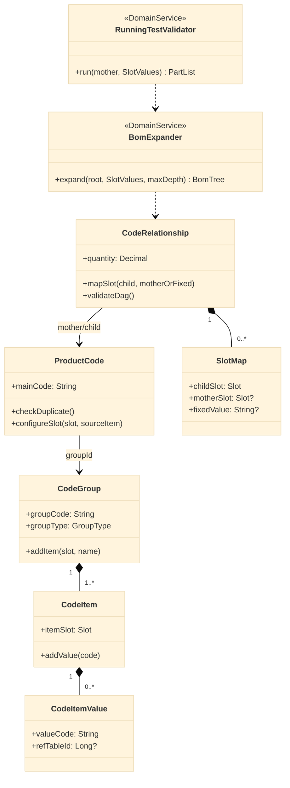
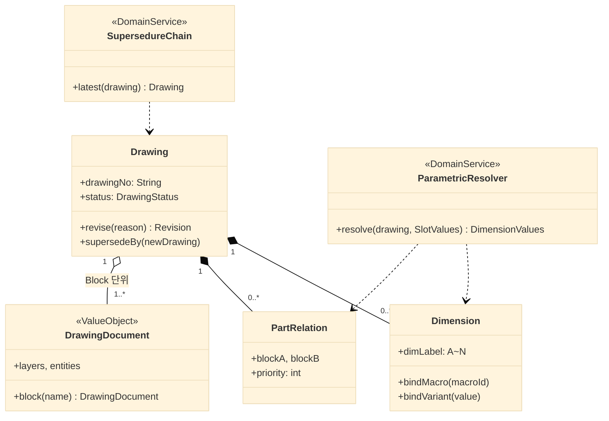

# EDIM 클래스 정의서

> 도메인 모델(Aggregate·엔티티·VO·도메인 서비스)의 **언어 중립** 정의.
> 백엔드 언어 확정(컴포넌트정의서 §11-1) 시 표기법·패키지 규칙만 §개발표준 5에 따라 구체화하며,
> 본 문서의 모델 구조는 언어와 무관하게 유지된다.

| 항목 | 내용 |
|---|---|
| 문서 버전 | v0.1 (초안) |
| 작성일 | 2026-07-07 |
| 모델링 기준 | DDD-lite — 모듈 경계 = 개발표준 §5 도메인 패키지, Aggregate 단위 트랜잭션 |
| 관련 | DB정의서 v0.4(영속 매핑) · 컴포넌트정의서(서비스 배치) · OpenAPI(표현 계층 스키마) |

---

## 1. 모델링 원칙

1. **Aggregate = 트랜잭션 경계** — Root를 통해서만 내부 엔티티 변경. 타 Aggregate는 ID 참조
2. **인바리언트는 도메인에** — DB 제약(XOR·UQ·EXCLUDE)은 최후 방어선, 동일 규칙을 도메인 메서드가 선검증 (§6 대응표)
3. **Approvable 공통 계약** — 승인 대상 자산은 공통 인터페이스 구현, 전이는 `ApprovalGate` 도메인 서비스만 수행 (개발표준 §1-2)
4. **VO 우선** — `HierarchyAddress`, `SlotValues`, `RowKey`, `Money`, `DateRange` 등 개념은 원시 타입 금지
5. **엔진은 순수** — Macro/BOM 엔진은 부수효과 없는 순수 계산 (저장은 응용 계층)
6. 명명: 클래스 PascalCase 영문 — 도메인 용어는 요구사항정의서 '용어정의' 준수 (Arrangement, SlotMap 등)

---

## 2. 공통 커널 (shared)

| 클래스 | 유형 | 책임 · 주요 멤버 | 영속 |
|---|---|---|---|
| `TenantContext` | VO | 요청 스코프 테넌트/사용자 (`tenantId`, `userId`, `userLevel`) — 모든 리포지토리 조회 조건 | - |
| `AuditInfo` | VO | createdBy/At, updatedBy/At | 공통 컬럼 |
| `HierarchyAddress` | VO | Materialized Path, `isDescendantOf()`, `rebase(newParent)` | sys_hierarchy.address |
| `HierarchyNode` | Entity(Root) | Tree 노드, `move()`(하위 일괄 rebase — 단일 트랜잭션), `checkRelations()` | sys_hierarchy |
| `Approvable` | Interface | `approvalStatus`, `submitForApproval()`, `onApproved()/onRejected()` | approval_status |
| `ApprovalRequest` | Entity(Root) | 승인 요청 수명주기, 중복 PENDING 금지 | sys_approval_request |
| `ApprovalGate` | 도메인 서비스 | 결정 처리: 요청 결정 + 대상 `Approvable` 전이를 **동일 트랜잭션**으로 | SVC-10 |
| `Money` | VO | amount + currency (연산 시 통화 일치 검증) | NUMERIC + currency |
| `DateRange` | VO | `overlaps()` — 단가 기간 검증 | valid_from/to |

---

## 3. RCCS 코드 도메인 (code)

| 클래스 | 유형 | 핵심 인바리언트 · 메서드 | 영속 |
|---|---|---|---|
| `CodeGroup` (Root) | Approvable | 그룹 내 Slot 유일. `addItem/addValue`(중복검토) | code_group/item/value |
| `ProductCode` (Root) | Approvable | mainCode 테넌트 유일, Slot 구성은 승인된 CodeItem만 | product_code(+_item) |
| `CodeRelationship` (Root) | Approvable | SlotMap: motherSlot **XOR** fixedValue · 그래프 DAG(순환 금지) · **RunningTest 통과 전 승인 요청 불가** | code_relationship(+slot_map) |
| `ArrangementCode` (Root) | Approvable | 구성품 결합조건은 승인 Macro 참조 | arrangement_code(+component) |
| `SlotValues` | VO | 자릿수→값 맵. `inherit(slotMap)` — 전개 시 Child 값 계산 | JSONB |
| `BomExpander` | 도메인 서비스 | 재귀 전개(깊이 제한), `resolvedCode`·수량 누적 — verify_runtime T1과 동일 의미론 | SVC-03/ENG-02 |
| `RunningTestValidator` | 도메인 서비스 | Mother 조합 전수 전개 검증 → 승인 선행 조건 | SVC-03 |

## 4. 도면·PLM 도메인 (drawing)

| 클래스 | 유형 | 핵심 인바리언트 · 메서드 | 영속 |
|---|---|---|---|
| `Drawing` (Root) | Approvable | 상태기계 DRAFT→REVIEW→APPROVED→RELEASED, 개정 시 재승인. dimLabel 도면 내 유일 | dwg_drawing/revision |
| `DrawingDocument` | VO | 기하 JSON (프로토타입 스키마), Block 추출·합성. 5MB 초과 시 외부화 | dwg_document |
| `Dimension` | Entity | **macro XOR variant** (`bind*`가 상호 해제), KEY/DETAIL, 우선순위 | dwg_dimension |
| `PartRelation` | Entity | 관계 우선순위 — 순환 참조 사전 점검 | dwg_part_relation |
| `VerificationRule` | Entity | 검증 Macro 평가 → Warning 목록 | dwg_verification |
| `ParametricResolver` | 도메인 서비스 | 우선순위 **위상 정렬** → Macro 일괄 평가 → 치수값 → Document 반영 | ENG-03 |
| `SupersedureChain` | 도메인 서비스 | old→new 체인 추적, 자기참조 금지, 대체본 사용 경고 | dwg_supersedure |
| `Part` / `Material` | Entity(Root) | 마스터. Material.hazardClass | prt_part / mat_material |

## 5. 나머지 도메인 요약

| 도메인 | 클래스 (유형) | 핵심 책임 · 인바리언트 | 영속 / 배치 |
|---|---|---|---|
| **table** | `DataTable`(Root, Approvable) · `DataRow`(Entity) · `RowKey`(VO: 문자+**숫자 해석** `asNumeric()`) · `TableQuery`(VO: 열·범위) | 범위 조회는 RowKey.numeric 기준 (v0.3 결함의 도메인 대응) | tbl_* / SVC-05 |
| **macro** | `Macro`(Root, Approvable — 4표현 보유, 버전 불변) · `MacroAst`(VO) · `MacroParser` · `RefResolver`(TableRef/VarRef/PreCRef) · `MacroEvaluator`(순수, 타임아웃·깊이 제한) · `DagValidator` · `TestRunner` | DRAFT→**TESTED**→PENDING→APPROVED (Test 통과 없이 승인 불가) · eval 금지, 자체 AST만 | tbx_macro(+ref) / ENG-01 |
| **toolbox** | `UiForm`(Root, Approvable — layoutDef 선언적 바인딩만) · `Templet`(Root) · `FormRenderSpec`(VO) | 게시본만 렌더러 제공, 스크립트 실행 금지 | tbx_ui_form/templet / SVC-06 |
| **cpq** | `Selection`(Root — slotValues, finalize→`FinishedGoodsCode` VO) · `SelectionItem`(Entity — resolvedCode/**resolvedSlots**) · `XCodeWorkflow`(도메인 서비스 — 비규격 분기 상태) | 미승인 코드 선택 불가 · 확정 후 slot 불변 | cpq_selection(+item) / SVC-07 |
| **run** | `RunJob`(Root — 상태·progress·dimensionValues) · `RunStage`(Interface) + `BomStage/DimensionStage/DrawingStage/PricingStage/TechStage/DocStage` · `RunOrchestrator`(응용 서비스 — 큐 소비, 단계 재시도) · `RunOutput`(Entity) | 부분 실행(runType), 단계 실패 격리, 산출물은 Project Folder 규약 | cpq_run/output / ENG-02 |
| **cost** | `Price`(Root — target XOR, `DateRange` 중복 금지) · `PriceResolver`(도메인 서비스 — APPLIED→PURCHASE→STOCK→QUOTE 우선순위) · `MaterialCostCalculator`/`ManufacturingCostCalculator` · `Pcr`(Root — businessType 유일, EBIT 전개) · `Quotation`(Root) | 재고단가 4값(최고/최저/평균/최근) 산출 | cst_* / SVC-08 |
| **erp** | `ProcessDefinition`(Root) + `ProcessEdge`(Entity — 전이 조건) · `ProcessEvent`(Root — `transition()` 상태기계: 선행 DONE 검사·기한 경고) · `Project`(Root — salesStage 전이) · `WorkProcess`(Entity) | 자동(is_auto) 프로세스는 Run/이벤트가 전이 | erp_* / SVC-09 |
| **doc** | `DocControl`(Root — `ReleasedStatus` 상태기계 SET_UP→CHECK→APPROVE→ACCEPTED, 버전별 행) · `ManagementGrade`(VO — 열람/출력 판정) · `DocCodeAllocator`(도메인 서비스 — 채번 규칙) | Grade 미달 시 목록 마스킹 | doc_control / SVC-11 |
| **file** | `StoredFile`(Root — projectId+folder) · `ProjectFolder`(VO: DWG/PRICE/DATA/BOM/RECEIVED) · `SignedUrlIssuer`(서비스) | 실체는 Object Storage, 경로만 DB | dwg_file / SVC-12 |
| **identity** | `User`(Root — 잠금 정책) · `Role`+`Permission`(VO: resourceType×action) · `Tenant`(Root) · `PermissionEvaluator`(도메인 서비스 — 매트릭스 판정) | login_id 테넌트 유일 | sys_* / SVC-01 |

## 6. 인바리언트 ↔ DB 제약 대응 (이중 방어)

| 도메인 규칙 (선검증) | DB 제약 (최후 방어) |
|---|---|
| `SlotMap`: mother XOR fixed | ck_slot_source |
| `Dimension.bind*` 상호 배타 | ck_dim_binding |
| `Price` 대상 XOR·기간 중복 (`DateRange.overlaps`) | ck_price_target · ex_price_overlap |
| `ApprovalRequest` 대상당 PENDING 1건 | uq_approval_pending |
| `SupersedureChain` 자기참조 금지 | dwg_supersedure CHECK |
| `Pcr` businessType 유일 | UQ(selection_id, business_type) |
| `HierarchyNode` 형제 이름 유일 | UQ(parent_id, node_name) |
| `Macro` TESTED 선행 | (도메인 전용 — 상태기계) |
| `RunningTest` 통과 후 승인 | (도메인 전용) |

## 7. 배치·매핑 총괄

- 클래스 ↔ DB: §2~5 표의 '영속' 열 (리포지토리가 camelCase↔snake_case 변환 — 개발표준 §5)
- 클래스 ↔ 컴포넌트: 도메인 서비스는 해당 SVC/ENG 내부에 배치, Aggregate 저장소는 도메인당 1 Repository
- 클래스 ↔ API: 표현 계층 DTO는 OpenAPI 스키마 52종 — Aggregate를 직접 노출하지 않음

## 8. 개정 트리거 / 변경 이력

- 백엔드 언어 확정 → 표기 컨벤션·베이스 클래스(예: Approvable mixin 방식)만 갱신
- Macro 문법 특허 검토 → `MacroParser` 문법 정의 개정
- ERP 상세(v0.4 DB) 확장 → erp 도메인 클래스 증설

| 버전 | 일자 | 내용 |
|---|---|---|
| v0.1 | 2026-07-07 | 최초 작성 — 11개 도메인, Aggregate 22·도메인 서비스 15·VO 12, 인바리언트-제약 대응표 |
