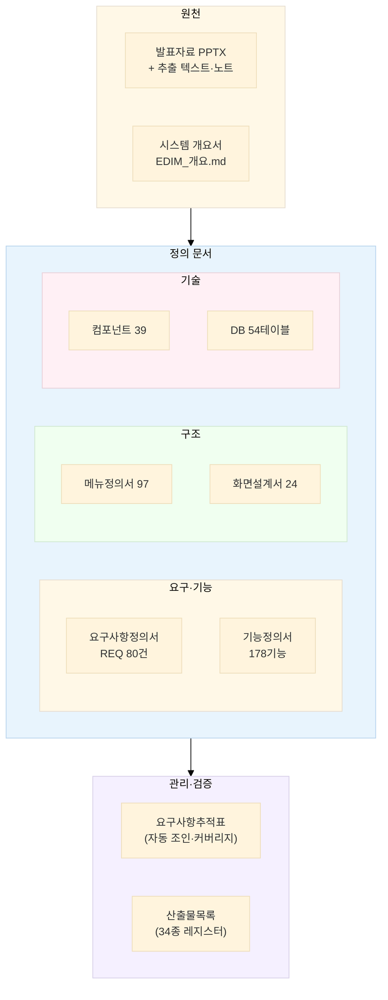

# EDIM 문서 관리 요약

> **edim-ai-blueprint 프로젝트 문서 체계의 단일 진입점.**
> 무엇이 어디에 있고, 서로 어떻게 연결되며, 어떻게 수정·재생성하는지를 요약한다.
>
> 전체 산출물 현황·계획의 단일 기준: [`EDIM_산출물목록.xlsx`](EDIM_산출물목록.xlsx) (37종)

| 항목 | 내용 |
|---|---|
| 최종 갱신 | 2026-07-11 (착수 문서 3종 완료) |
| 원천 자료 | `reference/EDIM Tool System EP2.pptx` (NOVA Solution, 78슬라이드) |
| 저장소 | https://github.com/fankh/external-projects (`edim-ai-blueprint/docs/`) |
| 온라인 열람 | 화면설계서: https://edim.seekerslab.com/design/ · 디자인 A: /design/hifi/ · **디자인 B(권고): /design/dense/** |

---

## 1. 문서 지도



---

## 2. 문서 목록

### 작성 완료 (버전 관리 중)

| 문서 | 파일 | 버전 | 형식 | 역할 |
|---|---|---|---|---|
| 시스템 개요서 | [`EDIM_개요.md`](EDIM_개요.md) | v0.1 | MD (다이어그램 8) | 발표자료 분석 — 모든 문서의 기준. §13 기능 코드 맵, §14 로드맵 |
| 요구사항정의서 | [`02_요구사항/EDIM_요구사항정의서.xlsx`](02_요구사항/EDIM_요구사항정의서.xlsx) | v0.2 | Excel 6시트 | 기능 50 · 비기능 22 · 인터페이스 8 · 용어 16 |
| 기능정의서 | [`EDIM_기능정의서.xlsx`](EDIM_기능정의서.xlsx) | v0.2 | Excel 3시트 | 14모듈 179기능(i18n 포함) — 기능코드·컴포넌트·DB·Phase 추적 |
| 메뉴정의서 | [`EDIM_메뉴정의서.xlsx`](EDIM_메뉴정의서.xlsx) | v0.3 | Excel 2시트 | 98메뉴 (PPT 3차 전수 대조+i18n) — 화면·기능·권한 매핑 |
| 화면설계서 | [`EDIM_화면설계서.html`](EDIM_화면설계서.html) | v0.3 | HTML (단일 파일) | 와이어프레임 24화면 (W-01~W-24) + 설계 노트 |
| 컴포넌트 정의서 | [`EDIM_컴포넌트_정의서.md`](EDIM_컴포넌트_정의서.md) / [`xlsx`](EDIM_컴포넌트정의서.xlsx) | v0.2 | MD + Excel | 39컴포넌트·API 108 — **구축 상태 열 포함** (개발 서버 현황) |
| DB 정의서 | [`EDIM_DB_정의서.md`](EDIM_DB_정의서.md) / [`xlsx`](EDIM_DB정의서.xlsx) | v0.5 | MD + Excel | 54테이블 462컬럼 (i18n) — 설계 원칙·공통코드·미결정 8건 |
| 요구사항추적표 (RTM) | [`EDIM_요구사항추적표.xlsx`](EDIM_요구사항추적표.xlsx) | 자동 | Excel 3시트 | REQ→기능→메뉴→화면→컴포넌트→DB 180행, **커버리지 179/179** |
| 산출물목록 | [`EDIM_산출물목록.xlsx`](EDIM_산출물목록.xlsx) | v0.2 | Excel 2시트 | 37종 레지스터 — 상태·우선 권고. **신규 문서는 여기에 먼저 등록** |
| 권한·승인 정의서 | [`EDIM_권한승인정의서.xlsx`](EDIM_권한승인정의서.xlsx) | v0.1 | Excel 6시트 | 역할 4종·매트릭스(97메뉴 자동)·승인 상태기계 13·Platform 범위·Grade |
| 개발 표준 정의서 | [`EDIM_개발표준정의서.md`](EDIM_개발표준정의서.md) | v0.1 | MD | 공통 원칙·명명·API 규약·FE/BE·Git/리뷰·테스트·보안·CI — 개정 트리거 연동 |
| DB DDL·검증 | [`ddl/edim_schema.sql`](ddl/edim_schema.sql) / [`ddl/verify_runtime.sql`](ddl/verify_runtime.sql) | v0.4.1 | SQL | 실 PG16 검증 통과 — BOM 재귀·제약 6종·Project Folder 실행 확인 |
| WBS·일정표 | [`04_WBS/EDIM_WBS.xlsx`](04_WBS/EDIM_WBS.xlsx) | v0.1 | Excel 3시트 | 38 Task·44주 간트·마일스톤 4 — 시작일 가정 |
| 기능확인서 (FVT) | [`03_기능확인서_FVT/EDIM_기능확인서.xlsx`](03_기능확인서_FVT/EDIM_기능확인서.xlsx) | v0.1 | Excel 6시트 (자동) | 기능 179·비기능 22 확인 항목·결함목록·승인란 — 판정 기입 후 버전 고정 |
| 데이터 이행 계획서 | [`EDIM_데이터이행계획서.md`](EDIM_데이터이행계획서.md) | v0.1 | MD | 이행 대상 9·원칙 5·절차 5단계·검증 6기준·AI 학습 연계 |
| 사업수행계획서 | [`EDIM_사업수행계획서.md`](EDIM_사업수행계획서.md) | v0.1 | MD | 범위·조직·일정·관리 체계 — 계약 확정(시작일·인력·협의 4건) 시 v1.0 승격 |
| 위험관리대장 | [`EDIM_위험관리대장.xlsx`](EDIM_위험관리대장.xlsx) | v0.1 | Excel 2시트 (자동) | 초기 위험 14건(3×3 평가·대응 전략) — `make_risk_xlsx.py` 재생성, 주간 갱신 |
| 보안관리계획서 | [`EDIM_보안관리계획서.md`](EDIM_보안관리계획서.md) | v0.1 | MD | REQ-N 보안 기준선·RBAC·데이터/문서 보안·인프라·사고 대응 — 솔루션 범위 협의 후 v0.2 |
| 배치·보고서양식 정의서 | [`EDIM_배치보고서양식정의서.md`](EDIM_배치보고서양식정의서.md) | v0.2 | MD | A부 배치 잡(JOB-01~08·BAT-01~06) + B부 양식(Print 통제·RPT-01~07·FORM-01~04) — 레지스터 2종 통합본 |
| 인터페이스 정의서 | [`EDIM_인터페이스정의서.md`](EDIM_인터페이스정의서.md) · [`api/edim-openapi.yaml`](api/edim-openapi.yaml) | v0.1 | MD + OpenAPI 3.1 | 공통 규약(4로케일)·시나리오·WS·외부 연계 8종 — **스펙은 APIS 목록에서 자동 생성** |
| 클래스 정의서 | [`EDIM_클래스정의서.md`](EDIM_클래스정의서.md) | v0.1 | MD (classDiagram 2) | 언어 중립 도메인 모델 — 11도메인, 인바리언트↔DB 제약 이중 방어 대응표 |
| 디자인 시안 A (Modern) | [`EDIM_디자인시안.html`](EDIM_디자인시안.html) | v0.1 | HTML | 브랜드 접점용 (로그인·Dashboard·모바일) · /design/hifi/ |
| 디자인 시안 B (Dense) ★ | [`EDIM_디자인시안_B_dense.html`](EDIM_디자인시안_B_dense.html) | v0.1 | HTML | **레거시 문법 조사+적용** — 22px 컨트롤·MDI·F-key·조회밴드, 업무 화면 권고안 · /design/dense/ |
| 요구사항 보완노트 | [`EDIM_요구사항_보완노트.md`](EDIM_요구사항_보완노트.md) | - | MD | PPT 재검토 발견 사항·고객 협의 필요 4건 |
| 아키텍처(프로토타입) | [`ARCHITECTURE.md`](ARCHITECTURE.md) / [`pdf`](ARCHITECTURE.pdf) | v1 | MD + PDF | 프로토타입 앱(현 배포본) 구조 |

### 미작성 문서

전체 계획은 [산출물목록](EDIM_산출물목록.xlsx) 참조. 제안서는 사업 조건 확정 후 `_template/01_제안서`에서 복사해 작성
(빈 템플릿 사본은 정리함 — 2026-07-07).

### 근거 자료 (`reference/`)

| 파일 | 내용 |
|---|---|
| `EDIM Tool System EP2.pptx` | 원본 발표자료 (78슬라이드, 35MB) |
| `EDIM Tool System EP2.pdf` | 렌더링본 — 슬라이드 시각 확인용 |
| `EDIM_EP2_slide_text.txt` | 전 슬라이드 텍스트 추출 |
| `EDIM_EP2_speaker_notes.txt` | 발표자 노트 51장 — **표준 워크플로우 원문** |

---

## 3. 추적 체계

모든 문서는 하나의 추적 체인으로 연결되며, RTM이 무결성을 자동 검증한다.

```
요구사항(REQ-F-xxx) → 기능(모듈-xxx) → 메뉴(M-x-x) → 화면(W-xx)
                                   ↘ 컴포넌트(FE/SVC/ENG…) → DB(테이블) → Phase(P1~P5)
```

- **ID 체계**: REQ-F/N/I(요구) · 14모듈 접두어(기능) · M-x-x(메뉴) · W-xx(화면) · FE/GW/SVC/ENG/AI/INT/INF(컴포넌트) · 도메인 접두어 snake_case(DB) · S/C/E/D/H(발표자료 기능코드)
- **검증 실적**: 메뉴 — PPT 3차 전수 대조(브레드크럼·Head Tab·프로세스 코드 41종 closure) / RTM — 기능 커버리지 179/179

---

## 4. 관리 규칙

### 수정 절차 (순서 중요)

1. **MD가 원본인 문서** (DB 정의서): MD 수정 → `make_db_xlsx.py` 재생성
2. **스크립트가 원본인 문서** (기능·메뉴·요구사항·컴포넌트·산출물·FVT·OpenAPI): `docs/tools/make_*.py`의 데이터 수정 → 재생성. **xlsx/yaml 직접 편집 금지** (재생성 시 소실)
3. **RTM**: 요구사항·기능·메뉴 중 하나라도 바뀌면 `make_rtm_xlsx.py` 재실행 → 커버리지 시트 확인 (미연결/해석불가 0이어야 함)
4. 신규 문서 작성 시: 산출물목록에 등록 → 개요 §14 갱신

### 재생성 명령

```powershell
# docs/ 기준, PYTHONUTF8=1 권장
py docs/tools/make_feature_xlsx.py        # 기능정의서
py docs/tools/make_menu_xlsx.py           # 메뉴정의서
py docs/tools/make_requirements_xlsx.py   # 요구사항정의서
py docs/tools/make_rtm_xlsx.py            # RTM (위 3종 수정 후 필수)
py docs/tools/make_db_xlsx.py             # DB정의서 (MD 파싱)
py docs/tools/make_component_xlsx.py      # 컴포넌트정의서
py docs/tools/make_doclist_xlsx.py        # 산출물목록
py docs/tools/make_authz_xlsx.py          # 권한승인정의서 (메뉴 수정 후 재실행)
py docs/tools/make_wbs_xlsx.py            # WBS (START 상수 = 시작일 가정)
py docs/tools/make_risk_xlsx.py           # 위험관리대장 (RISKS 목록 수정 후 재실행)
py docs/tools/make_fvt_xlsx.py            # 기능확인서 (기능정의서 기반 — 판정 기입 전까지만)
py docs/tools/make_openapi.py             # OpenAPI 스펙 (APIS 수정 후 필수 — 자동 검증)
py docs/tools/md2pdf.py                   # MD 9종 → docs/pdf/ PDF (Mermaid 렌더 포함, MD 수정 후 필수)
py docs/tools/make_docs_portal.py         # 다운로드 포털 (파일 추가·변경 후)
```

> **배포 형식**: MD는 저장소 원본(리뷰·diff용), 외부 배포는 `docs/pdf/`의 PDF (Mermaid 렌더 포함) — 포털은 PDF만 노출.

### 표기·품질 규칙

- 버전: `v0.x` 초안 반복 → 고객 승인 시 `v1.0`. 변경 시 각 문서의 문서정보(이력)에 사유 기록
- Mermaid 다이어그램: 저장소 스타일 가이드 준수 (init 블록 필수·행당 3개·서브그래프당 4개·형제 색상 구분), `mermaid-cli`로 렌더 검증
- Excel: 헤더 네이비(#1A1A40)·맑은 고딕 10pt·자동필터·틀고정 — 생성 스크립트가 보장
- 커밋 메시지: `edim-ai-blueprint: <내용>` — 저장소 관례
- 문서 내 상호 참조는 상대 링크 사용 (GitHub 렌더 호환)

### 배포·동기화

| 위치 | 용도 | 갱신 |
|---|---|---|
| `C:\repos\new-research\external-projects` | 주 작업 클론 | 커밋·푸시 원점 |
| `C:\repos\external-projects` | 보조 클론 | `git pull` |
| 서버 `~/apps/external-projects` | 배포 소스 | **자동** — `edim-autodeploy.timer`(2분)가 push 감지 → pull·docker build·rsync (로그: `journalctl -u edim-autodeploy`) |
| https://edim.seekerslab.com/design/ | 화면설계서 열람 | 화면설계서 변경 시 `sudo cp docs/EDIM_화면설계서.html /var/www/edim/design/index.html` |
| **https://edim.seekerslab.com/cpq · /plm · /code · /erp · /toolbox · /common** | **EDIM 업무 앱 (edim-web — dense B안 실구현, mock API, 24화면 전량+상세 4종 드릴다운)** | `edim-web/` 수정 → `npm run build`(dist 커밋) → 서버 `git pull` 후 `sudo rsync -a --delete edim-ai-blueprint/edim-web/dist/ /var/www/edim/edim-static/` |
| **https://edim.seekerslab.com/docs/** | **산출물 다운로드 포털** (29종) | `py docs/tools/make_docs_portal.py` → 커밋·푸시 → 서버 `git pull` 후 `sudo rsync -a --delete docs/ /var/www/edim/docs/files/ && sudo cp docs/portal.html /var/www/edim/docs/index.html` |

> **접근 제어**: `/design/`·`/docs/`·`/api/`·루트(/)는 Basic Auth `edim`/`edim` (`/etc/nginx/.edim_htpasswd`).
> **앱 경로(/cpq·/plm·/code·/erp·/edim-static/)는 basic auth 해제** — 앱 자체 dense 로그인 화면 사용 (계정 `edim`/`edim`, sessionStorage 세션).
> 예외: `/jenkins/`·`/minio/ui/` — 자체 로그인 사용 (`auth_basic off`).

---

## 5. 다음 작성 우선순위

산출물목록 v0.2 기준 (상세는 [`EDIM_산출물목록.xlsx`](EDIM_산출물목록.xlsx)):

1. ~~권한·승인 정의서~~ · ~~개발 표준 정의서~~ · ~~데이터 이행 계획서~~ · ~~WBS·FVT 내용화~~ — ✅ 완료
2. ~~착수 문서 3종 (사업수행계획서·위험관리대장·보안관리계획서)~~ — ✅ 완료 (v0.1, 2026-07-11)
3. ~~배치(Job) 정의서 · 보고서/양식 정의서~~ — ✅ 완료 (통합본 v0.2, 2026-07-11 — 고객 양식 확정 시 v0.3)
4. 운영자·사용자 매뉴얼 (안정화 단계) · 현행분석서·제안서 (고객사·사업 조건 확정 후)
5. 고객 협의 대기: 보안 솔루션 범위 · DUCT 사업 범위 · ERP 자체구현/연계 경계 (보완노트 §3.3)
