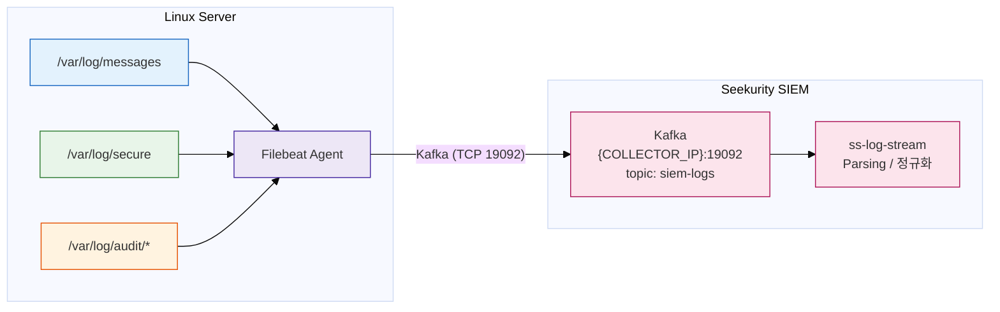

# AIG Filebeat 설치·설정 매뉴얼 (Linux Log 수집)

| 항목 | 내용 |
|------|------|
| 고객사 | AIG |
| 문서명 | Filebeat 설치·설정 매뉴얼 |
| 대상 | Linux Server (RHEL / Rocky / CentOS / Ubuntu) |
| SIEM Collector IP | {COLLECTOR_IP} |
| 작성일 | 2026-08-10 |
| 최종 갱신일 | 2026-08-15 |
| 버전 | v2.1 |

## 개정 이력

| 버전 | 일자 | 내용 |
|------|------|------|
| v1.0 | 2026-08-10 | 최초 작성 |
| v2.0 | 2026-08-15 | 수집 경로 정정. Seekurity SIEM v3는 Beats 입력(TCP 5044)을 수신하지 않으므로 Filebeat 출력을 Kafka(19092)로 변경 |
| v2.1 | 2026-08-15 | 주 수집 경로를 rsyslog → 514로 확정. Kafka(19092)는 내부 브로커로 원격 접속에 재구성이 선행되어야 하므로, 본 Filebeat 경로는 AIG의 3rd-party 요구에 한정된 조건부 경로로 명시 |

## 1. 개요

### 1.1 목적

Linux Server의 시스템 Log를 Seekurity SIEM으로 수집하기 위한 절차를 정의한다. 본 문서는 AIG가 3rd-party 에이전트(Filebeat) 사용을 요구함에 따라 작성된 고객 전용 매뉴얼이다. Filebeat는 Seekurity SIEM의 표준 구성요소가 아니다.

### 1.2 수집 경로 (중요)

Seekurity SIEM v3의 표준 외부 로그 수집 포트는 Syslog UDP 514이며, Kafka(19092)는 내부 브로커이다. 수집 경로는 다음과 같다.

| 경로 | 구성 | 권장도 |
|------|------|--------|
| A. rsyslog → 514 | rsyslog → UDP 514 → ss-syslog-receiver | 주 경로 (권장). 어플라이언스 기본 구성에서 즉시 동작 |
| B. Filebeat → Kafka | Filebeat → Kafka 19092 (siem-logs) → ss-log-stream | 조건부 (AIG 전용). Kafka 재구성 선행 필요 (2.2 참조) |

권장 경로는 A(rsyslog → 514)이며, 표준 절차는 공통 가이드 `docs/linux-log-integration.md`를 따른다. 본 매뉴얼(경로 B)은 AIG가 Filebeat 사용을 요구하는 경우에 한해 적용하며, 아래 2.2의 선행 제약을 반드시 확인한다.



### 1.3 SIEM 수신 형식 (중요)

ss-log-stream은 siem-logs 토픽의 각 메시지를 다음 필드를 가진 JSON으로 기대한다. 이 형식이 아니면 Event가 파싱 단계에서 폐기되므로, 4.1의 Filebeat 성형 설정을 반드시 적용한다.

| 필드 | 값 | 필수 |
|------|-----|------|
| protocol | "file" (Filebeat 수집 시 고정) | 필수 |
| device | Log Source 이름 (SIEM에 등록한 이름과 일치) | 필수 (파서 조회 키) |
| rawData | 원본 Log 한 줄 | 필수 |
| generatedTime | 이벤트 시각 (UTC) | 권장 (누락 시 수신 시각으로 대체) |

### 1.4 수집 대상 Log

| Log File | 내용 | 배포판 |
|----------|------|--------|
| `/var/log/messages` | 시스템 전반 Event | RHEL / Rocky / CentOS |
| `/var/log/secure` | 인증·SSH 접속 Event | RHEL / Rocky / CentOS |
| `/var/log/syslog` | 시스템 전반 Event | Ubuntu / Debian |
| `/var/log/auth.log` | 인증·SSH 접속 Event | Ubuntu / Debian |
| `/var/log/audit/audit.log` | auditd 감사 Event | 공통 (auditd 사용 시) |
| `/var/log/cron` | Cron 작업 Event | RHEL 계열 |

## 2. 사전 준비

### 2.1 시스템 요구사항

| 항목 | 최소 사양 |
|------|-----------|
| OS | RHEL / Rocky / CentOS 7 이상, Ubuntu 18.04 이상 |
| Memory | 100MB 이상 여유 |
| Disk | 200MB 이상 여유 (설치 + Registry) |
| 권한 | root 또는 sudo |

### 2.2 네트워크 (방화벽) 요구사항

Linux Server에서 SIEM Kafka 방향으로 아래 통신이 허용되어야 한다.

| Source | Destination | Protocol / Port | 용도 |
|--------|-------------|-----------------|------|
| Linux Server IP | {COLLECTOR_IP} | TCP 19092 | Filebeat → Kafka Event 전송 |

경로 A(rsyslog)를 사용하는 경우에는 UDP 514가 대신 필요하다.

**선행 제약 (경로 B 필수 확인)**

Kafka(19092)는 어플라이언스 내부 브로커로, 모든 내부 컴포넌트가 `localhost:19092`로 접속한다. 즉 Kafka의 `advertised.listeners`가 localhost로 설정되어 있어, 원격 서버의 Filebeat는 기본 구성에서 접속할 수 없다. 방화벽만 열어서는 동작하지 않으며, 아래가 선행되어야 한다.

1. Kafka `advertised.listeners`를 SIEM 서버의 외부 접근 주소로 재구성 (내부 컴포넌트 접속에 영향이 없도록 다중 listener 구성 검토)
2. 방화벽에서 TCP 19092 외부 개방
3. 위 재구성은 어플라이언스 표준 설정 변경에 해당하므로 SIEM Engineer 검토·승인 후 진행

재구성이 어렵거나 불필요한 경우, 표준 경로 A(rsyslog → 514, `docs/linux-log-integration.md`)를 사용한다.

사전 통신 확인:

```bash
# TCP 19092 연결 확인 (둘 중 가능한 명령 사용)
curl -v telnet://{COLLECTOR_IP}:19092 --connect-timeout 5
nc -zv {COLLECTOR_IP} 19092
```

연결 실패 시 네트워크 담당자에게 방화벽 정책(Linux Server → {COLLECTOR_IP} TCP 19092) 오픈을 요청한다.

### 2.3 설치 파일 준비

| 구분 | 방법 |
|------|------|
| 온라인 환경 | Elastic 공식 Repository 또는 패키지 직접 다운로드 |
| 폐쇄망 환경 | 반입 승인된 RPM/DEB 파일을 서버로 복사 (`scp`, `sftp`) |

권장 버전: Filebeat 8.x (예시: 8.14.3). 전 서버 동일 버전으로 통일한다.

## 3. 설치

### 3.1 RHEL / Rocky / CentOS (RPM)

온라인 설치:

```bash
curl -L -O https://artifacts.elastic.co/downloads/beats/filebeat/filebeat-8.14.3-x86_64.rpm
sudo rpm -vi filebeat-8.14.3-x86_64.rpm
```

폐쇄망 설치 — 반입한 RPM 파일을 서버에 복사한 뒤 동일하게 실행한다.

```bash
sudo rpm -vi /tmp/filebeat-8.14.3-x86_64.rpm
```

### 3.2 Ubuntu / Debian (DEB)

```bash
curl -L -O https://artifacts.elastic.co/downloads/beats/filebeat/filebeat-8.14.3-amd64.deb
sudo dpkg -i filebeat-8.14.3-amd64.deb
```

### 3.3 설치 확인

```bash
filebeat version
# 출력 예: filebeat version 8.14.3 (amd64), libbeat 8.14.3 ...
```

주요 경로:

| 경로 | 용도 |
|------|------|
| `/etc/filebeat/filebeat.yml` | 설정 파일 |
| `/var/lib/filebeat/` | Registry (수집 위치 기억) |
| `/var/log/filebeat/` | Filebeat 자체 Log |
| `/usr/share/filebeat/` | 실행 파일·모듈 |

## 4. 설정

### 4.1 filebeat.yml 설정

기존 설정 파일을 백업 후 아래 내용으로 수정한다.

```bash
sudo cp /etc/filebeat/filebeat.yml /etc/filebeat/filebeat.yml.orig
sudo vi /etc/filebeat/filebeat.yml
```

RHEL / Rocky / CentOS 예시:

```yaml
# ============== Filebeat inputs ==============
filebeat.inputs:
  - type: filestream
    id: system-logs
    enabled: true
    paths:
      - /var/log/messages
      - /var/log/secure
      - /var/log/cron

  - type: filestream
    id: audit-logs
    enabled: true
    paths:
      - /var/log/audit/audit.log

# ============== General ==============
name: "{HOSTNAME}"          # 서버 Hostname 으로 자동 설정하려면 이 줄 삭제

# ============== Processors (SIEM 수신 형식으로 성형) ==============
# ss-log-stream 이 요구하는 protocol / device / rawData 필드를 구성한다.
# device 값은 SIEM 에 등록한 Log Source 이름과 반드시 일치해야 파서가 적용된다.
processors:
  - add_fields:
      target: ""
      fields:
        protocol: "file"
        device: "AIG_Linux_{HOSTNAME}"
  - rename:
      fields:
        - from: "message"
          to: "rawData"
      ignore_missing: true
  - copy_fields:
      fields:
        - from: "@timestamp"
          to: "generatedTime"
      ignore_missing: true
      fail_on_error: false
  # 불필요한 기본 필드 제거 (전송량 절감, 파싱 방해 방지)
  - drop_fields:
      fields: ["agent", "ecs", "input", "log", "host"]
      ignore_missing: true

# ============== Output (Kafka → siem-logs) ==============
output.kafka:
  hosts: ["{COLLECTOR_IP}:19092"]
  topic: "siem-logs"
  required_acks: 1
  compression: gzip
  max_message_bytes: 1000000
  codec.json:
    pretty: false
    escape_html: false

# ============== Logging ==============
logging.level: info
logging.to_files: true
logging.files:
  path: /var/log/filebeat
  name: filebeat
  keepfiles: 7
  permissions: 0640
```

Ubuntu / Debian은 paths만 변경한다.

```yaml
    paths:
      - /var/log/syslog
      - /var/log/auth.log
```

주의 사항:

- `output.elasticsearch`, `output.logstash` 등 다른 output이 기본 활성화되어 있으면 반드시 주석 처리한다. Output은 한 개만 활성화 가능하다.
- `device` 값(`AIG_Linux_{HOSTNAME}`)과 동일한 이름의 File 유형 Log Source 및 파서를 SIEM에 사전 등록해야 정규화가 수행된다. 미등록 시 Event는 수집·저장되나 파싱되지 않은 상태로 인덱싱된다.
- Kafka 주소·토픽·형식은 SIEM 구성에 종속되므로 변경 전 SIEM Engineer에게 확인한다.

### 4.2 설정 문법 검증

```bash
sudo filebeat test config -c /etc/filebeat/filebeat.yml
# 출력: Config OK
```

### 4.3 Kafka 연결 검증

```bash
sudo filebeat test output -c /etc/filebeat/filebeat.yml
# 출력 예:
# kafka: {COLLECTOR_IP}:19092...
#   parse host... OK
#   dns lookup... OK
#   dial up... OK
```

`dial up... ERROR` 발생 시 2.2 방화벽 요구사항을 재확인한다.

## 5. 서비스 기동

### 5.1 서비스 시작 및 자동 시작 등록

```bash
sudo systemctl enable filebeat     # 부팅 시 자동 시작
sudo systemctl start filebeat
```

### 5.2 상태 확인

```bash
sudo systemctl status filebeat
# Active: active (running) 확인
```

### 5.3 서비스 관리 명령

| 작업 | 명령 |
|------|------|
| 시작 | `sudo systemctl start filebeat` |
| 중지 | `sudo systemctl stop filebeat` |
| 재시작 (설정 변경 후) | `sudo systemctl restart filebeat` |
| 상태 확인 | `sudo systemctl status filebeat` |
| 자체 Log 확인 | `sudo tail -f /var/log/filebeat/filebeat*` |

## 6. 검증

### 6.1 Agent 측 검증

```bash
# 1. 프로세스 확인
ps -ef | grep filebeat

# 2. Kafka 연결(ESTABLISHED) 확인
ss -antp | grep 19092
# 출력 예: ESTAB  ...  <서버IP>:xxxxx  {COLLECTOR_IP}:19092  users:(("filebeat",...))

# 3. 전송 Event 수 확인 (30초 주기 Metrics)
sudo grep "Non-zero metrics" /var/log/filebeat/filebeat* | tail -1
```

### 6.2 SIEM 측 검증

| 순서 | 확인 항목 | 방법 |
|------|-----------|------|
| 1 | Log 수신 확인 | SIEM Web UI > 모니터링 > Log Source 현황 |
| 2 | Parser 적용 확인 | 검색에서 해당 device 이름 Event 조회, 필드 정규화 확인 |
| 3 | Dashboard 표시 확인 | Linux Log Dashboard에 Event 표시 여부 |

### 6.3 테스트 Event 발생

```bash
# 인증 Log 테스트: 아래 명령으로 Event 발생 후 SIEM 에서 검색
logger -p authpriv.info "AIG SIEM integration test message"
```

SIEM Web UI 검색에서 `AIG SIEM integration test message`가 조회되면 연동 완료.

### 6.4 연동 체크리스트

- [ ] 방화벽 정책 오픈 (Server → {COLLECTOR_IP} TCP 19092)
- [ ] SIEM에 File 유형 Log Source 및 파서 등록 (device 이름 일치)
- [ ] Filebeat 설치 및 버전 확인
- [ ] `filebeat test config` OK
- [ ] `filebeat test output` (kafka) OK
- [ ] 서비스 기동 및 자동 시작 등록
- [ ] SIEM Log 수신 확인
- [ ] Parser / Dashboard 확인
- [ ] 테스트 Event 조회 확인

## 7. 문제 해결 (Troubleshooting)

| 증상 | 원인 | 조치 |
|------|------|------|
| `dial up... ERROR` | 방화벽 미오픈, Kafka 미기동 | 방화벽 정책(TCP 19092) 확인, SIEM Engineer에게 Kafka 상태 확인 요청 |
| `Config OK` 실패 | YAML 문법 오류 (들여쓰기) | 오류 메시지의 라인 확인, 공백 2칸 들여쓰기 준수 |
| 서비스 기동 실패 | 설정 오류, 권한 문제 | `journalctl -u filebeat -n 50`으로 원인 확인 |
| SIEM에 Event 미표시 | device 이름 불일치, 형식 오류 | 4.1의 device 값과 SIEM 등록 이름 일치 확인, processors 설정 확인 |
| Event는 수신되나 파싱 안 됨 | 해당 device의 파서 미등록 | SIEM에 File 유형 파서 등록 (device 이름 기준) |
| Log 파일 권한 부족 | 수집 대상 파일 읽기 권한 | `ls -l /var/log/secure` 확인, SELinux 정책 확인 (`ausearch -m avc -ts recent`) |
| Disk 사용량 증가 | Filebeat 자체 Log 누적 | `logging.files.keepfiles` 값 확인 (기본 7개 유지) |

재설치 시 주의: Registry(`/var/lib/filebeat/`)를 삭제하면 기존 Log를 처음부터 재전송하여 중복 Event가 발생한다. 재설치 시 Registry는 유지한다.

## 8. 부록

### 8.1 연동 정보 기록 Template

| 항목 | 값 |
|------|-----|
| System Type | Data & Application |
| System Name | Linux Server |
| Log Source Name | AIG_Linux_{용도} (예: AIG_Linux_WEB01) — device 값과 일치 |
| Server IP Address | {xxx.xxx.xxx.xxx} |
| Protocol | Filebeat → Kafka |
| Destination | {COLLECTOR_IP}:19092 (topic: siem-logs) |
| Filebeat Version | 8.14.3 |
| 수집 Log | /var/log/messages, /var/log/secure, /var/log/audit/audit.log |
| Manager | {담당자명} |

### 8.2 참고 문서

- `AIG_03-Log연동설계서.md` — Log Source 연동 설계
- `AIG_06-운영자매뉴얼.md` — 일일 점검·장애 대응
- Elastic Filebeat Reference — https://www.elastic.co/guide/en/beats/filebeat/current/index.html
