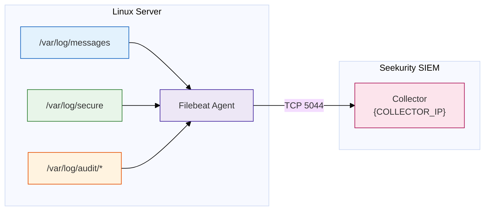

# AIG Filebeat 설치·설정 매뉴얼 (Linux Log 수집)

| 항목 | 내용 |
|------|------|
| 고객사 | AIG |
| 문서명 | Filebeat 설치·설정 매뉴얼 |
| 대상 | Linux Server (RHEL / Rocky / CentOS / Ubuntu) |
| SIEM Collector IP | {COLLECTOR_IP} |
| 작성일 | 2026-08-10 |
| 버전 | v1.0 |

---

## 1. 개요

### 1.1 목적

Linux Server 의 시스템 Log 를 Filebeat Agent 로 수집하여 Seekurity SIEM Collector(`{COLLECTOR_IP}`)로 전송하기 위한 설치·설정 절차를 정의한다.

### 1.2 수집 구성



| 구성 요소 | 역할 |
|-----------|------|
| Filebeat | Linux Server 에 설치되는 경량 Log 수집 Agent |
| SIEM Collector | Filebeat 가 전송한 Event 수신·Parsing (`{COLLECTOR_IP}`) |

### 1.3 수집 대상 Log

| Log File | 내용 | 배포판 |
|----------|------|--------|
| `/var/log/messages` | 시스템 전반 Event | RHEL / Rocky / CentOS |
| `/var/log/secure` | 인증·SSH 접속 Event | RHEL / Rocky / CentOS |
| `/var/log/syslog` | 시스템 전반 Event | Ubuntu / Debian |
| `/var/log/auth.log` | 인증·SSH 접속 Event | Ubuntu / Debian |
| `/var/log/audit/audit.log` | auditd 감사 Event | 공통 (auditd 사용 시) |
| `/var/log/cron` | Cron 작업 Event | RHEL 계열 |

---

## 2. 사전 준비

### 2.1 시스템 요구사항

| 항목 | 최소 사양 |
|------|-----------|
| OS | RHEL / Rocky / CentOS 7 이상, Ubuntu 18.04 이상 |
| Memory | 100MB 이상 여유 |
| Disk | 200MB 이상 여유 (설치 + Registry) |
| 권한 | root 또는 sudo |

### 2.2 네트워크 (방화벽) 요구사항

Linux Server 에서 SIEM Collector 방향으로 아래 통신이 허용되어야 한다.

| Source | Destination | Protocol / Port | 용도 |
|--------|-------------|-----------------|------|
| Linux Server IP | {COLLECTOR_IP} | TCP 5044 | Filebeat → Collector Log 전송 |

**사전 통신 확인**

```bash
# TCP 5044 연결 확인 (둘 중 가능한 명령 사용)
curl -v telnet://{COLLECTOR_IP}:5044 --connect-timeout 5
nc -zv {COLLECTOR_IP} 5044
```

> 연결 실패 시 네트워크 담당자에게 방화벽 정책(Linux Server → {COLLECTOR_IP} TCP 5044) 오픈을 요청한다.

### 2.3 설치 파일 준비

| 구분 | 방법 |
|------|------|
| 온라인 환경 | Elastic 공식 Repository 또는 패키지 직접 다운로드 |
| 폐쇄망 환경 | 반입 승인된 RPM/DEB 파일을 서버로 복사 (`scp`, `sftp`) |

권장 버전: **Filebeat 8.x** (예시: 8.14.3). 전 서버 동일 버전으로 통일한다.

---

## 3. 설치

### 3.1 RHEL / Rocky / CentOS (RPM)

**온라인 설치**

```bash
# 1. RPM 다운로드
curl -L -O https://artifacts.elastic.co/downloads/beats/filebeat/filebeat-8.14.3-x86_64.rpm

# 2. 설치
sudo rpm -vi filebeat-8.14.3-x86_64.rpm
```

**폐쇄망 설치** — 반입한 RPM 파일을 서버에 복사한 뒤 동일하게 실행한다.

```bash
sudo rpm -vi /tmp/filebeat-8.14.3-x86_64.rpm
```

### 3.2 Ubuntu / Debian (DEB)

```bash
# 1. DEB 다운로드
curl -L -O https://artifacts.elastic.co/downloads/beats/filebeat/filebeat-8.14.3-amd64.deb

# 2. 설치
sudo dpkg -i filebeat-8.14.3-amd64.deb
```

### 3.3 설치 확인

```bash
filebeat version
# 출력 예: filebeat version 8.14.3 (amd64), libbeat 8.14.3 ...
```

**주요 경로**

| 경로 | 용도 |
|------|------|
| `/etc/filebeat/filebeat.yml` | 설정 파일 |
| `/var/lib/filebeat/` | Registry (수집 위치 기억) |
| `/var/log/filebeat/` | Filebeat 자체 Log |
| `/usr/share/filebeat/` | 실행 파일·모듈 |

---

## 4. 설정

### 4.1 filebeat.yml 설정

기존 설정 파일을 백업 후 아래 내용으로 수정한다.

```bash
sudo cp /etc/filebeat/filebeat.yml /etc/filebeat/filebeat.yml.orig
sudo vi /etc/filebeat/filebeat.yml
```

**RHEL / Rocky / CentOS 예시**

```yaml
# ============== Filebeat inputs ==============
filebeat.inputs:
  - type: filestream
    id: system-logs
    enabled: true
    paths:
      - /var/log/messages
      - /var/log/secure
      - /var/log/cron
    fields:
      log_type: linux_system
      customer: AIG
    fields_under_root: true

  - type: filestream
    id: audit-logs
    enabled: true
    paths:
      - /var/log/audit/audit.log
    fields:
      log_type: linux_audit
      customer: AIG
    fields_under_root: true

# ============== General ==============
name: "{HOSTNAME}"          # 서버 Hostname 으로 자동 설정하려면 이 줄 삭제
tags: ["linux", "aig"]

# ============== Output (SIEM Collector) ==============
output.logstash:
  hosts: ["{COLLECTOR_IP}:5044"]
  loadbalance: false
  worker: 1

# ============== Logging ==============
logging.level: info
logging.to_files: true
logging.files:
  path: /var/log/filebeat
  name: filebeat
  keepfiles: 7
  permissions: 0640
```

**Ubuntu / Debian 은 paths 만 변경**

```yaml
    paths:
      - /var/log/syslog
      - /var/log/auth.log
```

> **주의**
> - `output.elasticsearch` 항목이 기본 활성화되어 있으면 반드시 주석 처리한다. Output 은 한 개만 활성화 가능하다.
> - SIEM Collector 수신 Port 가 5044 가 아닌 경우 SIEM Engineer 에게 확인 후 변경한다.

### 4.2 설정 문법 검증

```bash
sudo filebeat test config -c /etc/filebeat/filebeat.yml
# 출력: Config OK
```

### 4.3 Collector 연결 검증

```bash
sudo filebeat test output -c /etc/filebeat/filebeat.yml
# 출력 예:
# logstash: {COLLECTOR_IP}:5044...
#   connection...
#     parse host... OK
#     dns lookup... OK
#     dial up... OK
#   talk to server... OK
```

> `dial up... ERROR` 발생 시 → 2.2 방화벽 요구사항 재확인.

---

## 5. 서비스 기동

### 5.1 서비스 시작 및 자동 시작 등록

```bash
sudo systemctl enable filebeat     # 부팅 시 자동 시작
sudo systemctl start filebeat
```

### 5.2 상태 확인

```bash
sudo systemctl status filebeat
# Active: active (running) 확인
```

### 5.3 서비스 관리 명령

| 작업 | 명령 |
|------|------|
| 시작 | `sudo systemctl start filebeat` |
| 중지 | `sudo systemctl stop filebeat` |
| 재시작 (설정 변경 후) | `sudo systemctl restart filebeat` |
| 상태 확인 | `sudo systemctl status filebeat` |
| 자체 Log 확인 | `sudo tail -f /var/log/filebeat/filebeat*` |

---

## 6. 검증

### 6.1 Agent 측 검증

```bash
# 1. 프로세스 확인
ps -ef | grep filebeat

# 2. Collector 연결(ESTABLISHED) 확인
ss -antp | grep 5044
# 출력 예: ESTAB  ...  <서버IP>:xxxxx  {COLLECTOR_IP}:5044  users:(("filebeat",...))

# 3. 전송 Event 수 확인 (30초 주기 Metrics)
sudo grep "Non-zero metrics" /var/log/filebeat/filebeat* | tail -1
```

### 6.2 SIEM 측 검증

| 순서 | 확인 항목 | 방법 |
|------|-----------|------|
| 1 | Log 수신 확인 | SIEM Web UI > 모니터링 > Log Source 현황 |
| 2 | Parser 적용 확인 | 검색에서 해당 Hostname Event 조회, 필드 정규화 확인 |
| 3 | Dashboard 표시 확인 | Linux Log Dashboard 에 Event 표시 여부 |

### 6.3 테스트 Event 발생

```bash
# 인증 Log 테스트: SSH 로그인 1회 수행 후 SIEM 에서 검색
logger -p authpriv.info "AIG SIEM integration test message"
```

SIEM Web UI 검색에서 `AIG SIEM integration test message` 가 조회되면 연동 완료.

### 6.4 연동 체크리스트

- [ ] 방화벽 정책 오픈 (Server → {COLLECTOR_IP} TCP 5044)
- [ ] Filebeat 설치 및 버전 확인
- [ ] `filebeat test config` OK
- [ ] `filebeat test output` OK
- [ ] 서비스 기동 및 자동 시작 등록
- [ ] SIEM Log 수신 확인
- [ ] Parser / Dashboard 확인
- [ ] 테스트 Event 조회 확인

---

## 7. 문제 해결 (Troubleshooting)

| 증상 | 원인 | 조치 |
|------|------|------|
| `dial up... ERROR` | 방화벽 미오픈, Collector 미기동 | 방화벽 정책 확인, SIEM Engineer 에게 Collector 상태 확인 요청 |
| `Config OK` 실패 | YAML 문법 오류 (들여쓰기) | 오류 메시지의 라인 확인, 공백 2칸 들여쓰기 준수 |
| 서비스 기동 실패 | 설정 오류, 권한 문제 | `journalctl -u filebeat -n 50` 로 원인 확인 |
| Log 가 SIEM 에 미표시 | 수집 대상 파일 권한 부족 | `ls -l /var/log/secure` 확인, Filebeat 는 root 로 실행되므로 SELinux 정책 확인 (`ausearch -m avc -ts recent`) |
| Event 지연 | Collector 부하, 네트워크 지연 | `Non-zero metrics` 의 `output.events.acked` 추이 확인 |
| Disk 사용량 증가 | Filebeat 자체 Log 누적 | `logging.files.keepfiles` 값 확인 (기본 7개 유지) |

**재설치 시 주의**: Registry(`/var/lib/filebeat/`)를 삭제하면 기존 Log 를 처음부터 재전송하여 중복 Event 가 발생한다. 재설치 시 Registry 는 유지한다.

---

## 8. 부록

### 8.1 연동 정보 기록 Template

| 항목 | 값 |
|------|-----|
| System Type | Data & Application |
| System Name | Linux Server |
| Log Source Name | {위치}_Linux_{용도} (예: IDC_Linux_WEB01) |
| Server IP Address | {xxx.xxx.xxx.xxx} |
| Protocol | Filebeat (Beats/TCP) |
| Destination | {COLLECTOR_IP}:5044 |
| Filebeat Version | 8.14.3 |
| 수집 Log | /var/log/messages, /var/log/secure, /var/log/audit/audit.log |
| Manager | {담당자명} |

### 8.2 참고 문서

- `AIG_03-Log연동설계서.md` — Log Source 연동 설계
- `AIG_06-운영자매뉴얼.md` — 일일 점검·장애 대응
- Elastic Filebeat Reference — https://www.elastic.co/guide/en/beats/filebeat/current/index.html
