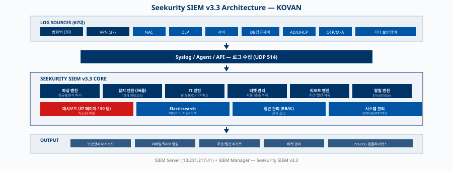
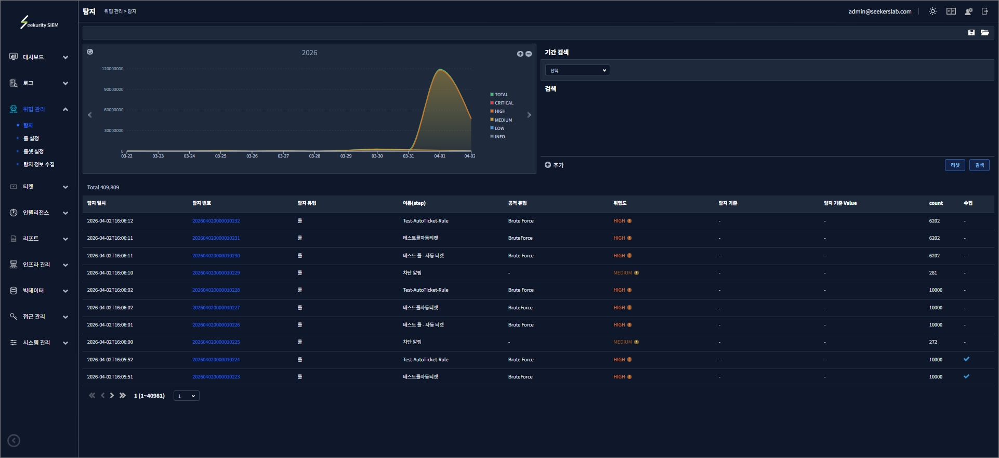
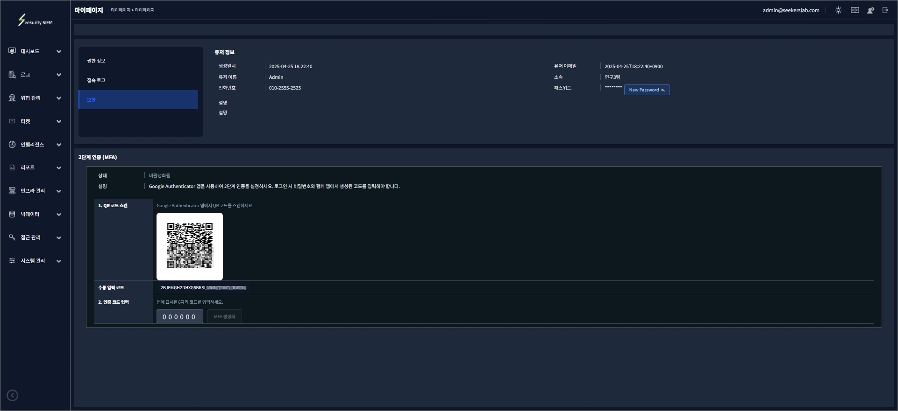

<!-- _class: cover-formal -->
<!-- _paginate: skip -->

# KOVAN SIEM 구축 사업 완료 보고서

## 프로젝트 완료 보고 (Project Completion Report)

| 구분 | 내용 |
|------|------|
| **사업명** | KOVAN SIEM 통합 보안관제 구축 |
| **수행기간** | 2025.09 - 2026.05 |
| **제출처** | KOVAN |
| **수행사** | SeekersLab |

> 보안등급: 대외비

---

# 목 차

| No | 제목 |
|:--:|------|
| 1 | 사업 개요 |
| 2 | 수행 결과 요약 |
| 3 | 로그 수집 현황 |
| 4 | 탐지 룰 현황 |
| 5 | 위협 인텔리전스 |
| 6 | 대시보드 및 보고서 |
| 7 | 교육 및 인수인계 |
| 8 | 유지보수 계획 |
| 9 | 산출물 |

---

# 1. 사업 개요

- **목적**: 통합 보안관제 체계 구축을 통한 보안 위협 실시간 탐지 및 대응 역량 확보
- **범위**: 22개 벤더 50+ 장비 로그 수집, 분석, 탐지 체계 구축
- **기간**: 2025.09 - 2026.05 (9개월)

<table style="width:100%"><tr><th style="width:20%">구분</th><th>내용</th></tr><tr><td><strong>대상 시스템</strong></td><td>방화벽, VPN, NAC, IPS/IDS, WAF, DDoS, 서버, DLP, EDR 등</td></tr><tr><td><strong>주요 벤더</strong></td><td>Juniper, Fortinet, SECUI, Genians, WINS, Penta, AhnLab, Lenovo 외 14개</td></tr><tr><td><strong>구축 범위</strong></td><td>로그 수집/파싱, 탐지 룰 56개, MITRE ATT&CK 매핑, 대시보드, 보고서</td></tr></table>

---

# 1. 시스템 아키텍처

---

# 2. 수행 결과 요약

<table style="width:100%"><tr><th style="width:25%">항목</th><th style="width:20%">목표</th><th style="width:35%">달성</th><th style="width:20%">달성률</th></tr><tr><td>로그소스 연동</td><td>67대</td><td>67대 (방화벽 30 + VPN 37)</td><td><strong>100%</strong></td></tr><tr><td>탐지 룰 구축</td><td>56개</td><td>56개</td><td><strong>100%</strong></td></tr><tr><td>벤더 파서 개발</td><td>22개</td><td>22개 (8 verified + 14 pending)</td><td><strong>100%</strong></td></tr><tr><td>MITRE ATT&CK 매핑</td><td>14 tactics</td><td>14 tactics</td><td><strong>100%</strong></td></tr></table>

---

# 3. 로그 수집 현황 — 방화벽 (1/2)

| 장비명 | IP | 장비유형 |
|--------|-----|---------|
| 한국 타이밴 방화벽 | 10.231.xxx.xxx, 10.231.xxx.xxx | 방화벽 |
| 메인 인터넷 방화벽 | 10.231.xxx.xxx, 10.231.xxx.xxx | 방화벽 |
| 웹 인터넷 방화벽 | 10.231.xxx.xxx, 10.231.xxx.xxx | 방화벽 |
| 시네마 방화벽 | 10.231.xxx.xxx, 10.231.xxx.xxx | 방화벽 |
| 사용자 방화벽 | 10.1.xxx.xxx, 10.1.xxx.xxx | 방화벽 |
| HSM 방화벽 | 10.231.xxx.xxx, 10.231.xxx.xxx | 방화벽 |
| Test 방화벽 | 10.231.xxx.xxx | 방화벽 |
| DS 방화벽 | 10.231.xxx.xxx, 10.231.xxx.xxx | 방화벽 |

---

# 3. 로그 수집 현황 — 방화벽 (2/2)

| 장비명 | IP | 장비유형 |
|--------|-----|---------|
| 전용선 방화벽 | 10.231.xxx.xxx, 10.231.xxx.xxx | 방화벽 |
| DB 방화벽 | 10.231.xxx.xxx, 10.231.xxx.xxx | 방화벽 |
| 관제망 방화벽 | 10.231.xxx.xxx, 10.231.xxx.xxx | 방화벽 |
| PG/선불 내부 방화벽 | 10.231.xxx.xxx, 10.231.xxx.xxx | 방화벽 |
| 사용자 방화벽 (250) | 10.231.xxx.xxx | 방화벽 |
| 관제 FW | 10.231.xxx.xxx, 10.231.xxx.xxx | 방화벽 |
| 그룹웨어 방화벽 | 220.117.xxx.xxx | 방화벽 |

---

# 3. 로그 수집 현황 — VPN (1/2)

| 장비명 | IP | 장비유형 |
|--------|-----|---------|
| 한국 타이밴 VPN | 10.231.xxx.xxx | VPN |
| BHN VPN | 220.117.xxx.xxx | VPN |
| 유니클로 VPN | 10.231.xxx.xxx, 10.231.xxx.xxx | VPN |
| UVAN운영 VPN | 10.231.xxx.xxx | VPN |
| UVAN개발 VPN | 10.231.xxx.xxx | VPN |
| DS농협카드 VPN | 10.231.xxx.xxx | VPN |
| 신한카드 VPN | 10.231.xxx.xxx | VPN |
| 제로페이 | 10.231.xxx.xxx | VPN |
| 현대푸본생명 VPN | 10.231.xxx.xxx | VPN |
| 국민은행직불/카드 VPN | 10.231.xxx.xxx | VPN |

---

# 3. 로그 수집 현황 — VPN (2/2)

| 장비명 | IP | 장비유형 |
|--------|-----|---------|
| Internet BLUEMAX VPN | 10.231.xxx.xxx | VPN |
| DS 현대카드 VPN | 10.231.xxx.xxx | VPN |
| 현대카드 VPN | 10.231.xxx.xxx | VPN |
| 우리카드 매입전용 VPN | 10.231.xxx.xxx | VPN |
| BC카드 승인 VPN | 10.231.xxx.xxx, 181~182 | VPN |
| DS BC카드 승인 VPN | 10.231.xxx.xxx | VPN |
| 농협카드 승인 VPN | 10.231.xxx.xxx | VPN |
| 농협카드 매입 VPN | 10.231.xxx.xxx | VPN |
| DS국민카드 VPN | 10.231.xxx.xxx | VPN |
| DS신한카드 VPN | 10.231.xxx.xxx | VPN |

---

# 4. 탐지 룰 현황

| 카테고리 | 룰 수 | CRITICAL | HIGH | MEDIUM | LOW | 주요 탐지 항목 |
|----------|:-----:|:------:|:----:|:------:|:---:|-------------|
| 방화벽 | 9 | 5 | 3 | 1 | - | 차단반복, 정책변경, DDoS, HA장애 |
| VPN | 6 | 1 | 3 | 2 | - | 로그인실패, 동시세션, 해외IP접속 |
| 웹 공격 | 8 | 2 | 4 | 2 | - | SQLi, XSS, 커맨드인젝션, 스캐너 |
| 인증/계정 | 4 | 1 | 2 | - | 1 | 계정잠금, 권한상승, 크리덴셜스터핑 |
| 악성코드/C2 | 3 | 1 | 2 | - | - | C2통신, DNS터널링, 악성파일 |
| 네트워크 | 6 | 1 | 2 | 3 | - | 포트스캔, ARP스푸핑, SYN Flood |
| 서버/시스템 | 4 | 1 | 1 | 2 | - | 서비스중지, 비인가프로세스 |
| 데이터유출 | 2 | - | 1 | 1 | - | 대용량다운로드, USB탐지 |
| 내부자위협 | 6 | 1 | 4 | 1 | - | 대량파일접근, 퇴직자, DB덤프 |
| 컴플라이언스 | 8 | 1 | 2 | 3 | 2 | 로그삭제, SSH키변경, 크론잡 |
| **합계** | **56** | **14** | **24** | **15** | **3** | **10개 카테고리** |

---

# 5. 위협 인텔리전스 연동

- 총 **615건** IOC 수집 완료 (IPv4: 322, URL: 277, Domain: 13, Email: 3)
- 심각도: CRITICAL 127건, HIGH 458건, MEDIUM 30건
- **17개 피드** 연동 (OpenPhish, KYRA Engine, Spamhaus, IPsum 등)

| 주요 피드 | IOC 수 | 유형 | 비고 |
|----------|:------:|------|------|
| OpenPhish | 265 | URL/피싱 | 피싱 URL 탐지 |
| KYRA Detection Engine | 115 | IP/URL | 자체 탐지 엔진 |
| Spamhaus DROP | 83 | IP | 하이재킹 IP 대역 |
| IPsum | 49 | IP | 집계 평판 점수 |
| AbuseIPDB | 40 | IP | 블랙리스트 IP |
| CINSscore | 19 | IP | 센티넬 모니터링 |
| ThreatFox/URLhaus | 14 | Domain/URL | 악성코드 배포 |

---

# 6. 대시보드 및 보고서

- Seekurity SIEM v3.3: **37개 페이지**, **50개 탭** 구축 완료

| 카테고리 | 페이지 수 | 탭 수 | 주요 기능 |
|----------|:-------:|:----:|----------|
| 대시보드 | 2 | 5 | 룰 탐지, 룰셋, 시스템 현황, 보안로그 |
| 위협 관리 | 5 | 13 | 이벤트, 룰 관리, 룰셋, 알림 |
| 로그 | 2 | - | 보안 로그, 네트워크 로그 |
| 인프라 관리 | 6 | 8 | 에이전트, 로그소스, 파서 |
| 인텔리전스 | 2 | - | TI 피드, IOC 관리 |
| 리포트 | 5 | - | 일간/주간/월간/맞춤 보고서 |
| 티켓 | 4 | - | 티켓 생성/추적/완료/통계 |
| 시스템 관리 | 4 | 14 | 사용자, 설정, 정책, 감사 |
| 기타 | 7 | 10 | 접근관리, 빅데이터, 보안정책 |

---

# 6. 페이지 목록 — 대시보드/위협/로그/인프라

| 카테고리 | 페이지명 | URL | 설명 |
|---------|---------|-----|------|
| 대시보드 | 대시보드 | /dashboard/dashboard | 룰 탐지, 룰셋, 시스템 현황, 보안로그 |
| 대시보드 | 커스텀 대시보드 | /dashboard/custom | 사용자 정의 위젯 배치 |
| 위협 관리 | 탐지 | /threat/detection | 실시간 이벤트 탐지 목록 |
| 위협 관리 | 룰 설정 | /threat/rule | 탐지 룰 생성/수정/삭제 |
| 위협 관리 | 룰셋 설정 | /threat/ruleset | 룰셋 그룹 관리 |
| 위협 관리 | TI 관리 | /threat/ti | 위협 인텔리전스 피드 관리 |
| 로그 | 보안 로그 | /log/logs | 보안 이벤트 로그 조회 |
| 로그 | 네트워크 트래픽 | /log/flow | 네트워크 플로우 분석 |
| 인프라 | 인프라 관리 | /infra/list | 에이전트/장비 목록 |
| 인프라 | 로그 소스 | /infra/collector | 수집기/로그소스 설정 |

---

# 6. 페이지 목록 — 리포트/티켓/시스템

| 카테고리 | 페이지명 | URL | 설명 |
|---------|---------|-----|------|
| 인텔리전스 | 위협 인텔리전스 | /intelligence/ti | IOC 피드 조회/매칭 |
| 인텔리전스 | 참조 인텔리전스 | /intelligence/ri | 참조 데이터 관리 |
| 리포트 | 리포트 목록 | /report | 생성된 보고서 조회 |
| 리포트 | 리포트 생성 | /report/create | 맞춤형 보고서 생성 |
| 리포트 | 리포트 스케줄 | /report/schedules | 자동 생성 예약 설정 |
| 티켓 | 티켓 목록 | /tickets | 보안 이벤트 티켓 관리 |
| 티켓 | 티켓 칸반 | /tickets/kanban | 칸반보드 뷰 |
| 티켓 | 티켓 리포트 | /tickets/report | 티켓 통계/분석 |
| 시스템 | 시스템 관리 | /manage/system | 서버/프로세스 관리 |
| 시스템 | 감사 로그 | /manage/audit | 관리자 활동 감사 |

---

# 6. 주요 화면 — 대시보드

- **실시간 모니터링**: 룰 탐지 현황, 이벤트 추이 차트, 심각도별 분류
- **시스템 현황**: 에이전트 상태, 로그 수집량, 디스크 사용률
- **보안로그 수집**: 로그소스별 수집 현황, 파싱 성공률 모니터링

---

# 6. 주요 화면 — 위협 탐지

- **이벤트 탐지**: 실시간 탐지 이벤트 목록, 시간대별 추이 그래프
- **상세 분석**: 이벤트 클릭 시 원본 로그, 룰 정보, 관련 IOC 확인
- **알림 연동**: 이메일/Slack 자동 알림, 티켓 자동 생성

---

# 6. 주요 화면 — 티켓 관리

- **티켓 목록**: 보안 이벤트별 티켓 생성, 담당자 배정, 상태 추적
- **칸반보드**: 드래그앤드롭 방식 티켓 상태 관리 (대기/진행/완료)
- **통계 리포트**: 처리 현황, 평균 처리 시간, SLA 준수율

---

# 6. 주요 화면 — 리포트

- **리포트 목록**: 생성된 보고서 조회, 기간별 필터링, PDF/Excel 다운로드
- **자동 생성**: 주간/월간 보고서 스케줄 예약, 이메일 자동 발송
- **맞춤 템플릿**: 위젯 기반 보고서 구성, 차트/표/통계 커스터마이징

---

# 7. 교육 및 인수인계

| 교육과정 | 대상 | 시간 | 주요 내용 | 상태 |
|----------|------|:----:|---------|------|
| SIEM 운영교육 | KOVAN 보안관제팀 전원 | 1시간 | 시스템 운영, 이벤트 조회, 알림 관리 | 완료 |
| 탐지룰 관리 | 보안관제팀 담당자 | 1시간 | 룰 생성/수정, 임계치 튜닝, 오탐 처리 | 완료 |
| 로그소스 연동 | 인프라팀 + 보안팀 | 1시간 | 장비 연동 절차, 파서 설정, 수집 확인 | 완료 |
| 장애대응 절차 | 보안관제팀 + 운영팀 | 1시간 | 장애 판별, 에스컬레이션, 복구 절차 | 완료 |

---

# 8. 유지보수 계획

- **무상 유지보수 기간**: 2026.06.01 - 2027.05.31 (12개월)
- **SLA 기준**: 가용성 99.5%, 장애복구 24시간 이내
- **장애 대응 체계**: 48시간 핫라인 + 원격/현장 지원

| 항목 | 내용 | SLA |
|------|------|-----|
| **무상 유지보수 기간** | 2026.06.01 - 2027.05.31 (12개월) | - |
| **긴급장애 대응** | 48시간 핫라인, 접수 후 24시간 내 원격 대응 | 24시간 |
| **정기점검** | 월 1회 시스템 점검 및 성능 최적화 | 월 1회 |
| **룰 업데이트** | 신규 위협 대응 룰 분기별 업데이트 제공 | 분기 |

---

# 9. 산출물

## 9.1 프로젝트 문서

| 단계 | 산출물 | 형식 | 파일 |
|------|--------|------|------|
| 착수 | SOW (작업명세서) | XLSX | `workbooks/KOVAN_SOW.xlsx` |
| 착수 | 수행 내용 | MD/PDF | `KOVAN_00-수행내용.md` / `.pdf` |
| 설계 | Log Source 목록 | XLSX | `workbooks/KOVAN_Log연동설계.xlsx` |
| 설계 | 방화벽 정책 요청서 | XLSX | `workbooks/KOVAN_방화벽정책.xlsx` |
| 구축 | 구축 일정표 | XLSX | `workbooks/KOVAN_일정표.xlsx` |
| 테스트 | 기능 확인서 (상세) | XLSX | `workbooks/KOVAN_기능확인서_상세.xlsx` |
| 테스트 | 기능 확인서 (요약) | XLSX | `workbooks/KOVAN_기능확인서_요약.xlsx` |
| 완료 | 완료 보고서 | MD/PDF | `KOVAN_07-완료보고서.md` / `.pdf` |

## 9.2 운영 산출물 (`workbooks/` + `assets/`)

| 산출물 | 형식 | 파일 |
|--------|------|------|
| 로그 소스 목록 (최종) | XLSX | `workbooks/KOVAN_로그소스목록.xlsx` |
| 탐지 룰 목록 | XLSX | `workbooks/KOVAN_탐지룰목록.xlsx` |
| 위협 인텔리전스 목록 | XLSX | `workbooks/KOVAN_위협인텔리전스목록.xlsx` |
| 위협 인텔리전스 (Export) | JSON | `assets/threat-intel-export.json` |
| 보안관제 운영 룰 목록 | XLSX | `workbooks/KOVAN_보안관제운영룰목록.xlsx` |
| PCI-DSS 요구사항 개발 | XLSX | `workbooks/KOVAN_PCI-DSS_요구사항개발.xlsx` |
| R&R / 연락처 | XLSX | `workbooks/KOVAN_R&R_연락처.xlsx` |

## 9.3 파서 / 소스 코드 (`parsers/`)

| 산출물 | 형식 | 파일 |
|--------|------|------|
| Log Parser (40+ 시스템) | PY | `KOVAN_Log_Parsers.py` |
| 탐지 룰 코드 | PY | `detection_rules.py` |
| 로그 분석 유틸 | PY | `log_analyzer.py` |
| 파서 단위 테스트 | PY | `test_parsers.py` |
| 샘플 로그 | TXT | `sample_logs.txt` |

## 9.4 데이터베이스 스크립트 (`assets/sql/`)

| 산출물 | 형식 | 파일 |
|--------|------|------|
| 룰 Insert 스크립트 | SQL | `assets/sql/kovan_rules_insert.sql` |
| 위협 인텔리전스 Insert | SQL | `assets/sql/kovan_ti_insert.sql` |
| 원본 룰 참조 | SQL | `assets/sql/rules.sql` |

---

# 부록: 대시보드 (1/2)

- 룰 탐지, 룰셋 통합 탐지, 시스템 현황, 커스텀 대시보드

<table class="grid-2x2"><tr>
<td>

대시보드 > 룰 탐지
</td>
<td>

대시보드 > 룰셋 탐지
</td>
</tr><tr>
<td>

대시보드 > 시스템 현황
</td>
<td>

대시보드 > 보안로그 수집
</td>
</tr></table>

---

# 부록: 대시보드 (2/2)

- 룰 탐지, 룰셋 통합 탐지, 시스템 현황, 커스텀 대시보드

<table class="grid-2x2"><tr>
<td>

대시보드 > 네트워크 트래픽
</td>
<td>

대시보드 > 커스텀 대시보드
</td>
</tr></table>

---

# 부록: 위협 (1/4)

- 이벤트 탐지, 룰 생성/관리, 룰셋 설정, TI 연동

<table class="grid-2x2"><tr>
<td>

위협관리 > 탐지
</td>
<td>

위협관리 > 룰 설정 > 룰 정보
</td>
</tr><tr>
<td>

위협관리 > 룰 설정 > 탐지 내역
</td>
<td>

위협관리 > 룰 설정 > 알람 전송
</td>
</tr></table>

---

# 부록: 위협 (2/4)

- 이벤트 탐지, 룰 생성/관리, 룰셋 설정, TI 연동

<table class="grid-2x2"><tr>
<td>

위협관리 > 룰 설정 > 관련 룰셋
</td>
<td>

위협 관리 > 룰 생성 > Step 1 기본 정보
</td>
</tr><tr>
<td>

위협 관리 > 룰 생성 > Step 2 탐지 조건
</td>
<td>

위협 관리 > 룰 생성 > Step 3 이메일 알림
</td>
</tr></table>

---

# 부록: 위협 (3/4)

- 이벤트 탐지, 룰 생성/관리, 룰셋 설정, TI 연동

<table class="grid-2x2"><tr>
<td>

위협 관리 > 룰 생성 > Step 4 Slack 알림
</td>
<td>

위협 관리 > 룰셋 설정 > 룰셋 정보
</td>
</tr><tr>
<td>

위협 관리 > 룰셋 설정 > 탐지 내역
</td>
<td>

위협 관리 > 룰셋 설정 > 알람 전송
</td>
</tr></table>

---

# 부록: 위협 (4/4)

- 이벤트 탐지, 룰 생성/관리, 룰셋 설정, TI 연동

<table class="grid-2x2"><tr>
<td>

위협 관리 > 룰셋 설정 > 상위 룰셋
</td>
<td>

위협관리 > TI 관리 > TI 정보
</td>
</tr><tr>
<td>

인텔리전스 > 위협 인텔리전스
</td>
<td></td>
</tr></table>

---

# 부록: 로그 (1/3)

- 보안 로그 조회, 네트워크 트래픽 분석

<table class="grid-2x2"><tr>
<td>

로그 > 보안 로그
</td>
<td>

로그 > 네트워크 트래픽
</td>
</tr><tr>
<td>

인프라 관리 > 로그 소스 > 네트워크 정보
</td>
<td>

인프라 관리 > 로그 소스 > 상면 관리
</td>
</tr></table>

---

# 부록: 로그 (2/3)

- 보안 로그 조회, 네트워크 트래픽 분석

<table class="grid-2x2"><tr>
<td>

인프라 관리 > 로그 소스 > 수집 정보
</td>
<td>

인프라 관리 > 로그 소스 > 정규표현식 분석
</td>
</tr><tr>
<td>

인프라 관리 > 로그 소스 > 로그 재파싱
</td>
<td>

인프라 관리 > 로그 소스 > 로그 재파싱 작업 이력
</td>
</tr></table>

---

# 부록: 로그 (3/3)

- 보안 로그 조회, 네트워크 트래픽 분석

<table class="grid-2x2"><tr>
<td>

접근 관리 > 유저 관리 > 접속 로그
</td>
<td>

시스템 관리 > 감사 로그
</td>
</tr><tr>
<td>

마이페이지 > 접속 로그
</td>
<td></td>
</tr></table>

---

# 부록: 인프라

- 장비 관리, 로그소스 수집기, 파서 분석, 상면 관리

<table class="grid-2x2"><tr>
<td>

인프라 관리 > 네트워크 정보
</td>
<td>

인프라 관리 > 상면 관리
</td>
</tr><tr>
<td>

인프라 관리 > 상면 관리
</td>
<td>

접근 관리 > 접근 관리 > 인프라 정보
</td>
</tr></table>

---

# 부록: 인텔리전스

- IOC 피드 매칭, 참조 인텔리전스

<table class="grid-2x2"><tr>
<td>

인텔리전스 > 참조 인텔리전스
</td>
<td></td>
</tr></table>

---

# 부록: 빅데이터

- 빅데이터 인덱스 관리

<table class="grid-2x2"><tr>
<td>

빅데이터 > 빅데이터 관리
</td>
<td></td>
</tr></table>

---

# 부록: 접근 (1/2)

- 유저 권한, 접속 로그, IP 접근 제어

<table class="grid-2x2"><tr>
<td>

접근 관리 > 유저 관리 > 권한 정보
</td>
<td>

접근 관리 > 유저 관리 > IP 접근 제어
</td>
</tr><tr>
<td>

접근 관리 > 권한 관리 > 페이지 정보
</td>
<td>

접근 관리 > 접근 관리 > 장비유형 정보
</td>
</tr></table>

---

# 부록: 접근 (2/2)

- 유저 권한, 접속 로그, IP 접근 제어

<table class="grid-2x2"><tr>
<td>

접근 관리 > 접근 관리 > 유저
</td>
<td></td>
</tr></table>

---

# 부록: 리포트 (1/2)

- 보고서 생성/스케줄, 맞춤 템플릿

<table class="grid-2x2"><tr>
<td>

리포트 > 리포트 목록
</td>
<td>

리포트 > 리포트 생성
</td>
</tr><tr>
<td>

리포트 > 리포트 스케줄
</td>
<td>

리포트 > 리포트 설정
</td>
</tr></table>

---

# 부록: 리포트 (2/2)

- 보고서 생성/스케줄, 맞춤 템플릿

<table class="grid-2x2"><tr>
<td>

리포트 > 리포트 상세
</td>
<td>

티켓 > 티켓 리포트
</td>
</tr></table>

---

# 부록: 티켓

- 티켓 목록/칸반/리포트, 이력 추적

<table class="grid-2x2"><tr>
<td>

티켓 > 티켓 목록
</td>
<td>

티켓 > 티켓 칸반
</td>
</tr><tr>
<td>

티켓 > 티켓 상세
</td>
<td></td>
</tr></table>

---

# 부록: 시스템 (1/4)

- SIEM 장비, 설정, 백업/복원, 감사 로그

<table class="grid-2x2"><tr>
<td>

시스템 관리 > 시스템 관리
</td>
<td>

시스템 관리 > SIEM 장비 관리
</td>
</tr><tr>
<td>

시스템 관리 > 시스템 알림
</td>
<td>

시스템 관리 > Syslog 전성
</td>
</tr></table>

---

# 부록: 시스템 (2/4)

- SIEM 장비, 설정, 백업/복원, 감사 로그

<table class="grid-2x2"><tr>
<td>

시스템 관리 > 프록시 설정
</td>
<td>

시스템 관리 > NTP 설정
</td>
</tr><tr>
<td>

시스템 관리 > SMTP 설정
</td>
<td>

시스템 관리 > 데이터 설정
</td>
</tr></table>

---

# 부록: 시스템 (3/4)

- SIEM 장비, 설정, 백업/복원, 감사 로그

<table class="grid-2x2"><tr>
<td>

시스템 관리 > 보안 설정
</td>
<td>

시스템 관리 > 백업 복원
</td>
</tr><tr>
<td>

시스템 관리 > 인덱스 목록
</td>
<td>

시스템 관리 > 무결성 검증
</td>
</tr></table>

---

# 부록: 시스템 (4/4)

- SIEM 장비, 설정, 백업/복원, 감사 로그

<table class="grid-2x2"><tr>
<td>

시스템 관리 > 검증 이력
</td>
<td>

시스템 관리 > 프로세스 관리
</td>
</tr></table>

---

# 부록: 마이페이지

- 개인 권한, 접속 로그, 보안 설정

<table class="grid-2x2"><tr>
<td>

마이페이지 > 권한 정보
</td>
<td>

마이페이지 > 보안
</td>
</tr></table>

---

<!-- _class: ending-dark -->
<!-- _paginate: skip -->

# KOVAN SIEM 구축 완료

## 감사합니다
